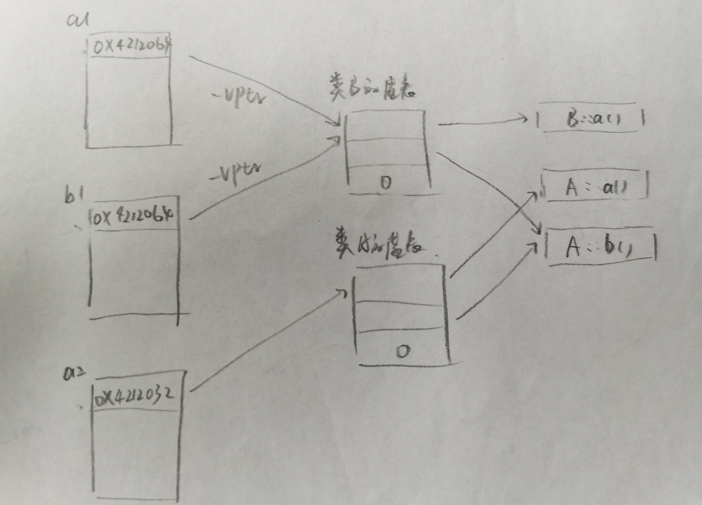
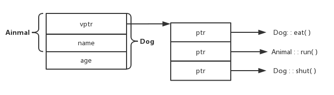
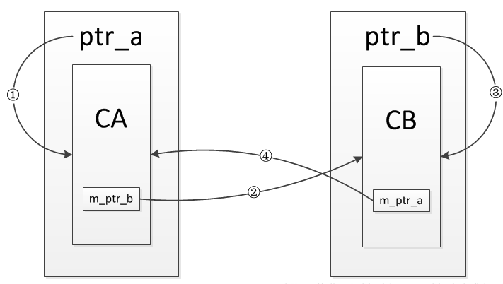
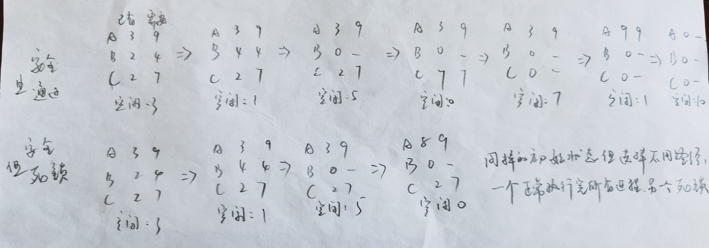

## C++
<details>
  <summary>malloc / free 与 new / delete 之间的区别</summary>
  
  - `new` / `delete` 是 **C++ 关键字**，需要编译器支持；`malloc` / `free` 是**库函数**，需要头文件支持。
  - 使用 `new` 操作符申请内存分配时**无须指定内存块的大小**，编译器会根据类型信息自行计算；而 `malloc` 则需要**显式地指出所需内存块的大小**。
  - `new` 操作符内存分配成功时，**返回对象类型的指针**，类型严格与对象匹配，无须进行类型转换，故 `new` 是符合类型安全性的操作符；而 `malloc` 内存分配成功则是**返回 void 类型指针**，需要通过强制类型转换将 `void*` 指针转换成我们需要的类型。
  - `new` 内存分配失败时，**抛出 bac_alloc 异常**。`malloc` 分配内存失败时**返回 NULL**。
  -  `new` 会先调用 `operator new` 函数，**申请足够的内存**（通常底层使用 `malloc` 实现），然后**调用对应类型的构造函数**，初始化成员变量，最后返回自定义类型指针；`delete` 先**调用析构函数**，然后调用 `operator delete` 函数**释放内存**（通常底层使用 `free` 实现）；`malloc` / `free` 是库函数，只能动态的申请和释放内存，无法强制要求其做自定义类型对象构造和析构工作。
  - `new` 操作符从**自由存储区**（free store）上为对象动态分配内存空间；而 `malloc` 函数从**堆**上动态分配内存。自由存储区是 C++ 基于 `new` 操作符的一个抽象概念，凡是通过 `new` 操作符进行内存申请，该内存即为自由存储区。而堆是操作系统中的术语，是操作系统所维护的一块特殊内存，用于程序的内存动态分配，C++ 使用 `malloc` 从堆上分配内存，使用 `free` 释放已分配的对应内存。自由存储区不等于堆。
  - `operator new` / `operator delete` **允许重载**，`malloc` / `free` **不允许重载**。
  > 参考：[经典面试题之 new 与 malloc 的区别](https://blog.csdn.net/nie19940803/article/details/76358673)，[new 与 malloc 的10点区别](https://www.cnblogs.com/shilinnpu/p/8945637.html)
  
</details>
<details>
  <summary>new 与 operator new 的区别（自问）</summary>

  - `new` (new operator) 是一个内置的**运算符**；`operator new` 是一个**函数**。
  - `new` 做的工作是调用 `operator new(sizeof(A))` + 调用`A::A()` + 返回指针，即**分配内存+调用构造函数+返回指针**；而 `operator new` 仅仅做了**分配内存的工作**。
  > 参考：[C++ 内存分配（new, operator new）详解](https://blog.csdn.net/uestclr/article/details/51171025)，[一分钟理解 C++ new 和 operator new](https://zhuanlan.zhihu.com/p/113439671)

</details>
<details>
  <summary>编译过程中各阶段所作工作</summary>

  - **预处理 $\Rightarrow$ 编译 $\Rightarrow$ 汇编 $\Rightarrow$ 链接**。
  - 预处理（.c-->.i）：编译器将头文件编译进来，还有宏的替换。
  - 编译（.i->.s）：编译器主要做词法分析，语法分析，语义分析等工作，检查无错误后，将其翻译为汇编语言。
  - 汇编（.s-->.o）：汇编器将汇编语言翻译成目标机器指令，生成目标文件。
  - 链接（.o-->可执行文件）：链接器将有关的目标文件链接起来，转为可执行文件。
  > 参考：[程序编译的四个阶段](https://www.jianshu.com/p/539a712ed284)，[C++ 程序编译过程](https://zhuanlan.zhihu.com/p/45402323)

</details>
<details>
  <summary>编译过程中的编译阶段所作的工作（自问）</summary>
  
  - **词法分析 $\Rightarrow$ 语法分析 $\Rightarrow$ 语义分析**。
  - 词法分析：其任务是对源程序逐字扫描，从中识别出一个个“单词”，“单词”又叫做符号，他是程序语言的基本语法单位，如关键字，标识符，常数，运算符，分隔符等。
  - 语法分析：其任务是跟根据语言的规则将单词符号序列分解成语法单位，如“表达式”，“语句”，“程序”等。语法规则就是语法单位的构成规则，通过语法分析确定整个输入串能否构成一个语法上正确的程序。如果程序没有错误，语法分析后就能正确的构造出语法树，否则就会指出语法错误，并给出诊断。
  - 语义分析：其任务是对类型进行分析和检查，一般类型检查包括两点：类型载体及在其上的运算。如，整除取余运算符只能对整数使用，如果运算对象是浮点数就认为是类型错误。
  > 参考：[编译原理-编译过程概述](https://blog.csdn.net/GarfieldGCat/article/details/89200785)

</details>
<details>
  <summary>纯虚函数与虚函数</summary>
  
  - 包含纯虚函数的类称为抽象类。
  - 不能实例化含纯虚函的类。
  - 在纯虚函数的函数原型后加上 `= 0` 代表该虚函数为纯虚函数。
  - 声明一个纯虚函数的目的是为了让派生类只继承函数接口；声明一个虚函数的目的是为了让抽象类继承该函数的接口和缺省实现。
  - 可以为纯虚函数提供定义，即可为其供应一份实现代码，调用它的唯一途径是使用时明确指出其 class 名称。例如：`a->base::test();`，其中 `base` 是一个抽象类，`a` 是以 `base` 作为基类的派生类的一个实例，`test()` 是在 `base` 内声明并定义的一个纯虚函数。
  > [参考：C++ 虚函数与纯虚函数的用法与区别](https://www.cnblogs.com/inception6-lxc/p/8597326.html)，[Effective C++ 条款34：区别接口继承和实现继承]()

</details>
<details> 
  <summary>int 类型的变量不赋予默认值，那么它的值是什么</summary>
  
  - 如果该变量处于静态存储区，即全局变量和静态变量存储的区域，那么变量会被默认初始化，其值置为0。
  - 如果该变量不在静态存储区，那么变量不会被初始化，其值为随机值。
  - 以上适用于所有内置类型的变量。
  > 参考：[C++ Primer 中“内置类型的默认初始化到底指什么](https://zhidao.baidu.com/question/745125691050893132.html)

</details>
<details>
  <summary>free 怎么保证能释放内存</summary>
  
  - `malloc` 的调用需要内存大小；`free` 的调用需要`malloc` 返回的内存地址，而不需要内存大小。
  - `malloc` 返回的地址的前面一块内存存有 `malloc` 分配的内存大小值，`free` 根据这个内存大小值释放同样大小的内存块。
  - 例子：假设你用 `malloc` 需要申请100个字节，实际是可能申请了104个字节，前4字节存有该块内存的实际大小100，并把前4个字节后的地址返回给你。`free` 释放的时候会根据传入的地址向前偏移4个字节，从这4字节获取具体的内存块大小并释放。
  > 参考：[C 语言中 free 怎么知道要删除多大的空间](https://www.zhihu.com/question/23196195)

</details>
<details>
  <summary>C++ 虚函数表</summary>

  - 每个包含虚函数的类都有一个虚函数表。
  - 同一个类的所有实例共享有一个虚函数表。
  - 当生成实例时，会在对象内存空间的头部存放一个指向该类的虚函数表的指针 `_vptr`。
  - 虚函数表中存放着该类的所有虚函数的地址，虚函数表是一个指针数组。
  - 派生类若是覆写了父类中的虚函数，那么派生类虚函数表中的该虚函数的地址为派生类的地址，否则为父类的虚函数地址。如 `class A` 有 `virtual void AA();` 和 `virtual void BB();` 这两个虚函数，`class B` 覆写了 `virtual void AA();`，那么 `class B` 的虚函数表中存放着 `B::AA()` 和 `A::BB()` 这两个函数的地址。
  - 创建一个父类指针指向其派生类对象，该指针使用的虚函数表是派生类的虚函数表，`_vptr` 指向的是派生类的虚函数表，所以调用虚函数的时候若派生类有进行覆写，都是调用派生类的版本，若没有覆写，则调用父类的版本。
  ```C++
  #include <iostream>
  using namespace std;

  class A {
  public:
      virtual void a() { cout << "A a" << endl; };
      virtual void b() { cout << "A b" << endl; }

  };
  class B : public A{
      virtual void a() {cout << "B a" << endl; }
      void c() { cout << "B c" << endl; }
  };

  int main() {
      A* a1 = new B;
      A* a2 = new A;
      B* b1 = new B;

      // 虚函数表的指针存放在对象最前面的位置
      // 由下输出结果可知，a1 和 b1 的虚函数表是一样的，所以指向派生类的父类指针所使用的虚函数表与派生类一致
      cout << "a1 vptr " << *((int*)a1) << endl; // 返回 a1 的虚函数表指针，输出 ”a1 vptr 4212096“
      cout << "a2 vptr " << *((int*)a2) << endl; // 返回 a2 的虚函数表指针，输出 ”a2 vptr 4212064“
      cout << "b1 vptr " << *((int*)b1) << endl; // 返回 b1 的虚函数表指针，输出 ”b1 vptr 4212096“

      a1->a(); // 调用 B 的版本，输出 ”B a“
      a1->b(); // 调用 A 的版本，输出 ”A b“
      // a1->c(); // 编译通过不了，指向派生类的父类指针不能调用派生类的非虚函数

      return 0;
  }
  ```
  
  > 参考：[C++ 虚函数表剖析](https://zhuanlan.zhihu.com/p/75172640)，[虚函数表](https://www.cnblogs.com/yunlambert/p/9876564.html)

</details>
<details>
  <summary>C++ 三大特性概括（自问）</summary>

  - **封装 + 继承 + 多态**
  - 封装：**代码模块化**，隐藏对象的属性和实现细节仅公开接口供用户使用。
  - 继承：**代码复用**，可以在类原有的特性基础上进行拓展，增加功能。
  - 多态：**接口复用**，一个接口，多种方法。
  - 以上仅为三大特性概念的概括。
  > 参考：[C++ 三大特性-封装](https://blog.csdn.net/cherrydreamsover/article/details/81942293)，[C++ 中的继承](https://blog.csdn.net/studyhardi/article/details/90744785)，[C++ 之多态性](https://blog.csdn.net/studyhardi/article/details/90815766)

</details>
<details>
  <summary>继承</summary>

  - private 继承
  - public 继承
  - protected 继承
  - 多重继承
  - 虚继承

</details>
<details>
  <summary>多态</summary>


</details>
<details>
  <summary>重载，覆写，隐藏（自问）</summary>
  
  - 重载：同一可访问区内被声明的几个具有不同参数列表（参数的类型，个数，顺序不同）的同名函数，根据参数列表确定调用那个函数。
  - 覆写：派生类中重新定义的函数，其函数名，参数列表，返回类型，所有都必须同基类中被重写的函数一致，只有函数体不同。
  - 隐藏：根据 C++ 的名称遮掩规则，内层作用域的名称会遮掩外层作用域的名称，在类中，基类是外层作用域，派生类是内层作用域，派生类中的函数与屏蔽与其同名的基类函数。如果派生类中的函数与基类同名，并且参数不同，无论有无 `virtual` 关键字，基类的函数都被隐藏；如果派生类的函数与基类的函数同名，并且参数相同，但是函数没有 `virtual` 关键字，此时基类的函数被隐藏。
  ```C++
  class Base {
    private:
      int x;
    public:
      virtual void mf1() = 0;
      virtual void mf1(int);
      void mf3();
      void mfs(double);
  };

  class Derived: public Base {
    public: 
      virtual void mf1(); // 覆盖 void Base::mf1()，隐藏 void Base::mf1(int)
      virtual void mf3(); // 隐藏 void Base::mf3()，void Base::mf3(double)
      void mf4();
      void mf4(double); // 重载 void Derived::mf4()
  }
  ```
  > 参考：[C++ 中重载、重写（覆盖）和隐藏的区别](https://blog.csdn.net/zx3517288/article/details/48976097)，[重载、覆盖、隐藏的区别](https://blog.csdn.net/weixin_40087851/article/details/82012624)，[Effective C++ 条款33：避免遮掩继承而来的名称]()

</details>
<details>
  <summary>C++11 部分特性</summary>
  
  - 使用 `nullptr` 代替 `NULL`，可区分空指针和0。
  - 引入 `auto` 关键字，实现类型推导，但是 `auto` 不能用于函数传参，也不能用于推到数组类型。
  - 引入基于范围的 `for` 循环。
  - 列表初始化。
  - C++11 之前，`>>` 一律被当做右移运算符来进行处理，而 C++11 开始，根据其应用场景进行判断。
  - 支持 Lambda 表达式。
  - 引入 `= default`，强制编译器生成默认函数版本。
  - 引入 `= delete`，表示限制默认函数的生成。
  - 引入 `final` 关键字。
  - 引入 `override` 关键字。
  - 引入 `decltype` 关键字，可以用于求表达式的类型。
  - 引入 `std::unordered_map` 和 `std::unordered_set`，内部实现是哈希表，因此查找的复杂度为 O(1)。
  - 引入智能指针。

  > 参考：[我在项目中经常使用的 C++11 新特性](https://zhuanlan.zhihu.com/p/102419965?utm_source=qq)
</details>
<details>
  <summary>野指针</summary>
  
  - 野指针，就是指针指向的位置是未知的，随机的。
  - **野指针成因**
    - **指针定义时没有初始化**，指针在被定义的时候，如果程序不对其进行初始化的话，它会随机指向一个区域，但是全局指针和静态指针会默认初始化指向 `nullptr`。
    - **指针被释放时没有置空**，当指针指向的空间使用 `free` 或 `delete` 释放后，如果程序员没有对其进行置空（指向 `nullptr` ）或者其他赋值操作的话，那么当前啊所指向的内存空间的值就是未知的，那么该指针为一个野指针。
    - **指针操作超越变量作用域**，假定一个函数返回值为指针类型，在函数内创建一个变量，并返回指向该变量的指针，因为局部变量存放在栈中，函数结束时栈弹出该变量的值，那么原来存放该局部变量的内存的当前值是未知的，所以返回的指针是一个野指针。
  - **如何避免野指针**
    - 定义指针的时候记得初始化，可以置为 `nullptr`。
    - 使用 `free` 和 `delete` 释放完指针指向的内存后，记得将指针置为 `nullptr`。
  > 参考：[野指针（概念，产生原因，危害，避免方法）](https://blog.csdn.net/l477918269/article/details/89949858)

</details>
<details>
  <summary>NULL，0，nullptr</summary>
  
  - C 语言中的 `NULL` 通常被定义为 `#define NULL ((void*)0)`，也就是说 `NULL` 实际上是一个 `void*` 的指针，然后吧 `void*` 指针赋值给其他类型的指针的时候，隐式转换成相应的类型。但是 C++ 是强类型的，`void*` 不能隐式转换为其他类型的指针，需要显式转换。当 C++ 中 `NULL` 定义为  `((void*)0)` 的时候，指针初始化使用 `NULL` 的时候可能需要显示转换类型，如 `int* p = (int*)NULL`。
  - 为了解决 C++ 中使用 `NULL` 进行赋值的兽需显式转换的问题，提出用 0 代替 ((void*)0)，一般定义为 `#define NULL 0`，0 代表指向内存地址为 0 的内存，这样就不需要进行显式转换了，因为是直接把一块内存地址给指针，但使用的时候需要注意当 `NULL` 作为函数参数的时候可能会出问题，如有两个函数，`void func(int a);` 和 `void func(int* b)`，其中一个是另一个的重载版本，当使用 `NULL` 作为参数调用 `func()` 的时候，调用的是 `void func(int a);` 的版本，而我们实际上是想调用 `void func(int* b);`的，所以尽量不适用 NULL 作为指针。
  - 为解决 C++ 中 `NULL` 的问题，在 C++11 中用 `nullptr` 代替 `NULL`，`nullptr` 代表一个空指针，既不是 `(void*)0)` 的宏定义，也不是 0 的宏定义。将`nullptr` 赋予指针时不需要进行类型转换，在作为参数传递的时候也不用担心重载问题，作为参数时会识别为指针而不是 `int` 类型。
  > 参考：[史上最明白的 NULL、0、nullptr 区别分析](https://www.cnblogs.com/porter/p/3611718.html)

</details>
<details>
  <summary>为什么虚函数是动态绑定</summary>
  
  - 静态绑定：
  - 动态绑定：
  - 当一个对象的指针需要调用一个它的虚函数的时候，首先它需要找到它的虚函数表，在虚函数表中找到该虚函数的地址，然后运行处于该地址上的函数，但问题是只有当对象实例化以后才拥有一个虚函数表，而实例化在运行阶段发生，不在编译阶段发生。举个例子，有一个父类 `class A` 和一个他的派生类 `class B`，`class A` 有一个虚函数 `virtual void func1();`，和一个非虚函数 `void func2();`，创建一个指针 `A* a = new B`， 在程序中写入 `a->func1();`，在编译阶段，编译器只知道 `a` 是一个 `class A` 类型的指针，但是此时 `a` 所指向的内存并没有存放虚函数表的地址，也就不知道虚函数的地址，所以**编译期间无法确定虚函数的函数地址**，但是如果在程序中写入 `a->func2();`，由于 `func2()` 不是虚函数，他的函数地址在编译阶段可以确定。所以虚函数是动态绑定，在运行期可确定，非虚函数是静态绑定，在编译器可确定。
  > 参考：[为什么虚函数在编译期间无法绑定](https://blog.csdn.net/qq_41786318/article/details/81979658)

</details>
<details>
  <summary>引用是否能实现动态绑定，为什么引用可以实现</summary>
  
  - 可以，因为它们并不引发内存任何与类型有关的内存委托操作，会受到改变的，只有它们**所指向内存的大小和解释方式**，也就是说引用和指针不会影响内存里的内容，只会改变所指内存的大小，而虚函数表放在对象内存空间最上面的位置，所以一个指向派生类的基类指针的虚函数表还是使用派生类的虚函数表。比如有一个基类 `class Animal` 和一个派生类 `class Dog`，分析 `Animal* a = new Dog;`，`new Dog` 开辟一块 `class Dog` 类型大小的内存，并返回一个其地址给 `a`，而 `a` 所指内存的大小由 `Animal*` 决定，为 `class Animal` 的大小，过程中并没有改变原有内存的内容，只是改变了指针所指向的内存大小。
  
  - 如果只是单纯的向上转型，没有使用指针或引用，是不会发生多态的，因为基类和派生类之间的转型动作会改变虚函数表指针 `_vptr` 的指向。如有一个基类 `class A` 和一个派生类 `class B`，基类有一个虚函数 `virtual void t();`， 分析 `B b; A a = b;`，这里将 `b` 转型为 `class A` 类型，进行向上转型，转型过程中 `_vptr` 会改变，指向 `class A` 的虚函数表，调用 `a.t();`，其调用的是基类的版本，而不是派生类的版本，这也就不是多态了。
  > [浅谈为什么只有指针能够完成多态及动态转型的一个误区](https://www.cnblogs.com/fandingBlog/p/3918407.html)，[C++ 多态，为何只能通过指针或引用实现](https://blog.csdn.net/shichao1470/article/details/89893508#_2)

</details>
<details>
  <summary>const 用法</summary>


</details>
<details>
  <summary>static 用法</summary>


</details>
<details>
  <summary>指针和引用的区别</summary>
  
  - 指针是一个变量，这个变量存储的是一个地址；引用只是原变量的一个别名。
  - 指针占有一块自己的内存空间；而引用和原变量的内存空间是一样的。
  - 使用 `sizeof` 看一个指针的大小是4；而引用则是被引用对象的大小。
  - 指针可以初始化为空值；而引用不可以为空，必须被初始化，且必须是对一个已存在对象的引用。
  - 指针可以有多级；引用只有一级。
  - 指针使用 `++` 是指向下一块地址；而引用使用 `++` 就是原变量进行 `++` 操作。
  - 有 `const` 指针，`A* const a;` 是正确的，指针是一个变量，可以有 `const` 属性；没有 `const` 引用，`A b; A& const a = b;;` 是错误的，因为引用自身不是一个对象，是一个别名，本来就是不能修改的，就无所谓 `const` 属性一说，如果把 `const` 放在 `A&` 前面，那么修饰的就是引用所指向的那个对象了；而对象是有 `const` 属性的，自然是没问题的。
  - 指针在使用中可以指向其它对象；但是引用只能是一个对象的引用，不能被改变。
  - 如果返回动态内存分配的对象或者内存，必须使用指针；引用可能引起内存泄露。
  - 指针需要解引用才能对被指对象进行操作，引用不需要。
  > 参考：[C++面试宝典导读](https://www.nowcoder.com/tutorial/93/a34ed23d58b84da3a707c70371f59c21)，[引用没有const，指针有const](https://www.zhihu.com/question/291649692)

</details>
<details>
  <summary>堆和栈的区别</summary>

  - **申请方式**：stack 由系统自动分配；heap 需要程序员自己申请，并指明大小。
  - **申请后系统的响应**：申请栈上的空间时，只要栈的剩余空间大于所申请空间，系统将为程序提供内存，否则将报异常提示栈溢出；申请堆上的空间时，首先应该知道操作系统有一个记录空闲内存地址的链表，当系统收到程序的申请时，会遍历该链表，寻找第一个空间大于所申请空间的堆结点，然后将该结点从空闲结点链表中删除，并将该结点的空间分配给程序，另外，对于大多数系统，会在这块内存空间中的首地址处记录本次分配的大小，这样，代码中的 `delete` 语句才能正确的释放本内存空间。另外，由于找到的堆结点的大小不一定正好等于申请的大小，系统会自动的将多余的那部分重新放入空闲链表中。
  - **申请大小的限制**：栈是向低地址扩展的数据结构，是一块连续的内存的区域，栈顶的地址和栈的最大容量是系统预先规定好的，在 Windows 下，**栈的大小是 1M**，如果申请的空间超过栈的剩余空间时，将提示 overflow；堆是向高地址扩展的数据结构，是不连续的内存区域，这是由于系统是用链表来存储的空闲内存地址的，自然是不连续的，而链表的遍历方向是由低地址向高地址，堆的大小受限于计算机系统中有效的虚拟内存，32位 Windows 系统中，一个进程空间大小为 4G，其中进程的高位 2G 留给内核，低于 2G 留给用户，所以进程中的**堆的大小小于 2G**，进程的堆获得的空间比较灵活，也比较大。
  - **申请效率**：栈由系统自动分配，速度较快；但程序员是无法控制的；堆是由new分配的内存，一般速度比较慢，而且容易产生内存碎片。
  - **堆和栈中的存储内容**：栈中一般存放返回地址，局部变量，函数参数等；存放在堆中的一块数据一般会在头部存放该数据块的大小，堆中的具体内容由程序员决定。
  > 参考：[堆和栈的区别](https://zhuanlan.zhihu.com/p/78478567)，[进程空间分配和堆栈大小](https://www.cnblogs.com/ladawn/p/8449399.html)

</details>
<details>
  <summary>进程的最大线程数</summary>

  - 32位 Windows 下，一个进程虚拟地址空间为 4G（2^32），内核占 2G，留给用户只有 2G，一个线程默认栈的大小是 1M，所以一个进程最大开2048个线程。当然内存不会完全拿来做线程的栈，所以最大线程数实际值要小于2048，大概2000个。
  - 32位 Linux 下，一个进程虚拟地址空间4G，内核占1G，用户留3G，一个线程默认栈的大小为 8M，所以最多380个左右线程。
  - 可以通过修改默认栈的方式改变进程的最大线程数。
  > 参考：[进程空间分配和堆栈大小](https://www.cnblogs.com/ladawn/p/8449399.html)

</details>
<details>
  <summary>struct 和 class 的区别</summary>

  - **默认继承权**：class 默认 private 继承，struct 默认 public 继承。
  - **成员默认访问权限**：class 的成员默认是 private 权限，struct 默认是 public 权限。
  - C++ 中 struct 能包含成员函数，有自己的构造函数，可以有析构函数，支持继承、多态，支持private、protected、public关键字。
  - class 可以继承自struct修饰的类；同时，struct 也可以继承自 class 修饰的类。当 class 修饰的类作为父类，struct 修饰的类作为子类时，默认继承是 private 还是 public 取决于子类而不是父类，这里由于是子类是 struct 修饰的，所以默认继承是 public；同理，当 struct 修饰的类作为父类，class 修饰的类作为子类时，默认继承是 private。
  > 参考：[struct 和 class 的区别](https://www.cnblogs.com/ZhenXin0101/p/11451694.html)

</details>
<details>
  <summary>C 和 C++ 的区别</summary>

  - C++  面向对象；C 面向过程。
  - C++ 具有封装、继承和多态三种特性。
  - C++ 支持泛型编程，支持模板类、函数模板等。
  - 还有很多，不一一列举。
  > 参考：[C++面试宝典导读](https://www.nowcoder.com/tutorial/93/a34ed23d58b84da3a707c70371f59c21)

</details>
<details>
  <summary>define 和 const 的区别</summary>

  - define 宏在预处理阶段展开；const 常量在编译阶段使用。
  - define 宏没有类型，在预处理阶段不会做任何类型检查，直接展开；const 常量有具体的类型，在编译阶段会进行类型检查。
  -  define 宏使用多少次，就展开多少次，在内存中可能会有多个重复数据；const 常量在内存中只有一份数据。
  - 由于 define 宏是在预处理阶段展开，返回立即数，所以 define 宏存在于代码段；而 const 常量位于数据段。
  - 由于 define 宏在预处理阶段被替换，所以如果由于这个 define 宏导致编译出错的话，返回的编译信息中不会有 define 宏的名称，而是 define 宏的替换值，如 `1.11`，而根据这个替换值难以定位错误发生的地方；如果使用 const 常量替换 define 宏，那么如果编译发生错误，那么编译信息中将会包含 const 常量的名称，可以轻松定位错误发生的位置。 
  > 参考：[浅谈define和const的区别](https://blog.csdn.net/ZYZMZM_/article/details/83302084)，[const与define的区别](https://www.cnblogs.com/zhangjiansheng/p/7630160.html)，[Effective C++ 条款02-尽量以 const，enum，inline 替换 #define]()

</details>
<details>
  <summary>C 语言实现面向对象</summary>
  
  ```C++
  #include <stdio.h>
  #include <assert.h>

  struct ShapeVtb;

  // Shape 的属性
  typedef struct {
      struct ShapeVtb const *vptr;

      int x;
      int y;
  } Shape;

  // Shape 的虚函数表
  struct ShapeVtb {
      int (*area)(const Shape* const me);
      void (*draw)(const Shape* const me);
  };

  // Shape 类的虚函数
  static int Shape_area_(Shape const * const me) {
      assert(0); // 类似纯虚函数
      return 0U; // 避免警告
  }

  // Shape 类的虚函数
  static void Shape_draw_(Shape const * const me) {
      assert(0); // 纯虚函数不能被调用
  };

  // Shape 的方法，设置 x 和 y，同时也是构造函数
  void Shape_ctor(Shape * const me, int x, int y) {
      // Shape 类的虚表
      static struct ShapeVtb const vtb = { Shape_area_, Shape_draw_ };

      me->vptr = &vtb;
      me->x = x;
      me->y = y;
  }

  // Shape 的方法，增加 x 和 y
  void Shape_moveBy(Shape * const me, int dx, int dy) {
      me->x += dx;
      me->y += dy;
  }

  // Shape 的方法，获取 x 的值
  int Shape_getX(const Shape* const me) {
      return me->x;
  }

  // Shape 的方法，获取 y 的值
  int Shape_getY(const Shape* const me) {
      return me->y;
  }

  static inline int Shape_area(const Shape* const me) {
      return (*me->vptr->area)(me);
  }

  static inline void Shape_draw(const Shape* const me) {
      (*me->vptr->draw)(me);
  }

  Shape const *largestShape(Shape const *shapes[], int nShapes)
  {
      Shape const *s = (Shape *)0;
      int max = 0U;
      int i;
      for (i = 0U; i < nShapes; ++i)
      {
          int area = Shape_area(shapes[i]);// 虚函数调用
          if (area > max)
          {
              max = area;
              s = shapes[i];
          }
      }
      return s;
  }

  void drawAllShapes(Shape const *shapes[], int nShapes)
  {
      int i;
      for (i = 0U; i < nShapes; ++i)
      {
          Shape_draw(shapes[i]); // 虚函数调用
      }
  }

  // Rectangle 的属性
  typedef struct {
      Shape super; // 继承 Shape

      // 自己的属性
      int width;
      int height;
  } Rectangle;

  // Rectangle 的虚函数
  static int Rectangle_area_(const Shape* const me)
  {
      const Rectangle* const me_ = (Rectangle const *)me; // 显式的转换
      return (int)me_->width * (int)me_->height;
  }

  static void Rectangle_draw_(const Shape* const me)
  {
      const Rectangle* const me_ = (Rectangle const *)me; // 显式的转换
      printf("Rectangle_draw_(x=%d,y=%d,width=%d,height=%d)\n", Shape_getX(me), Shape_getY(me), me_->width, me_->height);
  }

  // Rectangle 的构造函数
  void Rectangle_ctor(Rectangle* const me, int x, int y, int width, int height)
  {
      static struct ShapeVtb const vtb = { Rectangle_area_, Rectangle_draw_ };
      Shape_ctor(&me->super, x, y); // 调用基类的构造函数
      me->super.vptr = &vtb; // 重载 vptr

      me->width = width;
      me->height = height;
  }

  int main() {
      Shape s1, s2;

      Shape_ctor(&s1, 0, 1);
      Shape_ctor(&s2, -1, 2);

      printf("Shape s1(x=%d, y=%d)\n", Shape_getX(&s1), Shape_getY(&s1));
      printf("Shape s2(x=%d, y=%d)\n", Shape_getX(&s2), Shape_getY(&s2));

      Shape_moveBy(&s1, 2, -4);
      Shape_moveBy(&s2, 1, -2);

      printf("Shape s1(x=%d,y=%d)\n", Shape_getX(&s1), Shape_getY(&s1));
      printf("Shape s2(x=%d,y=%d)\n", Shape_getX(&s2), Shape_getY(&s2));

      Rectangle r1, r2;

      // 实例化对象
      Rectangle_ctor(&r1, 0, 2, 10, 15);
      Rectangle_ctor(&r2, -1, 3, 5, 8);

      printf("Rect r1(x=%d,y=%d,width=%d,height=%d)\n", Shape_getX(&r1.super), Shape_getY(&r1.super), r1.width, r1.height);
      printf("Rect r2(x=%d,y=%d,width=%d,height=%d)\n", Shape_getX(&r2.super), Shape_getY(&r2.super), r2.width, r2.height);

      // 注意，这里有两种方式，一是强转类型，二是直接使用成员地址
      Shape_moveBy((Shape *)&r1, -2, 3);
      Shape_moveBy(&r2.super, 2, -1);

      printf("Rect r1(x=%d,y=%d,width=%d,height=%d)\n", Shape_getX(&r1.super), Shape_getY(&r1.super), r1.width, r1.height);
      printf("Rect r2(x=%d,y=%d,width=%d,height=%d)\n", Shape_getX(&r2.super), Shape_getY(&r2.super), r2.width, r2.height);

      Shape const *shapes[] = { &r2.super, &r1.super };
      Shape const *s = largestShape(shapes, sizeof(shapes)/sizeof(shapes[0]));
      
      printf("largestShape s(x=%d,y=%d)\n", Shape_getX(s), Shape_getY(s));

      drawAllShapes(shapes, sizeof(shapes)/sizeof(shapes[0]));

      return 0;
  }
  ```
  > 参考：[C 语言实现面向对象编程](https://blog.csdn.net/onlyshi/article/details/81672279)

</details>
<details>
  <summary>C++ 内存管理</summary>

  - 代码段：包括只读存储区和文本区，其中只读存储区存储字符串常量，文本区存储程序的机器代码。
  - 数据段：存储程序中已初始化的全局变量和静态变量。
  - bss 段：存储未初始化的全局变量和静态变量（局部+全局），以及所有被初始化为0的全局变量和静态变量。
  - 堆区：调用 new/malloc 函数时在堆区动态分配内存，同时需要调用 delete/free 来手动释放申请的内存。
  - 映射区：存储动态链接库以及调用 mmap 函数进行的文件映射。
  - 栈区：使用栈空间存储函数的返回地址、参数、局部变量、返回值。
  > 参考：[C++面试宝典导读](https://www.nowcoder.com/tutorial/93/8f140fa03c084299a77459dc4be31c95)

</details>
<details>
  <summary>析构函数一般写成虚函数的原因</summary>

  - 任何 class 只要带有 virtual 函数都几乎确定也有一个 virtual 析构函数，当一个派生类对象经由一个基类对象执指针被删除，而该基类带着一个 non-virtual 析构函数，通常情况下是该派生类对象的派生类部分没被销毁，而如果是析构函数是虚函数，那么就会调用派生类的析构函数来释放对象内存，那么基类部分和派生类部分都将被释放。如有一个基类 `class A` 和一个派生类 `class B`，他们的析构函数不是虚函数，那么分析 `A* a= new B; delete A;`，这里释放 `a` 指向的内存时，只会释放 `class A` 部分的内存，而 `class B` 的部分还保留在内存中。
  - 如果一个 class 如果不含有 virtual 函数，通常意味着它不想被用作一个基类，当一个类不想被当作基类的时候，最好不要令其析构函数为一个虚函数。因为如果类中存在虚函数，那么对象中需要存有一个虚函数表指针 `_vptr`，但是本身这个类是不需要作为基类的，也就不需要虚函数表，所以这是浪费了资源，多占用了空间。
  > 参考：[Effective C++ 条款07-为多态基类声明 virtual 析构函数]()

</details>
<details>
  <summary>构造函数为什么不能定义为虚函数</summary>

  - 因为没有意义啊，构造函数在虚函数表建立之前就要执行。
  > 参考：[C++中为什么构造函数不能定义为虚函数](https://blog.csdn.net/qq_39885372/article/details/104915425)

</details>
<details>
  <summary>构造函数或者析构函数中调用虚函数会怎样</summary>

  - 最好不要。派生类在构造过程中会先调用基类的构造函数，如果基类中调用了一个虚函数，那么他会调用基类版本的虚函数，而不是派生类的版本，因为在此时，对象其实是基类对象而不是派生类对象，这样的话，虚函数就没有起到虚函数的作用，因为它在哪个类的构造函数中就调用那个类的虚函数版本。析构函数同理，虚函数在哪个类的析构函数中使用就调用那个类的虚函数版本。
  > [Effective C++ 条款09-绝不在构造和析构过程中调用 virtual 函数]()

</details>
<details>
  <summary>深拷贝和浅拷贝的区别</summary>

  - 在对象拷贝过程中，如果没有自定义一个拷贝构造函数，系统会提供一个默认拷贝构造函数，默认拷贝构造函数对于基本类型的成员变量，**按字节赋值**，对于类类型的成员变量，调用其相应的拷贝构造函数，这种叫做浅拷贝，对于指针成员变量，如果按字节赋值的话，那么**两个对象中的这个指针成员变量将指向同一块内存**，如果其中一个对象进行析构以后，且析构函数中释放了该指针指向的内存，那么此时还未进行析构的那个对象的指针成员变量将指向一块存有未知数值的内存，而且在这个对象进行析构的时候，这块内存又被释放一次，结果会导致程序奔溃。
  - 为解决这个问题，需要使用深拷贝，我们需要自定义一个拷贝构造函数，让指针成员变量指向新开辟的内存空间。
  > 参考：[C++浅拷贝和深拷贝的区别](https://www.cnblogs.com/wjcoding/p/10955017.html)

</details>
<details>
  <summary>对象复用的了解，零拷贝的了解</summary>

  - 

</details>
<details>
  <summary>介绍 C++ 所有的构造函数</summary>

  - **无用的默认构造函数**：如果没有显式地定义默认构造函数，编译器会自动生成一个默认构造函数，生成的默认构造函数什么也不做，只是为了保证程序能够正确运行而已。
  - **有用的默认构造函数**：如果没有显式地定义默认构造函数，编译器会自动生成一个默认构造函数，同时，如果该类中有一个成员类对象，那么生成的默认构造函数并不是什么都不做，它会调用成员类对象的构造函数。
  - **有用的默认构造函数**：如果没有显式地定义默认构造函数，编译器会自动生成一个默认构造函数，同时，如果该类中包含有一个虚函数，那么虚函数表 `_vbtl` 和 虚函数表指针 `_vptr` 会在默认构造函数中合成出来。
  - **无参构造函数**：用户自定义的不带参数的构造函数，可以在初始化列表中对成员变量进行初始化，同时也会隐式进行成员类的构造以及虚函数表和虚函数表指针的合成。
  - **带参构造函数**：用户自定义的带参数的构造函数，可以在初始化列表中对成员变量进行初始化，同时也会隐式进行成员类的构造以及虚函数表和虚函数表指针的合成。如果是单参数的构造函数，可以提供参数类型到类类型的隐式转换，如果不想要隐式转换，可以在该构造函数前面加上 `explicit`，说明该构造函数必须显式调用。
  - **默认拷贝构造函数**：如果没有显式定义一个拷贝构造函数，那么编译器会自动生成一个拷贝构造函数，该拷贝函数是浅拷贝的，对于每个基本类型的成员变量进行按字节赋值。
  - **自定义拷贝构造函数**：用户可自定义拷贝构造函数，对普通类型变量可以进行值拷贝，针对指针变量，可以新开辟一块空间，将源对象的指针指向的值放入该块内存，并让指针指向这块内存，这样就实现了深拷贝，源对象和拷贝对象之间不会互相影响。
  > [C++默认构造函数——深入理解](https://blog.csdn.net/hankai1024/article/details/7947989)

</details>
<details>
  <summary>什么情况下会调用拷贝构造函数</summary>

  - 当函数的参数为类的对象的时候。
  - 函数的返回值是类的对象的时候。
  - 对象需要通过另一个对象初始化的时候。
  > 参考：[C++ 拷贝函数详解](https://www.cnblogs.com/alantu2018/p/8459250.html)

</details>
<details>
  <summary>结构体内存对齐方式和为什么要进行内存对齐</summary>

  - 给定结构体里每个变量一个对齐标准（根据规则，可能是宏指定的也可能是变量的大小），该变量的地址必须是该标准的整数倍。
  - **数据成员对齐规则**：结构体的数据成员，第一个数据成员放在 offset 为 0 的地方（offset 位置由结构体的整体对齐决定），以后每个数据成员的对齐按照 `#pragma pack` 指定的数值和这个数据成员自身长度中，比较小的那个进行。
  - **结构体的整体对齐规则**：在数据成员完成各自对齐之后，结构体本身也要进行对齐，对齐将按照 `#pragma pack` 指定的数值和结构最大数据成员长度中，比较小的那个进行。
  - **结构体作为成员**：如果一个结构里有某些结构体成员，则结构体成员要从其内部最大元素大小的整数倍地址开始存储。
  - **为什么要内存对齐**：因为每次 CPU 从内存中取数据，都是取总线宽度大小的数据，而起始地址得是总线宽度的整数倍（不确定），内存对齐有助于提升读取效率。（不懂）
  ```C++
  #include <iostream>
  using namespace std;

  #pragma pack (1) // 指定按1对齐
  struct struct01 {
      int i; // 长度4 > 1，按 1 对齐
      short us; // 长度 2 > 1，按 1 对齐
      char b; // 长度1 = 1，按 1 对齐
  };
  #pragma pack ()

  #pragma pack (2) // 指定按2对齐
  struct struct02 {
      int i; // 长度4 > 2，按 2 对齐
      short us; // 长度2 = 2，按 2 对齐
      char b; // 长度1 < 2，按 1 对齐
      char d; // 长度1 < 2，按 1 对齐
  };
  #pragma pack ()

  // 默认对齐
  struct struct03
  {
      int i; // 长度4 < 8，按 4 对齐
      short us; // 长度2 < 8，按 2 对齐
      char b; // 长度1 < 8，按 1 对齐
  } ;

  int main(){
      struct01 s1;
      struct02 s2;
      struct03 s3;

      cout << "sizeof(struct01): " << sizeof(struct01) << endl; // 输出 “sizeof(struct01): 7”
      cout << "sizeof(struct02): " << sizeof(struct02) << endl; // 输出 “sizeof(struct02): 8”
      cout << "sizeof(struct03): " << sizeof(struct03) << endl; // 输出 “sizeof(struct03): 8”

      cout << "s1 i address: " << reinterpret_cast<intptr_t>(&(s1.i)) << endl; // 输出 “s1 i address: 6422041”
      cout << "s1 us address: " << reinterpret_cast<intptr_t>(&(s1.us)) << endl; // 输出 “s1 us address: 6422045”
      cout << "s1 b address: " << reinterpret_cast<intptr_t>(&(s1.b)) << endl; // 输出 “s1 b address: 6422047”
      cout << "s2 i address: " << reinterpret_cast<intptr_t>(&(s2.i)) << endl; // 输出 “s2 i address: 6422032”
      cout << "s2 us address: " << reinterpret_cast<intptr_t>(&(s2.us)) << endl; // 输出 “s2 us address: 6422036”
      cout << "s2 b address: " << reinterpret_cast<intptr_t>(&(s2.b)) << endl; // 输出 “s2 b address: 6422038”
      cout << "s2 d address: " << reinterpret_cast<intptr_t>(&(s2.d)) << endl; // 输出 “s2 d address: 6422039”
      cout << "s3 i address: " << reinterpret_cast<intptr_t>(&(s3.i)) << endl; // 输出 “s3 i address: 6422024”
      cout << "s3 us address: " << reinterpret_cast<intptr_t>(&(s3.us)) << endl; // 输出 “s3 us address: 6422028”
      cout << "s3 b address: " << reinterpret_cast<intptr_t>(&(s3.b)) << endl; // 输出 “s3 b address: 6422030”

      return 0;
  }
  ```
  > 参考：[C++ 面试题之结构体内存对齐计算问题总结大全](https://www.jb51.net/article/120329.htm)

</details>
<details>
  <summary>内存泄露的定义，如何检测与避免</summary>

  - 内存泄漏指的是在程序里动态申请的内存在使用完后，没有进行释放，导致这部分内存没有被系统回收，久而久之，可能导致系统可用内存越来越少。
  - 内存泄漏的可能成因
    - 在一个程序块内没有成对使用 new/delete。
    - 在类的构造函数与析构函数中没有匹配地调用 new/delete。
    - 在释放对象数组时，使用的是 delete，而没有使用 delete []。
    - 基类的析构函数为非虚函数，使用一个基类指针的 delete 删除一个派生类对象。
  - 检测：利用内存检查工具。
  - 如何避免内存泄漏
    - 不要手动管理内存，可以尝试在适用的情况下使用智能指针。
    - 使用 string 而不是 char*，string 类在内部处理所有内存管理。
    - 在C++中避免内存泄漏的最好方法是尽可能少地在程序级别上进行 new 和 delete 调用。任何需要动态内存的东西都应该隐藏在一个 RAII 对象中，当它超出范围时释放内存。RAII 在构造函数中分配内存并在析构函数中释放内存，这样当变量离开当前范围时，内存就可以被释放。
    - 培养良好的编码习惯，在涉及内存的程序段中，检测内存是否发生泄漏。
  > [面试问题之 C++ 语言：如何避免内存泄漏](https://www.cnblogs.com/yichengming/p/11466636.html)，[C++中避免内存泄露常见的解决方式](https://www.cnblogs.com/mfrbuaa/p/4265483.html)

</details>
<details>
  <summary>内存泄漏和内存溢出</summary>

  - 内存泄漏指的是在程序里动态申请的内存在使用完后，没有进行释放，导致这部分内存没有被系统回收，久而久之，可能导致系统可用内存越来越少。发生在堆上。
  - 内存溢出指的是用户的实际的数据长度超过了可用的内存空间大小，导致覆盖了其他正常数据。一般发生在栈上。
  > 参考：[内存泄漏和内存溢出有啥区别](https://www.zhihu.com/question/40560123)

</details>
<details>
  <summary>内存检查工具的了解</summary>

  - Windows 下 vs 可用 CRT
  - LInux 下可用 valgrind
  > 参考：[C++ 内存泄露检查工具](https://blog.csdn.net/ttomqq/article/details/81937561)，[C/C++ 内存泄漏及检测](https://www.cnblogs.com/skynet/archive/2011/02/20/1959162.html)  

</details>
<details>
  <summary>模板的用法和适用场景</summary>

</details>
<details>
  <summary>为什么用成员初始化列表会快一些</summary>

  - 因为对象的初始化动作发生在进入构造函数本体之前，在构造函数内部进行的都是赋值操作，而不是初始化。假定再构造函数内对成员变量进行赋值，如果是内置类型的话，没有多少影响，但是如果是类对象，那么就会先调用一次构造函数，然后再调用赋值操作符进行赋值操作。如果使用成员初始化列表就可以免去一次赋值操作。
  > [Effective C++ 条款04-确定对象被使用前已被初始化]()

</details>
<details>
  <summary>C++ 智能指针</summary>

  - 用户开辟一块内存，使用以后容易忘记释放，会造成内存泄漏，如果释放了内存，但是没有将指针置空，那么指针将变成野指针。为了解决这两个问题，引入智能指针，**以对象管理资源**，获得资源后立刻放入管理对象，管理对象运用析构函数确保资源被释放。
  - **auto_ptr**：`auto_ptr` 在拷贝和赋值过程中，会直接剥夺原对象对内存的控制权，转交给新对象，然后将原对象置为 `nullptr`，如果后面再次访问原对象就会出错。C++11 已移除 `auto_ptr`。
  - **unique_ptr**：`unique_ptr` 直接禁用拷贝和赋值，任何调用他们的行为都将在编译期间报错。
  - **shared_ptr**：`shared_ptr` 既不会直接剥夺原对象对内存的控制权，也允许进行拷贝和赋值，因为它引入了**引用计数**（用指针记录），`shared_ptr` 在内部为资源维护了一个引用计数，用来记录该资源被几个 `shared_ptr` 对象共享。当有一个对象加入管理该资源时，资源的计数加一；在对象销毁时，资源的计数减一，当资源的计数为 0 时，需要释放该资源，当资源的计数不为 0 时，说明还有其他的对象在管理此资源，那么就不能释放该资源。但是 `shared_ptr` 存在由引用计数导致的**循环引用问题**，本来还有线程安全问题，但是 C++ 库针对这一点，将 `shared_ptr` 中的引用计数操作改成原子操作，所以 `shared_ptr` 是线程安全的，而循环引用问题通过引入 `weak_ptr` 解决。
  - **weak_ptr**：`weak_ptr` 为解决 `shared_ptr` 的循环引用问题而设计，它本身不能直接定义为管理原始指针的对象，只能将 `shared_ptr` 对象赋值给 `weak_ptr`，同时也不能将 `weak_ptr` 对象直接赋值给 `shared_ptr` 类型的对象，最重要的一点是赋值给它不会增加引用计数。举个例子，如下代码中，`ptr_a` 和 `m_ptr_b` 指向同一个资源，`ptr_b` 和 `m_ptr_a` 指向同一个资源，当离开局部作用域后，`ptr_a` 和 `ptr_b` 被析构，两个资源各自的引用计数减一，但要注意的是析构的是 `ptr_a` 和 `ptr_b` ，是智能指针，而不是他们管理的资源，所以`m_ptr_a` 和 `m_ptr_b` 不会被析构，由于此时 `m_ptr_a` 和 `m_ptr_b` 还管理着这两个资源，所以直到离开作用域都不会释放该资源。看图理解。当引入 `weak_ptr` 后，由于 `weak_ptr` 不会增加引用计数，在进行完 `ptr_a->set_ptr(ptr_b);ptr_b->set_ptr(ptr_a);` 操作后，两个资源的引用计数还是一，所以当 `ptr_a` 和 `ptr_b` 析构后，资源的引用计数变为 0，他们管理的资源也就可以被析构了。
  ```C++
  // 循环引用问题
  #include <iostream>
  #include <memory>
  using namespace std;

  class CB;
  class CA
  {
  public:
      void set_ptr(shared_ptr<CB>& ptr) { m_ptr_b = ptr; }
  private:
      shared_ptr<CB> m_ptr_b;
  };

  class CB
  {
  public:
      void set_ptr(shared_ptr<CA>& ptr) { m_ptr_a = ptr; }
  private:
      shared_ptr<CA> m_ptr_a;
  };

  int main() {
      {
          shared_ptr<CA> ptr_a(new CA()); 
          shared_ptr<CB> ptr_b(new CB());

          ptr_a->set_ptr(ptr_b);
          ptr_b->set_ptr(ptr_a);
      }

      return 0;
  }
  ```
  
  ```C++
    // 引入 weak_ptr 解决循环引用问题
  #include <iostream>
  #include <memory>
  using namespace std;

  class CB;
  class CA
  {
  public:
      void set_ptr(shared_ptr<CB>& ptr) { m_ptr_b = ptr; }
  private:
      weak_ptr<CB> m_ptr_b; // 改成 weak_ptr
  };

  class CB
  {
  public:
      void set_ptr(shared_ptr<CA>& ptr) { m_ptr_a = ptr; }
  private:
      weak_ptr<CA> m_ptr_a; // 改成 weak_ptr
  };

  int main() {
      {
          shared_ptr<CA> ptr_a(new CA()); 
          shared_ptr<CB> ptr_b(new CB());

          ptr_a->set_ptr(ptr_b);
          ptr_b->set_ptr(ptr_a);
      }

      return 0;
  }
  ```
  > 参考：[C++智能指针](https://blog.csdn.net/Ferlan/article/details/86513679)，[智能指针（三）：weak_ptr 浅析](https://blog.csdn.net/albertsh/article/details/82286999)

</details>
<details>
  <summary>C++的四种强制转换</summary>

  - **static_cast**：强迫隐式转换，与 C 语言中的强迫转换功能基本相同。可用于类层次结构中父类和子类之间的指针或引用的转换，其中向上转换是安全的，向下转换是不安全的；可用于有基本数据类型之间的转换；可把空指针转换为目标类型的指针；可把任何类型的表达式转换为 void 类型。  
  - **dynamic_cast**：主要用作安全向下转型，向上转型与 static_cast 的效果是一样的，当进行下行转换的时候，要求基类中至少有一个虚函数，才会进行安全检查。
  - **const_cast**：将 const 类型转换为非 const 类型，去除掉表达式的 const 属性。
  - **reinterpret_cast**：用于低级转换，数据的二进制形式重新解释，但是不改变其值。用于进行各种不同类型的指针之间、不同类型的引用之间、指针和能容纳指针的整数类型之间（如 int* 类型转换为 int 类型）的转换。
  - **为什么 static_cast 的向下转型是不安全的，而 dynamic_cast 的向下转型是安全的**：因为运行时 dynamic_static 会做安全检查，而 static_cast 不会。一个指向派生类对象的基类指针转型为其派生类的指针类型，这个动作本身就是安全的，因为基类指针指向的这个派生类对象包含了派生类部分，只是基类指针指向的内存没有包含派生类部分，现在重新让一个派生类指针指向该派生类对象，这个派生类指针指向的内存自然会包含该派生类对象的派生类部分；一个指向基类对象的基类指针转型为其派生类的指针类型，这种情况是不好的，因为一个基类对象没有包含派生类的部分，如果强行转换，那么派生类部分的数据就是未知的，对于这种情况 static_cast 不会做出检查，会直接转换，将所指向的内存大小改成派生类的大小，但是 dynamic_cast 会做出检测，返回空指针，用户就可以知道这里出错了。
  
  > 参考：[C++ 中四种 cast 类型强制转换方式](https://blog.csdn.net/epluguo/article/details/12251759)，[关于 dynamic_cast、static_cast 转换做安全检查的不同](https://blog.csdn.net/znzxc/article/details/81177792)

</details>
<details>
  <summary>C++ 的 STL 介绍</summary>

  
</details>
<details>
  <summary>STL 源码中的 hash 表的实现</summary>


</details>
<details>
  <summary>STL 中 unordered_map 和 map 的区别</summary>


</details>
<details>
  <summary>STL 中 vector 的实现</summary>


</details>
<details>
  <summary>vector 使用的注意点及其原因，频繁对 vector 调用 push_back() 对性能的影响和原因</summary>


</details>


## 网络
<details>
  <summary>TCP 粘包拆包</summary>

  - 拆包原因1：要发送的数据大于 TCP 发送缓冲区剩余空间大小。
  - 拆包原因2：待发送数据大于 MSS（最大报文段长度），TCP 在传输前将进行拆包。
  - 粘包原因1：要发送的数据小于 TCP 发送缓冲区的大小，TCP 将多次写入缓冲区的数据一次发送出去。
  - 粘包原因2：接收数据端的应用层没有及时读取接收缓冲区中的数据。
  - 解决方案1：给每个数据包添加包首部，首部中应该至少包含数据包的长度，这样接收端在接收到数据后，通过读取包首部的长度字段，便知道每一个数据包的实际长度
  - 解决方案2：发送端将每个数据包封装为固定长度，接收端每次从接收缓冲区中读取固定长度的数据就自然而然的把每个数据包拆分开来。
  - 解决方案3：可以在数据包之间设置边界，服务端从网络流中按边界分离出各个数据包。
  - TCP 是基于字节流的，虽然应用层和 TCP 传输层之间的数据交互是大小不等的数据块，但是 TCP 把这些数据块仅仅看成一连串无结构的字节流，没有边界；另外从 TCP 的帧结构也可以看出，在 TCP 的首部没有表示数据长度的字段，基于上面两点，在使用 TCP 传输数据时，才有粘包或者拆包现象发生的可能；UDP 是基于报文发送的，从 UDP 的帧结构可以看出，在 UDP 首部采用了 16bit 来指示 UDP 数据报文的长度，因此在应用层能很好的将不同的数据报文区分开，从而避免粘包和拆包的问题。
  - 还有 TCP 拆包粘包表现形式的图没有画。
  > 参考：[TCP粘包，拆包及解决方法](https://blog.csdn.net/wxy941011/article/details/80428470)，[计算机网络-自顶向下方法 3.5.1-TCP 连接]()
  
</details>
<details>
  <summary>HTTP 与 HTTPS 的区别及 HTTPS 流程</summary>
  
  - HTTP：HTTP 也称超文本传输协议，是 Web 的应用层协议，由一个客户程序和一个服务器程序组成，客户程序和服务器程序运行在不同的端系统中，通过交换 HTTP 报文进行会话。
  - HTTPS：HTTPS 也称安全超文本传输协议，在数据进行传输前，对数据进行加密，使用 HTTP + SSL 实现。
  - HTTP 明文传输，数据都是未加密的，安全性较差，HTTPS数据在传输过程是加密的，安全性较好。
  - 使用 HTTPS 协议需要到 CA（Certificate Authority，数字证书认证机构） 申请证书，一般免费证书较少，因而需要一定费用。
  - HTTP 页面响应速度比 HTTPS 快，主要是因为 HTTP 使用 TCP 三次握手建立连接，客户端和服务器需要交换3个包，而 HTTPS 除了 TCP 的三个包，还要加上 ssl 握手需要的9个包，所以一共是12个包。
  - HTTP 的标准端口80，HTTPS 标准端口是443。
  - **HTTPS 流程**：(1) 客户使用 https 的 url 访问 Web 服务器的443端口，向服务器发起 HTTPS 请求 $\Longrightarrow$ (2) 服务器收到请求后，将网站的证书信息（包含 CA 证书的公钥）传送一份给客户端 $\Longrightarrow$ (3) 客户收到服务器的证书后，验证其合法性，如果合法，客户生成一个随机值，作为客户的密钥，使用服务器公钥对随机值进行非对称加密 $\Longrightarrow$ (4) 将加密后的客户密钥发送给服务器 $\Longrightarrow$ (5) 服务器接收到客户发来的密文后，用服务器私钥进行非对称解密，解密之后的明文就是客户密钥，然后用客户密钥对数据进行对称加密，这样数据就成了密文 $\Longrightarrow$ (6) 服务器将密文发送给客户 $\Longrightarrow$ (7) 客户收到服务器发来的密文，用客户密钥对其进行对称解密，得到服务器发送的数据。
  - 一个 HTTPS 请求包含了两次 HTTP 传输，HTTPS 传输过程中使用了3个密钥，服务器公钥，用于非对称加密,服务器私钥，用于非对称解密，客户密钥，用于对称加密和解密。
  > 参考：[HTTP 和 HTTPS](https://www.cnblogs.com/zhenguoli/p/8622933.html)，[HTTPS 原理及流程](https://www.jianshu.com/p/14cd2c9d2cd2)，[HTTPS过程以及详细案例](https://www.cnblogs.com/helloworldcode/p/10104935.html)，[计算机网络-自顶向下方法]()

</details>
<details>
  <summary>HTTP 状态码</summary>

  - 200：请求成功。
  - 301：资源被永久转移到其他 URL。
  - 400：指示该请求不能被服务器理解。
  - 404：请求的资源不在服务器上。
  - 500：内部服务器错误。
  - 505：服务器不支持请求报文使用的 HTTP 协议版本。
  - 1**：信息，服务器收到请求，需要请求者继续执行操作。
  - 2**：成功，操作被成功接收并处理。
  - 3**：重定向，需要进一步的操作以完成请求。
  - 4**：客户端错误，请求包含语法错误或无法完成请求。
  - 5**：服务器错误，服务器在处理请求的过程中发生了错误。
  > 参考：[HTTP 状态码](https://www.runoob.com/http/http-status-codes.html)

</details>
<details>
  <summary>socket 网络编程（自问）</summary>
  
  - `SOCKET PASCAL FAR socket(int af, int type, int protocol)`：`socket` 函数用于创建套接字，参数 `af` 指定同学发生的区域：`AF_UNIX`，`AX_INET`，`AF_INET6`，`AF_UNIX` 为 UNIX 本地通信，`AX_INET` 是使用 IPV4 通信，`AF_INET6` 是使用 IPV6 通信；参数 `type`  描述要建立的套接字类型：`SOCK_STREAM`，`SOCK_DGRAM`，`SOCK_RAW`，`SOCK_STREAM` 是 流式套接字，`SOCK_DGRAM` 是 数据报式套接字，`SOCK_RAW` 是原始式套接字；参数 `protocol` 说明该套接字使用的特定协议，选择 TCP 或是 UDP。
  - `int PASCAL FAR bind(SOCKET s, const struct sockaddr FAR * name, int namelen)`：`bind` 函数将套接字地址（包括本地主机地址和本地端口地址）与所创建的套接字绑定起来。
  - `int PASCAL FAR connect(SOCKET s, const struct sockaddr FAR * name, int namelen)`：`connect` 函数用于建立连接。
  - `SOCKET PASCAL FAR accept(SOCKET s, struct sockaddr FAR* addr, int FAR* addrlen)`：`accept` 函数用于使服务器等待来自某客户进程的实际连接。
  - `int PASCAL FAR listen(SOCKET s, int backlog)`：`listen` 函数用于监听客户发来的连接请求。
  - `int PASCAL FAR send(SOCKET s, const char FAR *buf, int len, int flags)`：`send` 函数用于发送数据。
  - `int PASCAL FAR recv(SOCKET s, char FAR *buf, int len, int flags)`：`recv` 函数用于接收数据。
  - `int PASCAL FAR select(int nfds, fd_set FAR * readfds, fd_set FAR * writefds, fd_set FAR * exceptfds, const struct timeval FAR * timeout)`：`select` 函数用于检测一个或多个套接字的状态，对每一个套接字来说，这个调用可以请求读、写或错误状态方面的信息。请求给定状态的套接字集合由一个 `fd_set` 结构指示，在返回时，此结构被更新，以反映那些满足特定条件的套接字的子集，同时， `select` 函数调用返回满足条件的套接字的数目。
  - 使用 `select` 函数可以写出**非阻塞**的程序，可以进行 **IO 多路复用**。当程序中使用 `connect`，`accept`，`recv`这几个函数时，程序就是阻塞程序，执行到这些函数的时候必须等待某个事件发生，如果没有发生，进程或者线程就被阻塞，而且如果有多个套接字都要传输的时候，一个套接字在发送和接收过程中一直占用着设定的端口，此时其他套接字无法在该端口传输数据，其阻塞时间又会浪费实际可用的时间，使得效率很低。所以可以使用 `select` 函数，`select` 函数可以检测套接字的状态，只要轮询 `select` 函数，查看当前是否有可以处理的套接字即可。
  - 还差两张 socket 通信原理的图没画，一个 TCP 的，一个 UDP 的。
  > 参考：[socket 技术详解](https://www.cnblogs.com/fengff/p/10984251.html)，[socket 通信中 select 函数的使用和解释](https://www.cnblogs.com/gangzilife/p/9766292.html)，[IO 多路复用](https://www.jianshu.com/p/dd5b6893bef7)
  
</details>
<details>
  <summary>通信光缆被挖掘机挖断了，现在建立好的TCP的连接变成啥样，有进行四次挥手嘛 ：逐渐超时被动关闭</summary>

</details>
<details>
  <summary>TCP 三次握手</summary>

  - **三次握手过程**
    - 假定 A 为客户端，B为服务端。
    - 首先 B 处于监听状态，等待客户的连接请求。
    - A 向 B 发送连接请求报文，称为 **SYN 报文段**，报文段中设置 SYN = 1，序号字段 Seq Number 设置为 x。
    - B 收到 SYN 报文段后，如果同意建立连接，则向 A 发送连接确认报文，称为 **SYNACK 报文段**，报文段中设置 SYN = 1，确认字段 Ack Number 设置为 x + 1，序号字段设置为 y。
    - A 收到 B 的 SYNACK 报文段后，A 向 B 发送确认报文段，设置 SYN = 0，确认字段 Ack Numbwe 设置为 y + 1，序号字段设置为 x + 1。 
  - **为什么是三次握手，不是二次握手**
    - **为了防止历史失效连接请求报文段引发混乱**，假定客户端发送的第一个连接请求报文段没有丢失，而是在某个网络节点长时间滞留，但是此时客户端已经重新发送了新的连接请求并建立了连接，假定此时此次连接结束并释放，而在网络滞留的那个请求报文段到达服务端，那么服务端此时会认为是客户端新发送的连接请求。现在假定使用两次握手，那么当服务端接收到 SYN 报文段，向客户端发送一个确认报文段，服务端此时认为已经进入连接，但是第一个连接请求实际上已经废弃了，所以客户端不会和服务端建立连接，只是服务端单方面认为建立了连接，并一直等待客户端发送数据过来，导致资源浪费；假定使用三次握手，当服务端接收到 SYN报文段，向客户端发送一个 SYNACK 报文段，并等待客户端发送确认报文段以建立连接，客户端检查接收到的 SYNACK 报文段，由于这是历史失效连接，客户端并不会返回确认报文段，而是发送 RST 报文段给服务端，表示中止这一次连接。
  - **为什么是三次握手，不是四次握手**
    - 这里的四次握手其实是客户端到服务端的SYN $\Rightarrow$ 服务端到客户端的 ACK $\Rightarrow$ 服务端到客户端的 SYN $\Rightarrow$ 客户端到服务端的 ACK；三次握手则是客户端到服务端的SYN $\Rightarrow$ 服务端到客户端的 SYN + ACK $\Rightarrow$ 客户端到服务端的 ACK。所以三次握手相当于把四次握手的第2个步骤和第3个步骤合为一个步骤。
  > 参考：[计算机网络-自顶向下方法 3.5-面向连接的运输：TCP]()，[TCP 为什么是三次握手，而不是两次或四次](https://www.zhihu.com/question/24853633)，[计算机网络-传输层](https://github.com/CyC2018/CS-Notes/blob/master/notes/%E8%AE%A1%E7%AE%97%E6%9C%BA%E7%BD%91%E7%BB%9C%20-%20%E4%BC%A0%E8%BE%93%E5%B1%82.md#tcp-%E7%9A%84%E4%B8%89%E6%AC%A1%E6%8F%A1%E6%89%8B)

</details>
<details>
  <summary>TCP 四次挥手</summary>

  - **四次挥手过程**
    - 假定 A 为客户端，B 为服务端
    - 以下描述不讨论序号和确认号，根据序号和确认号的规则可确定其值。
    - A 发送连接释放报文，报文段中 FIN = 1，A进入 FIN-WAIT-1 状态。
    - B 收到之后发出确认，此时 TCP 处于半关闭状态，B 能向 A 发送数据但是 A 不能向 B 发送数据，A进入 FIN-WAIT-2 状态。
    - 当 Ｂ不再需要连接时，发送连接释放报文，报文段中 FIN = 1。
    - 当 A 收到后发出确认，进入 TIME-WAIT 状态，等待 2 * MSL（最大报文存活时间）后释放连接。
    - B 收到 A 的确认后释放连接。
  - **为什么是四次挥手**
    - 由于TCP连接是全双工的，因此每个方向都必须单独进行关闭。这原则是当一方完成它的数据发送任务后就能发送一个 FIN 来终止这个方向的连接。
  - **什么要有 TIME-WAIT 阶段**
    - 客户端发送出最后的 ACK 报文，但该 ACK 报文可能丢失。服务端如果没有收到 ACK 报文，将不断重复发送 FIN 报文。所以客户端不能立即关闭，它必须确认服务端接收到了该 ACK 报文。客户端会在发送出 ACK 报文之后进入到 TIME_WAIT 状态。客户端会设置一个计时器，等待 2 * MSL 的时间。如果在该时间内再次收到 FIN，那么客户端会重发 ACK报文 并再次等待 2 * MSL。
  - **为什么四次挥手不把 ACK 报文段和 FIN 报文段合为一个报文段发送给客户端，像三次握手把服务端的 ACK 报文段和 SYN 报文段合为一个报文段发送给客户端一样**
    - 当收到对方的 FIN 报文时，仅仅表示对方不再发送数据了但是还能接收数据，己方是否现在关闭发送数据通道，需要上层应用来决定，因此，己方 ACK 和 FIN 一般都会分开发送。
  > 参考：[计算机网络-传输层](https://github.com/CyC2018/CS-Notes/blob/master/notes/%E8%AE%A1%E7%AE%97%E6%9C%BA%E7%BD%91%E7%BB%9C%20-%20%E4%BC%A0%E8%BE%93%E5%B1%82.md#tcp-%E7%9A%84%E4%B8%89%E6%AC%A1%E6%8F%A1%E6%89%8B)，[TCP的三次握手与四次挥手理解及面试题](https://blog.csdn.net/qq_38950316/article/details/81087809)

</details>
<details>
  <summary>socket 中的 accept() 发生在 TCP 三次握手的哪个阶段</summary>

</details>
<details>
  <summary>HTTP 请求方法有几种</summary>

  - **GET**：获取资源，GET 方法用来请求访问已被 URI 识别的资源。指定的资源经服务器端解析后返回响应内容。
  - **HEAD**：获取报文首部，和 GET 方法类似，但是不返回报文实体主体部分，主要用于确认 URL 的有效性以及资源更新的日期等。
  - **POST**：传输实体的主体，POST 主要用来传输数据，而 GET 主要用来获取资源。
  - **PUT**：上传文件，由于自身不带验证机制，任何人都可以上传文件，因此存在安全性问题，一般不使用该方法。
  - **PATCH**“：对资源进行部分修改，PUT 也可以用于修改资源，但是只能完全替代原始资源，PATCH 允许部分修改。
  - **DELETE**：删除文件，按请求 URI 删除指定的资源，与 PUT 功能相反，并且同样不带验证机制。
  - **OPTIONS**：查询支持的方法和检查服务器性能。
  - **CONNECT**：要求在与代理服务器通信时建立隧道，实现用隧道协议进行 TCP 通信，使用 SSL 和 TLS 协议把通信内容加密后经网络隧道传输。
  - **TRACE**：追踪路径，服务器会将通信路径返回给客户端。
  > [图解 HTTP 2.5-告知服务器意图的 HTTP 方法]()
  
</details>
<details>
  <summary>URL，URN，UNI</summary>

  - **URL**：统一资源定位符，URL 表示某一互联网资源的地点，互联网资源和 URL 唯一对应，URL 是 URI 的子集。
  - **URN**：统一资源名称，URN 表示一个实体的标识符，实体和 URN 唯一对应，URN 是 URI 的子集。
  - **URI**：统一资源标识符，URI 用字符串标识某一互联网资源，互联网资源和 URI 唯一对应。
  > 参考：[HTTP 协议中 URI 和 URL 有什么区别](https://www.zhihu.com/question/21950864)

</details>
<details>
  <summary>TCP 拥塞控制</summary>


</details>
<details>
  <summary>从浏览器中输入一个 url 到回显的全过程</summary>


</details>
<details>
  <summary>对路由协议的了解与介绍。内部网关协议 IGP 包括 RIP，OSPF，和外部网关协议 EGP 和 BGP</summary>


</details>
<details>
  <summary>路由协议所使用的算法</summary>


</details>
<details>
  <summary>TCP 和 UDP 的区别</summary>


</details>
<details>
  <summary>TCP 和 UDP 相关的协议与端口号</summary>


</details>
<details>
  <summary>网页解析的过程与实现方法</summary>


</details>
<details>
  <summary>网络层分片的原因与具体实现</summary>


</details>
<details>
  <summary>TCP 握手以及每一次握手客户端和服务器端处于哪个状态（11种状态）</summary>


</details>
<details>
  <summary>超时重传机制（不太高频）</summary>


</details>
<details>
  <summary>TCP 怎么保证可靠性</summary>


</details>
<details>
  <summary>流量控制的介绍，采用滑动窗口会有什么问题（死锁可能，糊涂窗口综合征）</summary>


</details>
<details>
  <summary>TCP 滑动窗口协议</summary>


</details>
<details>
  <summary>拥塞控制和流量控制的区别</summary>


</details>
<details>
  <summary>http/1.0 和 http/1.1 的区别</summary>


</details>
<details>
  <summary>由 http 升级为 https 需要做哪些操作</summary>


</details>
<details>
  <summary>URL 包括哪三个部分</summary>


</details>
<details>
  <summary>一个机器能够使用的端口号上限是多���，为什么，可以改变吗，那如果想要用的端口超过这个限制怎么办</summary>


</details>
<details>
  <summary>对称密码和非对称密码体系</summary>


</details>
<details>
  <summary>数字证书的了解（高频）</summary>


</details>
<details>
  <summary>客户端为什么信任第三方证书</summary>


</details>
<details>
  <summary>RSA 加密算法，MD5 原理</summary>


</details>
<details>
  <summary>单条记录高并发访问的优化</summary>


</details>
<details>
  <summary>介绍一下 ping 的过程，分别用到了哪些协议</summary>


</details>
<details>
  <summary>有没有抓过 TCP 包，描述一下</summary>


</details>
<details>
  <summary>一个ip配置多个域名，靠什么识别</summary>


</details>
<details>
  <summary>服务器攻击（DDos攻击）</summary>


</details>

## 操作系统
<details>
  <summary>为什么需要操作系统（自问）</summary>
  
  - **提供抽象**：操作系统可以隐藏硬件，呈现给程序良好、清晰、优雅、一致的抽象，将丑陋的硬件转变未美丽的抽象。
  - **资源管理**：操作系统可以记录哪个程序在使用什么资源，对资源请求进行分配，评估使用代价，并且未不同的程序和用户调节互相冲突的资源请求。
  > 参考：[现代操作系统 1.1-什么是操作系统]()

</details>
<details>
  <summary>进程间通信（自问）</summary>
  
  - **消息传递**：提供 `send` 和 `recieve` 两个原语操作（原语一般是指由若干条指令组成的程序段，用来实现某个特定功能，在执行过程中不可被中断）。操作系统内核存有一组消息缓冲区，当发送进程想要发送消息给接收进程时，发送进程调用 `send`，`send` 陷入内核，将要发送的消息复制到内核中的消息缓冲区（队列形式）中，而接收进程 PCB（进程管理快）中有一个消息队列指针，指向内核中属于它的消息缓冲区，当接收进程想要接受数据的时候就调用 `recieve`，陷入内核，将消息缓冲区头部的数据取出，这样就完成了一个消息传递的过程。`send` 和 `recieve` 使用信号量实现。
  - **共享内存**：两个或多个进程可将自身的一块地址空间映射到同一块物理内存，当一个进程在此共享内存进行修改的时候，其他拥有此块共享内存的进程可以读取到修改的内容，进而实现了进程通信的功能，这里关键要解决互斥问题，可用解决读者-写者问题的思路解决。
  - **管道**：分为无名管道（PIPE）和命名管道（FIFO）。管道特性：半双工，具有固定读写端，其中 PIPE 只能用于具有亲缘关系的进程之间通信，而 FIFO 可用于无亲缘关系的进程之间通信。管道的实质是一个内核缓冲区，管道一端的进程顺序地将进程数据写入缓冲区，另一端的进程则顺序地读取数。看上去和消息传递的过程很相似，但是消息传递可以不按照队列次序进行接收，可以根据自定义条件接收消息。
  > [操作系统原理（北京大学） P38-进程间通信](https://www.bilibili.com/video/BV1Gx411Q7ro?p=38)，[进程间通讯的7种方式](https://blog.csdn.net/zhaohong_bo/article/details/89552188)

</details>
<details>
  <summary>同步-互斥问题（自问）</summary>
  
  - 进程同步指的是系统中多个进程中发生的事情存在某种**时序关系**，需要相互合作，共同完成一项任务。具体的说，一个进程运行到某一点时，要求另一伙伴进程为他提供消息，在未获得消息之前，该进程进入阻塞态，获得消息之后被唤醒进入就绪态。
  - 进程之间的互斥是由于各个进程要求使用共享资源，而这些资源需要排他性使用，各进程之间**竞争**使用这些资源。
  - 一般情况下提问同步机制其实问的是同步 + 互斥。
  - 经典案例：生产者-消费者问题，一个或多个生产者生产数据放入缓冲区，消费者从缓冲区去数据，每次取一项。存在问题：只能有一个生产者或消费者对缓冲区进行操作（互斥）；缓冲区已满时，生产者不会继续往缓冲区添加数据，当缓冲区已空时，消费者不会继续取出数据（同步）。读者-写者问题，可以同时读，不可以同时读写和两个以上的写（互斥）。
  - 同步方式：**临界区**（访问公共资源时，一个进程访问时，其他进程不能访问），**信号量**（PV操作，关键在于其将判断和加减操作合为一个原语，中间不会被中断，可以保证临界区的同步与互斥），**互斥锁**（二元信号量，其控制的量只有1和0这两个量，就是简化版的信号量，有互斥功能，无同步功能），**事件**（通过通知方式保持同步和互斥，疑问）。
  > [操作系统原理（北京大学） P29-进程同步](https://www.bilibili.com/video/BV1Gx411Q7ro?p=38)，

</details>
<details>
  <summary>进程调度方法（自问）</summary>

  - **先来先服务**：非抢占式算法，使用该算法，进程按照它们请求 CPU 的顺序使用 CPU，适用于批处理系统。
  - **最短作业优先**：非抢占式算法，使用该算法，需要与之进程的运行时间，选择运行时间最短的那个进程运行，适用于批处理系统。
  - **最短剩余时间优先**：抢占式算法，使用该算法，调度程序总是选择剩余运行时间最短的那个进程运行，适用于批处理系统。
  - **轮转调度**：每个进程被分配一个时间段，称为时间片，即允许该进程在该时间段中运行。如果在时间片结束时该进程还在运行，则将剥夺CPU井分配给另一个进程。如果该进程在时间片结束前阻塞或结束，则CPU立即进行切换，适用于交互式系统。
  - **优先级调度**：每个进程被赋予一个优先级，允许优先级最高的可运行进程先运行，适用于交互式系统。
  - 还有其他调度机制，不一一列举。
  > 参考：[现代操作系统 2.4-调度]()

</details>
<details>
  <summary>线程调度方法（自问）</summary>
  
  - **用户级线程调度**：内核不知道线程的存在，内核使用进程调度算法调度进程，然后可以在进程内定制线程的调度方法。
  - **内核级线程调度**：内核可以把线程当作进程，使用进程调度方法。
  - 用户级线程和内核级线程之间的差别在于性能，用户级线程的线程切换需要少量的机器指令，而内核级线程需要完整的上下文切换；另一方面，在使用内核级线程时， 一且线程阻塞在 I/O 上就不需要像在用户级线程中那样将整个进程挂起 。
  > 参考：[现代操作系统 2.4-调度]()

</details>
<details>
  <summary>线程调用机制</summary>

</details>
<details>
  <summary>常见锁有哪些，区别，如何选择</summary>
  
  - **互斥锁**：在访问共享资源后临界区域前，对互斥锁进行加锁；在访问完成后释放互斥锁导上的锁。在访问完成后释放互斥锁导上的锁；对互斥锁进行加锁后，任何其他试图再次对互斥锁加锁的线程将会被阻塞睡眠，直到锁被释放后会被唤醒。一般适用于排他性的场景，如往共享内存中写数据。
  - **读写锁**：如果有其他线程读数据，则允许其他线程进行读操作，但不允许写操作；如果有其它线程写数据，则其它线程都不允许读、写操作。读写锁适用于读比写多的场景。
  - **自旋锁**：自旋锁与互斥锁功能一样，保证临界区只有一个线程或进程，唯一一点不同的就是互斥量阻塞后睡眠让出 CPU，而自旋锁阻塞后不会让出 CPU，会一直忙等待，直到得到锁。自旋锁适用于锁的持有时间较短的场景。
  - **乐观锁**：每次使用数据���时候都不会加锁，只有在提交的时候会检查是否违反数据完整性。适用于并发竞争不激烈的场景。
  - **悲观锁**：每次使用数据的时候都会加锁。适用于并发竞争激烈的场景。
  - 不确定乐观锁和悲观锁是否可以与其他三种锁并列。
  > 参考：[多线程的同步与互斥](https://blog.csdn.net/daaikuaichuan/article/details/82950711)，[各种锁以及使用场景](https://blog.csdn.net/lyl194458/article/details/90641870)

</details>
<details>
  <summary>死锁发生的必要条件</summary>
  
  - **互斥条件**：资源不能被共享，只能被一个进程独占。
  - **占有和等待条件**：当进程因请求资源而阻塞时，对已获得的资源保持不放，并等待所需资源的到来。
  - **不可抢占条件**：已经分配给一个进程的资源不能强制性地被抢占，它只能披占有它的进程显式地释放。
  - **环路等待条件**：在发生死锁时，必然存在一个进程-资源的环形链，该环路中的每个进程都在等待若下一个进程所占有的资源。
  > [死锁面试题](https://blog.csdn.net/hd12370/article/details/82814348)

</details>
<details>
  <summary>解决死锁问题的思路和方法</summary>
  
  - **死锁检测和死锁恢复**：使用此技术，系统不阻止死锁的产生，而是运行死锁的发生，当检测到死锁发生后，采取措施进行恢复。
    - **每种类型一个资源的死锁检测**：创建一个资源分配图，其中若进程持有资源则资源指向进程，若资源需要进程则进程指向资源，构建出一个有向图，如果该图中存在**有向环路**，那么就存在死锁，可采用检测有向图环路的算法进行检测死锁。如进程 A 拥有 c 资源，还需要 d 资源，进程 B 拥有 d 资源，还需要 c 资源，这就发生死锁，这里 c 资源和 d 资源都只有一个。*此算法是一种类型对应一个资源，有多个不同类型的资源，单个资源的银行家算法是一种类型有多个资源！*
    - **每种类型多个资源的死锁检测**：假定当前系统中还未分配的资源可以满足当前一个进程的所有资源需求，那么这个进程可以顺利执行，执行完毕后可以释放掉其所拥有的所有资源，如果当前还未分配资源不能满足任何一个进程所需资源，那么就陷入死锁，只要将资源满足需求的进程先释放掉，看是否还有剩余进程就能判定有无死锁。如进程 A 总共需要 2 个 c 和 3 个 d 才能继续执行，进程 B 总共需要 3 个 c 和 2 个 d 才能执行，当前 A 有1个 c 和1个 d， B 有1个 c 和 2个 d，未分配的 c 还有1个，未分配的 d 还有 1 个，此时假定这些进程不放弃已经拥有的资源，那么 A 和 B 的资源需求哦都得不到慢则，则陷入死锁。*感觉这个算法和多个资源的银行家算法很相似啊！*
    - **死锁恢复**：**利用抢占恢复**，临时把某个资源从它的当前所有者那转移到另一个进程中，一般需要人工干预，且比较困难；**利用回滚恢复**，如果系统设计人员以及主机操作员了解到死锁有可能发生，他们就可以周期性地对进程进行检查点检查，进程检查点检查就是将进程的状态写入一个文件以备以后重启，一旦检测到死锁，就可以将死锁的进程进行回滚，将需要的资源分配给一个死锁的进程；**通过杀死进程恢复**：直接杀死一个或多个进程用以回收资源，最好杀死可以从头开始不会带有副作用的资源。
  - **死锁避免**：首先引入两个概念：安全状态和不安全状态。如果没有死锁发生，并且即使所有进程突然请求对资源的最大需求，也仍然存在某种调度次序能够使得每一个进程运行完毕，则称该状态是安全的。而不安全状态则不存在一种次序能够使得所有进程运行完毕。注意：不安全状态不等于死锁。安全状态也有可能会走向死锁，需要按照给定的次序走才不会导致死锁；而不安全状态除非中间发生特殊情况，否则必然造成死锁。
  
    - **单个资源的银行家算法**：银行家算法就是对每一个资源请求进行检查，检查如果满足这一请求是否会达到安全状态。若是，那么就满足该请求，否则，就推迟对这一请求的满足。为了检查状态是否安全，银行家需要考虑他是否有足够的资源满足某一个客户。如果可以，那么这笔贷款就是能够收回的，井且接看检查最接近最大限额的一个客户，以此类推。如果所有投资最终都能被收回，那么该状态是安全的，最初的请求可以批准。
    - **多个资源的银行家算法**：检测当前未分配资源是否可以满足当前一个进程的所有资源需求，如果不存在这样一个进程，那么系统将死锁，如果存在一个这样的进程，假定将所需资源分配给它后结束该进程，将其所占有的所有资源回收，然后继续寻找一个满足要求的进程，直到算法结束。
    - 银行家算法虽然很有意义但缺乏实用价值，因为很少有进程能够在运行前就知道其所需资源的最大值。而且进程数也不是固定的，往往在不断地变化，况且原本可用的资源也可能突然间变成不可用。也就是说死锁避免的策略并不可行。
  - **死锁预防**：通过破坏死锁的四个必要条件达到死锁预防的效果。
    - **破坏互斥条件**：但是有些资源本就是不可同时操作的，比如同时写一个文件，破坏互斥条件虽然避免死锁但是会导致数据同步问题。
    - **破坏占有并等待条件**：规定所有的进程在开始执行前请求所需的全部资源，如果系统可分配的资源可以满足需求，那么将他们分配给这个进程，如果不满足，就不进行分配，进程等待。
    - **破坏不可抢占条件**：有些资源规定不可被抢占，如果强行抢占的话，可能会导致严重错误，如一个进程已经开始刻盘，突然将刻盘机分配个另一个进程，可能会划伤光盘。
    - **破坏环路链路等待条件**：将资源统一编号，进程可以在任何时刻提出资源请求，但是所有请求必须按照资源编号的顺序提出。
  
  > [现代操作系统 6.4-死锁检测与死锁恢复]()，[现代操作系统 6.5-死锁避免]()，[现代操作系统 6.6-死锁预防]()
  
</details>
<details>
  <summary>共享内存在进程外如何访问，如何保证安全</summary>

  - 读者-写者问题
  > 参考 [同步-互斥问题]()

</details>
<details>
  <summary>虚拟内存</summary>

  - 虚拟内存的基本思想是：每个程序拥有自己的地址空间，这个空间被分割成多个块，每一块称作一页或页面（page）。每一页有连续的地址范围。这些页被映射到物理内存，但井不是所有的页都必须在内存中才能运行程序。
  - 虚拟地址空间按照固定大小划分成被称为**页面**（page）的若干个单元，在物理内存中对应的单元称为**页框**（page frame）。内存和磁盘之间的交换总是以整个页面为单元进行的。
  - 在没有虚拟内存的计算机上，系统直接将虚拟地址送到内存总线上，读写操作使用具有同样地址的物理内存字，而在使用虚拟内存的情况下，虚拟地址不是被直接送到内存总线上，而是被送到**内存管理单元**（Memory Management Unit, MMU），MMU把虚拟地址映射为物理内存地址。
  - 当程序访问了一个尚未映射到物理内存的页面，此时 MMU 使 CPU 陷入到操作系统，这个陷阱叫做**缺页中断**。操作系统找到一个页框（页面置换算法找到合适的页框）且把它的内容写入磁盘（假定磁盘上没有相同的备份），随后把需要访问的页面读到刚才回收的页框中，修改映射关系，然后重新访问该页面。
  - 虚拟地址到物理地址的映射可以概括如下：**虚拟地址被分为虚拟页号（高位部分）和偏移量（低位部分）两部分**。虚拟页号可用作页表的索引，以找到该虚拟页面对应的页表项，由页表项可以找到页框号，然后把页框号拼接到偏移量的高位端，以替换掉虚拟页号，形成送往内存的物理地址。
  - **页表的目的是把虚拟页面映射为页框**，从数学角度来说，页表是一个函数，他的参数是虚拟页号，结果是物理页框号。
  - 正常情况下，虚拟地址转换为物理地址需要先读取页表找到页面对应的页框，再加上偏移量，但是我们可以引入一个称为**转换检测缓冲区**（TLB）的硬件，它可以将虚拟地址映射到物理地址而无需经过页表（虽然不经过页表，但是经过 TLB ，也许是因为 TLB 更快），进而**加速分页过程**。**TLB 工作流程**：将一个虚拟地址放入 MMU 中进行转换时，硬件首先通过将该虚拟页号与 TLB 中所有表项同时进行匹配，判断虚拟页面是否在其中。如果发现一个有效的匹配并且要进行的方位操作并不违反保护位，则将页框号直接从 TLB 中取出而不必在访问页表；如果 MMU 检测到没有有效的匹配项，就会进行正常的页表查询。接着从 TLB 中淘汰一个表项，然后用新找到的页表项代替他。
  - 针对虚拟地址空间很大的情况，为了避免把所有的页表都放在内存中，提出**多级页表**的解决方案，可把32位的虚拟地址划分为10位的 PT1 域、10位的 PT2 域和12位的 Offfset（偏移量）域。多级页表工作流程：当一个虚拟地址送到 MMU 时，MMU 首先提取 PT1 域并把该值作为访问顶级页表的索引，由索引顶级页表得到的表项中含有二级页表的地址或页框号，现在把 PT2 域做为访问二级页表的所有，以便找到虚拟页面对应的页框号，最后加上偏移量就可得到物理地址。
  - 还有一种用于解决虚拟地址空间很大的方法：**倒排页法**，该方法使用实际内存中的每个页框对应一个表项，而不是每个页面对应一个表项，即使用页框作为索引。由于页框的数量是固定的，所以倒排页法的页表也是固定大小的，所以可以避免由巨大虚拟地址空间导致的巨大页表的问题，但是这样从虚拟地址转换为物理地址的耗时会很长，因为不能用虚拟地址的页号作为索引搜索页表了，所以需要搜索整个页表找到对应的表项，这一波是用空间换时间。
  > 参考：[现代操作系统 3.3-虚拟内存]()

</details>
<details>
  <summary>页面置换算法（自问）</summary>

  - 当发生缺页中断时，操作系统必须在内存中选择一个页面将其换出内存，以便为即将调人的页面腾出空间。如果要换出的页面在内存驻留期间已经被修改过，就必须把它写回磁盘以更新该页面在磁盘上的副本； 如果该页面没有被修改过（如一个包含程序正文的页面），那么它在磁盘上的副本已经是最新的，不需要回写。直接用调入的页面覆盖被淘汰的页面就可以了。
  - **最优页面置换算法**：每个页面都可以用在该页面首次被访问前所要执行的指令数作为标记，最优页面置换算法规定应该置换标记最大的页面。问题是无法实现，操作系统无法知道各个页面下一次什么时候被访问。
  - **最近未使用页面置换算法**：根据读写位设置4个类别的页面，第0类：读=0，写=0；第1类：读=0，写=1，第2类：读=1，写=0，第3类：读=1，写=1。从编号最小的类别中选一个页面淘汰。
  - **先进先出页面置换算法**：由操作系统维护一个所有当前在内存中的页面的链表 ，最新进人的页面放在表尾，最早进入的页面放在表头。当发生缺页中断时，淘汰表头的页面井把新调人的页面加到表尾。
  - **第二次机会页面置换算法**：检查最老页面的 R（读） 位，如果 R 位是0，这个页面既老又没用，可以立刻置换掉；如果是1，就将 R 位清零，并把这个页面放到链表尾端，然后继续搜索，加入 R 位判断是为了避免将经常使用的页面替换掉。
  - **时钟页面置换算法**：把所有的页面保存在一个类似钟面的环形链表中，当发生缺页中断时 ，算法首先检查表针指向的页面，如果它的 R 位是0，就淘汰该页面 ， 井把新的页面插入这个位置，然后把表针前移一个位置；如果 R 位是1，就将 R 位清零并把表针前移一个位置。重复这个过程直到找到了 一个 R 位为0的页面为止。
  - **最近最少使用页面置换算法**：这个策略也称为**LRU**，其思路是在缺页中断发生时，置换未使用时间最长的页面。该算法成本较高，可使用硬件实现，也可使用软件进行模拟，一种方案是**NFU 算法**，该算法将每个页面与一个软件计数器相关联，计数器的初值为0。每次时钟中断时，由操作系统扫描内存中所有的页面，将每个页面的 R 位（它的值是0或1）加到它的计数器上 。 这个计数器大体上跟踪了各个页面被访问的频繁程度 。 发生缺页中断时，则置换计数器值最小的页面。该算法的缺点是从不忘记任何事情，比如，在一个多次（扫描 ） 编译器中，在第一次扫描中被频繁使用的页面在程序进入第二次扫描时，其计数器的值可能仍然很高。为了改进这个缺点，提出**老化算法！！**，在 NFU 算法的基础上进行修改，首先，在 R 位被加进之前先将计数器右移一位，其次，将 R 位加到计数器最左端的位而不是最右端的位。
  - **工作集页面置换算法**：进程的工作集可以被称为过去 t 秒实际运行时间中它所访问过的页面的集合，基于工作集的页面置换算法的基本思路就是找出一个不在工作集的页面并淘汰它。每个时钟滴答中，有一个定期的时钟中断会用软件方法来清除 R 位。在处理每个表项时，检查 R 位，如果**R = 1**，把当前实际时间写进页表项的“上次使用时间”域，以表示缺页中断发生时该页面正在被使用，即它在工作集中，不应该被删除；如果**R = 0且生存时间大于 t**，那么这个页面就不再在工作集中，用新的页面替换它；如果**R = 0且生存时间小于等于 t**，则该页面仍然在工作集中，但将其作为候选者，当扫描完整个页表后，还是没有发现R = 0且生存时间大于t 的表项时，就从候选者中挑出生存时间最长的进行替换。
  - **工作集始终页面置换算法！**：该算法基于时钟算法，并使用了工作集信息。每次缺页中断，首先检查指针指向的页面，如果**R = 1**，该页面在当前时钟滴答中就被使用过，那么该页面就不适合被淘汰，然后把该页面的的 R 位置0，指针指向下一个页面；如果**R = 0且生存时间大于 t 且该页面是干净的**，他就不在工作集中，用一个新页面替换它；如果**R = 0且生存时间大于 t 且该页面被修改过**，就不能立即申请页框，因为这个页面在磁盘上没有有效副本，**为了避免由于调度写磁盘操作引起进程切换**，指针继续向前走。
  > 参考：[现代操作系统 3.4-页面置换算法]()

</details>
<details>
  <summary>fork 功能</summary>
  
  - 在 UNIX系统中，只有一个系统调用可以用来创建进程：`fork`，这个系统调用会创建一个与调用进程相同的副本。在调用了 `fork` 以后，这两个进程（父进程与子进程）拥有相同的内存映像、同样的环境和同样的打开文件。
  - 通常，在 `fork` 创建子进程后，子进程接着执行 `execve` 系统调用，以修改其内存映像并运行一个新的程序。例如，当用户在 shell 中键入命令 `sort` 后，shell 就创建一个子进程，这个子进程就执行 `sort`。
  - 之所以要安排两步建立进程，是为了在 `fork` 之后但在 `execve` 之前允许该子进程处理其文件描述符，这样就可以完成对标准输入文件、标准输出文件和标准错误文件的重定向。
  - 而在 Windows 中，使用 `CreateProcess` 代替 `fork` + `execve`，既处理进程的创建，也负责把正确的程序装入新的进程。
  > 参考：[现代操作系统 2.1-进程]()

</details>
<details>
  <summary>中断过程，如何保存现场</summary>

  - **中断过程**：识别中断源 $\Rightarrow$ 保护现场 $\Rightarrow$ 进入中断服务程序 $\Rightarrow$ 恢复现场$\Rightarrow$ 中断返回
  - **保护现场**：将一些寄存器压入堆栈。
  > 参考：[操作系统-中断机制](https://blog.csdn.net/qq_41001071/article/details/90142906)

</details>
<details>
  <summary>用户态与内核态的区别</summary>

  - 内核态运行操作系统；用户态运行用户程序。
  - 内核态的程序可以执行特权指令；用户态的程序不可以执行特权指令，但是可以执行非特权指令。
  - 当程序运行在第 0 级特权级上时，那么就称其为运行在内核态；当程序运行在第 3 级特权级上时，那么就称其为运行在用户态。中间还有两个特权级可供虚拟机使用。
  - 当处于用户态执行的时候，进程所能访问的内存空间和对象收到限制，其所占有的处理器时可以被抢占的；当处于内核态执行时，则能访问所有的内存空间和对象，且所占有的处理器是不允许被抢占的。
  > 参考：[用户态和内核态的区别](https://www.cnblogs.com/gizing/p/10925286.html)

</details>
<details>
  <summary>用户态与内核态的切换</summary>
  
  - **系统调用**：用户态进程通过系统调用申请使用操作系统提供的服务程序完成工作。
  - **异常**：当CPU在执行运行在用户态下的程序时，发生了某些事先不可知的异常，这时会触发由当前运行进程切换到处理此异常的内核相关程序中，也就转到了内核态，比如缺页异常。
  - **外部中断**：当外围设备完成用户请求的操作后，会向CPU发出相应的中断信号，这时CPU会暂停执行下一条即将要执行的指令转而去执行与中断信号对应的处理程序，如果先前执行的指令是用户态下的程序，那么这个转换的过程自然也就发生了由用户态到内核态的切换。
  > 参考：[用户态和内核态的区别](https://www.cnblogs.com/gizing/p/10925286.html)

</details>
<details>
  <summary>线程与进程的区别</summary>

  - 进程是资源分配最小单位，线程是程序执行的最小单位。
  - 进程有自己独立的地址空间，同一进程的线程共享本进程的地址空间。
  - 一个进程崩溃后，不会对其他进程产生影响，但是一个线程崩溃整个进程都死掉。
  - CPU切换一个线程比切换进程开销小。
  - 创建一个线程比进程开销小。
  - 线程之间通信更方便，同一个进程下，线程共享全局变量，静态变量等数据，进程之间的通信需要以通信的方式（IPC）进行。 
  > 参考：[进程与线程的区别](https://blog.csdn.net/wsq119/article/details/82154305)

</details>
<details>
  <summary>何时用多线程，何时用多进程</summary>
  
  - 对资源的管理和保护要求高，不限制开销和效率时，使用多进程。
  - 要求效率高，频繁切换时，资源的保护管理要求不是很高时，使用多线程。
  > 参考：[进程与线程的区别](https://blog.csdn.net/wsq119/article/details/82154305)

</details>
<details>
  <summary>调用函数压栈</summary>
  
  - 几个概念：每个栈帧对应着一个未运行完的函数，栈帧中保存了该函数的返回地址和局部变量，ebp指向函数栈帧的底部，esp指向函数栈帧的顶部。
  - 以 `main()` 函数调用一个函数 `void func(int var1, int var2);`为例，当 `main()` 函数执行到 `func()` 函数时，先将 `main()` 函数的**返回地址**压入栈中，然后将 **ebp** 的值压入栈中，将 esp 的值赋予 ebp，新 esp 的值则等于新的 ebp 的值减去需要的空间（*使用 push 和 pop 等操作才会自动改变 ebp 的值，而使用 move 改变栈空间并不会改变 esp 的值*），接着将 `func()` 函数的**参数从右向左**依次压入栈中。
  > 参考：[函数调用过程中栈到底是怎么压入和弹出的](https://www.zhihu.com/question/22444939/answer/22200552)

</details>
<details>
  <summary>一个程序从开始运行到结束的完整过程（四个过程）</summary>
  
</details>
<details>
  <summary>哲学家就餐，银行家，读者写者，生产者消费者</summary>
  
</details>
<details>
  <summary>海量数据的 bitmap 使用原理</summary>
  
</details>
<details>
  <summary>布隆过滤器原理与优点</summary>
  
</details>
<details>
  <summary>布隆过滤器处理大规模问题时的持久化，包括内存大小受限、磁盘换入换出问题</summary>
  
</details>
<details>
  <summary>同步 I/O 和异步 I/O</summary>
  
</details>
<details>
  <summary>文件读写使用的系统调用</summary>
  
</details>
<details>
  <summary>线程池的了解、优点、调度处理方式和保护任务队列的方式</summary>
  
</details>
<details>
  <summary>怎么回收线程</summary>
  
</details>
<details>
  <summary>僵尸进程问题</summary>
  
</details>
<details>
  <summary>异常和中断的区别</summary>
  
</details>
<details>
  <summary>一般情况下在 Linux/windows 平台下栈空间的大小</summary>
  
</details>

## Linux
<details>
  <summary>Linux的I/O模型介绍以及同步异步阻塞非阻塞的区别（超级重要）</summary>
  
</details>
<details>
  <summary>文件系统的理解（EXT4，XFS，BTRFS）</summary>
  
</details>
<details>
  <summary>文件处理 grep，awk，sed 这三个命令必知必会</summary>
  
</details>
<details>
  <summary>I/O 复用的三种方法（select，poll，epoll）深入理解，包括三者区别，内部原理实现</summary>
  
</details>
<details>
  <summary>Epoll 的 ET 模式和 LT 模式（ET的非阻塞）</summary>
  
</details>
<details>
  <summary>查询进程占用CPU的命令（注意要了解到 used，buf，***代表意义）</summary>
  
</details>
<details>
  <summary>linux 的其他常见命令（kill，find，cp等等）</summary>
  
</details>
<details>
  <summary>shell 脚本用法</summary>
  
</details>
<details>
  <summary>硬连接和软连接的区别</summary>
  
</details>
<details>
  <summary>文件权限怎么看（rwx）</summary>
  
</details>
<details>
  <summary>文件的三种时间（mtime, atime，ctime），分别在什么时候会改变</summary>
  
</details>
<details>
  <summary>Linux 监控网络带宽的命令，查看特定进程的占用网络资源情况命令</summary>
  
</details>

## 数据结构
<details>
  <summary>B 树和 B+ 树的区别，分别是怎么实现的</summary>

</details>
<details>
  <summary>用过哪些数据结构</summary>

</details>
<details>
  <summary>图有哪两种遍历方式</summary>

</details>
<details>
  <summary>怎么用 STL 最快实现队，优先队列</summary>

</details>
<details>
  <summary>STL 里 map 的底层实现</summary>

</details>

## 算法
<details>
  <summary>注意事项</summary>
  
  - 当有多层嵌套循环的时候记得检查循环变量有无用错的地方。
  - 
</details>
<details>
  <summary>MySQL 统计各个分数的人数</summary>

</details>
<details>
  <summary>二叉搜索树的第 k 大（小）的数</summary>

</details>
<details>
  <summary>基本的排序算法，时间空间复杂度</summary>

</details>
<details>
  <summary>归并排序的空间复杂度为什么是 O(n)</summary>

</details>
<details>
  <summary>S快速排序最好最坏时间复杂度，怎么样避免出现最差情况</summary>

</details>
<details>
  <summary>堆排序应用于大数据</summary>

</details>
<details>
  <summary>写一个二叉树实现一个堆，再实现堆排序</summary>

</details>
<details>
  <summary>map 实现分数排序，分数相同按照胶卷时间</summary>

</details>
<details>
  <summary>循环有序数组查找某个数在不在里面</summary>

</details>
<details>
  <summary>Z 字形遍历二叉树</summary>

</details>
<details>
  <summary>找字符串里的最长不重复子串</summary>

</details>
<details>
  <summary>围成一张桌子 n个人编号1~n，他们开始报数，从1号开始报数，报到3离开桌子，直到剩一个人，找最后剩下的一个人的编号，能否用循环链表解决</summary>

</details>

## 数据库
<details>
  <summary>MySQL 索引为何失效</summary>
  
  - 索引可以加速查询。
  - `LIKE` 以 `%` 开头，索引无效。
  - `or` 语句前后没有同时使用索引，索引失效。
  - 当全表扫描速度比索引速度快时，MySQL 会使用全表扫描，索引失效。
  - 如果存在 NULL 值条件，索引失效。
  - 查询条件上如果对索引列使用函数，索引无效。
  - 当查询条件存在隐式转换时，索引会失效。
  - 还有许多，未一一列举。
  > 参考：[索引失效的情况有哪些，索引何时会失效（全面总结）](https://blog.csdn.net/bless2015/article/details/84134361?utm_medium=distribute.pc_relevant.none-task-blog-BlogCommendFromMachineLearnPai2-7.channel_param&depth_1-utm_source=distribute.pc_relevant.none-task-blog-BlogCommendFromMachineLearnPai2-7.channel_param)

</details>
<details>
  <summary>事务是什么，事务的几个特性</summary>
  
  - MySQL 事务主要用于处理操作量大，复杂度高的数据。比如说，在人员管理系统中，你删除一个人员，你既需要删除人员的基本资料，也要删除和该人员相关的信息，如信箱，文章等等，这样，这些数据库操作语句就构成一个事务。
  - **原子性**：一个事务（transaction）中的所有操作，要么全部完成，要么全部不完成，不会结束在中间某个环节。事务在执行过程中发生错误，会被回滚（Rollback）到事务开始前的状态，就像这个事务从来没有执行过一样。
  - **一致性**：在事务开始之前和事务结束以后，数据库的完整性没有被破坏。这表示写入的资料必须完全符合所有的预设规则，这包含资料的精确度、串联性以及后续数据库可以自发性地完成预定的工作。
  - **隔离性**：数据库允许多个并发事务同时对其数据进行读写和修改的能力，隔离性可以防止多个事务并发执行时由于交叉执行而导致数据的不一致。事务隔离分为不同级别，包括读未提交（Read uncommitted）、读提交（read committed）、可重复读（repeatable read）和串行化（Serializable）。
  - **持久性**：事务处理结束后，对数据的修改就是永久的，即便系统故障也不会丢失。
  > 参考：[MySQL 事务](https://www.runoob.com/mysql/mysql-transaction.html)

</details>
<details>
  <summary>关系型和非关系型数据库的区别（各自优点）</summary>

</details>
<details>
  <summary>常用SQL语句（DDL,DML,DCL,TCL）</summary>

</details>
<details>
  <summary>数据库中 join 的类型与区别（inner join, outer join, cross join, natural join, self join），注意适用场景和 sql 语句的编写</summary>

</details>
<details>
  <summary>数据库的索引类型</summary>

</details>
<details>
  <summary>聚集索引和非聚集索引的区别（叶节点存储内容）</summary>

</details>
<details>
  <summary>唯一性索引和主码索引的区别</summary>

</details>
<details>
  <summary>索引的优缺点，什么时候使用索引，什么时候不能使用索引（重点）</summary>

</details>
<details>
  <summary>索引的底层实现（B+树，为何不采用红黑树，B树）</summary>

</details>
<details>
  <summary>索引最左前缀问题</summary>

</details>
<details>
  <summary>Mysql 的优化（高频，索引优化，性能优化）</summary>

</details>
<details>
  <summary>数据库引擎介绍，innodb和myisam的特点与区别</summary>

</details>
<details>
  <summary>数据库隔离性设置不同会出现的问题（脏读、不可重复读、丢失修改、幻读）</summary>

</details>
<details>
  <summary>数据库的隔离级别，mysql 和 Oracle 的隔离级别分别是什么</summary>

</details>
<details>
  <summary>数据库连接池的作用</summary>

</details>
<details>
  <summary>Mysql 的表空间方式，各自特点</summary>

</details>
<details>
  <summary>分布式事务</summary>

</details>
<details>
  <summary>数据库的范式</summary>

</details>
<details>
  <summary>数据的锁的种类，加锁的方式</summary>

</details>
<details>
  <summary>视图的作用与使用方法（如何删除等）</summary>

</details>
<details>
  <summary>分库分表，主从复制，读写分离</summary>

</details>

## 设计模式
<details>
  <summary>为什么会有设计模式，有什么优点</summary>
  
  - 加快开发速度，设计模式是过去的程序员积累的经验，对某些场景下的代码设计有一定的总结，可以直接套用。
  - 提高**可维护性、可扩展性、可复用性**，初学者写的代码可能只考虑了功能实现，而没有考虑到后期维护问题，后期如果增加新功能代码应该如何修改，类之间的关系可能错综复杂，不熟悉该项目代码的人难以阅读及理解。
  > 参考：[设计模式简介](https://www.runoob.com/design-pattern/design-pattern-intro.html)，[设计模式总结篇](https://blog.csdn.net/niunai112/article/details/80034203)
  
</details>
<details>
  <summary>设计模式的几项原则（自问）</summary>

  - **开放封闭原则**：对扩展开放，对修改关闭。在程序需要进行拓展的时候，不能去修改原有的代码。
  - **里氏代换原则**：任何基类可以出现的地方，子类一定可以出现。LS 里氏代换原则是对开闭原则的补充。实现开闭原则的关键步骤就是抽象化，而基类与子类的继承关系就是抽象化的具体实现，所以里氏代换原则是对实现抽象化的具体步骤的规范。
  - **依赖倒转原则**：针对接口编程，依赖于抽象而不依赖于具体。
  - **接口隔离原则**：使用多个隔离的接口，比使用单个接口要好。它还有另外一个意思是：降低类之间的耦合度。由此可见，其实设计模式就是从大型软件架构出发、便于升级和维护的软件设计思想，它强调降低依赖，降低耦合。
  - **最少知道原则**：一个实体应当尽量少地与其他实体之间发生相互作用，使得系统功能模块相对独立。
  - **合成复用原则**：尽量使用合成/聚合的方式，而不是使用继承。
  > 参考：[C++------简单工厂模式，工厂方法模式和抽象工厂模式](https://www.cnblogs.com/zhangzeze/p/9392598.html)

</details>
<details>
  <summary>简单工厂模式</summary>

  - 简单工厂模式是由一个工厂对象决定创建出哪一种产品类的实例。
  - 例子：创建一个操作符工厂，该工厂可以生产各种操作符实例，客户在生产前需要告知该工厂类需要生产的操作符实例类型。
  ```C++
  #include <iostream>
  #include <string>
  using namespace std;
  #define ADD 1
  #define SUB 2
  #define MUL 3
  #define DIV 4

  class Operation {
  public:
      double getNumberA() { return _numberA; }
      double getNumberB() { return _numberB; }
      void setNumberA(int a) { _numberA = a; }
      void setNumberB(int b) { _numberB = b; }
      virtual double GetResult() { double result = 0; return result; }
  private:
      double _numberA = 0;
      double _numberB = 0;
  };

  class OperationAdd : public Operation {
  public:
      virtual double GetResult() { double result = 0; result = getNumberA() + getNumberB(); return result; }
  };

  class OperationSub : public Operation {
  public:
      virtual double GetResult() { double result = 0; result = getNumberA() - getNumberB(); return result; }
  };

  class OperationMul : public Operation {
  public:
      virtual double GetResult() { double result = 0; result = getNumberA() * getNumberB(); return result; }
  };

  class OperationDiv : public Operation {
  public:
      virtual double GetResult() {
          double result = 0;
          if (!getNumberB()) throw "Division by zero condition!";
          result = getNumberA() / getNumberB();
          return result;
      }
  };

  class OperationFactory {
  public:
      static Operation* createOperate(int operate) {
          Operation *op = nullptr;
          switch(operate) {
              case ADD: op = new OperationAdd(); break;
              case SUB: op = new OperationSub(); break;
              case MUL: op = new OperationMul(); break;
              case DIV: op = new OperationDiv(); break;
          }
          return op;
      }

  private:
      static Operation* op;
  };
  Operation* OperationFactory::op = nullptr;

  int main() {
      Operation* _operator_ = OperationFactory::createOperate(SUB);
      _operator_->setNumberA(5);
      _operator_->setNumberB(2);
      double res = _operator_->GetResult();
      cout << "result: " << res << endl;
      return 0;
  }
  ```
  - 优点：工厂类包含了必要的逻辑判断，根据客户端的选择条件动态实例化相关的类，对于客户端来说，去除了与具体产品的依赖。
  - 缺点：违反了开放封闭原则：对扩展开放，对修改关闭。如上面的例子，如果要增加一个求 `NumberA` 的 `NumberB` 次方的功能，除了要添加一个 `Operation` 的派生类`OperationPow`，还要对 `OperationFactory` 进行修改，在 `createOperate` 函数的 `switch` 内添加一个属于 `OperationPow` 的分支条件。
  > 参考：[C++------简单工厂模式，工厂方法模式和抽象工厂模式](https://www.cnblogs.com/zhangzeze/p/9392598.html)，[大话设计模式-简单设计模式]()

</details>
<details>
  <summary>工厂方法模式</summary>
  
  - 工厂方法模式是指定义一个用于创建对象的接口，让子类决定实例化哪个类，将创建过程延迟到子类中进行。
  - 例子：创建两个工厂，一个用于生产学雷锋的大学生，一个用于生产社区志愿者，当有老人需要帮助的时候，客户如果想要大学生可以找生产大学生的工厂，如果想要志愿者可以找生产志愿者的工厂。
  ```C++
  #include <iostream>
  #include <string>
  using namespace std;

  class LeiFeng {
  public:
      virtual void swap() { cout << "swap" << endl; }
      virtual void wash() { cout << "wash" << endl; }
      virtual void buyRice() { cout << "buyRice" << endl; }
  };

  class Upgrade: public LeiFeng {
  public:
      virtual void swap() { cout << "upgrade swap" << endl; }
      virtual void wash() { cout << "upgrade wash" << endl; }
      virtual void buyRice() { cout << "upgrade buyRice" << endl; }
  };

  class Volunteer: public LeiFeng {
      virtual void swap() { cout << "volunteer swap" << endl; }
      virtual void wash() { cout << "volunteer wash" << endl; }
      virtual void buyRice() { cout << "volunteer buyRice" << endl; }
  };

  class IFactory {
  public:
      virtual LeiFeng* createLeiFeng() = 0;
  };

  class UndergraduateFactory: public IFactory {
  public:
      virtual LeiFeng* createLeiFeng() { return new Upgrade(); }
  };

  class VolunteerFactory: public IFactory {
  public:
      virtual LeiFeng* createLeiFeng() { return new Volunteer(); }
  };

  int main() {
      IFactory* factory = new VolunteerFactory();
      LeiFeng* student = factory->createLeiFeng();
      student->swap();
      student->wash();
      student->buyRice();
      return 0;
  }
  ```
  - 优点：保留了简单工厂模式的优点，即据客户端的选择条件动态实例化相关的类，对于客户端来说，去除了与具体产品的依赖；同时也克服了简单工厂违背开放封闭原则的缺点。
  - 缺点：每次增加一个新产品，除了需要增加一个该产品的类（简单工厂模式也需要），还要再增加一个该产品的工厂类。
  > 参考：[C++------简单工厂模式，工厂方法模式和抽象工厂模式](https://www.cnblogs.com/zhangzeze/p/9392598.html)，[大话设计模式-简单设计模式]()

</details>
<details>
  <summary>抽象工厂模式</summary>

  - 抽象工厂模式是指提供一个创建一系列相关或相互依赖对象的接口，而无需指定它们具体的类。
  - 例子：创建两个工厂，一个使用 SqlServer 语句作为材料，一个使用 Access 语句作为材料，两个工厂都会生产一系列不同的产品，但是两个工厂的生产的产品系列都是一样的，一个工厂有的产品另一个工厂也会生产同系列的产品，只是两个工厂使用的原材料不同，客户可以选择其中一个工厂为其生产所有不同系列的产品。
  ```C++
  #include <iostream>
  #include <string>
  using namespace std;

  class User {
  public:
      int getId() { return id; }
      string getName() { return name; }
      void setId(int i) { id = i; }
      void setName(string n) { name = n; }

  private:
      int id;
      string name;
  };

  class Department {
  public:
      int getId() { return id; }
      string getDepartName() { return depart_name; }
      void setId(int i) { id = i; }
      void setDepartName(string n) { depart_name = n; }

  private:
      int id;
      string depart_name;
  };

  class IUser {
  public:
      virtual void insert(User user) = 0;
      virtual User getUser(int id) = 0;
  };

  class SqlServerUser: public IUser {
  public:
      virtual void insert(User user) { cout << "sqlServer insert" << endl; }
      virtual User getUser(int id) { cout << "sqlServer getUser" << endl; return User(); }
  };

  class AccessUser: public IUser {
  public:
      virtual void insert(User user) { cout << "access insert" << endl; }
      virtual User getUser(int id) { cout << "access getUser" << endl; return User(); }
  };

  class IDepartment {
  public:
      virtual void insert(Department department) = 0;
      virtual Department getDepartment(int id) = 0;
  };

  class SqlServerDepartment: public IDepartment {
  public:
      virtual void insert(Department department) { cout << "sqlServer insert" << endl; }
      virtual Department getDepartment(int id) { cout << "sqlServer getDepartmentUser" << endl; return Department(); }
  };

  class AccessDepartment: public IDepartment {
  public:
      virtual void insert(Department department) { cout << "access insert" << endl; }
      virtual Department getDepartment(int id) { cout << "access getDepartmentUser" << endl; return Department(); }
  };

  class IFactory {
  public:
      virtual IUser* createUser() = 0;
      virtual IDepartment* createDepartment() = 0;
  };


  class SqlServerFactory: public IFactory {
  public:
      virtual IUser* createUser() { return new SqlServerUser(); }
      virtual IDepartment* createDepartment() { return new SqlServerDepartment(); }
  };

  class AccessFactory: public IFactory {
  public:
      virtual IUser* createUser() { return new AccessUser(); }
      virtual IDepartment* createDepartment() { return new AccessDepartment(); }
  };

  int main() {
      User* user = new User();
      Department* department =  new Department();
      IFactory* factory = new SqlServerFactory();
      IUser* iu = factory->createUser();
      iu->getUser(1);
      iu->insert(*user);
      IDepartment* ide = factory->createDepartment();
      ide->getDepartment(1);
      ide->insert(*department);
      return 0;
  }
  ```
  - 优点：用户可以更为便利的交换一系列产品，如上面的例子，此时使用的是 SqlServer 作为数据库，使用的插入、查找都是 SqlServer 语句，如果要切换成 Access 作为数据库，只需要将 `IFactory* factory = new SqlServerFactory();` 改为 `IFactory* factory = new AccessFactory();`，这里的插入、查找就是产品，`SqlServerFactory` 和 `AccessFactory` 生产出来的插入和查找都是不一样的。
  - 缺点：扩展十分麻烦，如果需要在增加一个项目表 IProject，则需要增加 `IProject`，`SqlserverProject`，`AccessProject` 共三个类，还需要修改`IFactory`，`SqlserverFactory`，`AccessFactory`共三个类。《大话设计模式》一书中介绍了使用**反射 + 抽象工厂**进行设计的抽象工厂模式，更占优势，但是 C++ 中并没有反射功能，实现起来可能比较麻烦，这个的实现先暂时搁置。
  > 参考：[C++------简单工厂模式，工厂方法模式和抽象工厂模式](https://www.cnblogs.com/zhangzeze/p/9392598.html)，[大话设计模式-简单设计模式]()

</details>
<details>
  <summary>单例模式</summary>
  
  - 单例模式保证一个类只有一个实例，并提供一个访问它的全局访问点。
  - 有缺陷的懒汉式单例模式，此方法有两个缺陷，一个是**线程安全问题**，当多线程获取单例时有可能引发竞态条件：如果一个线程在 `if` 语句中判断 `m_instance` 为空，假定此时只是刚刚判断完条件，刚进入内部，要执行但是还没有执行 `m_instance = new Singleton();` 语句，恰好第二个线程也尝试获取单例，这个时候判断 `m_instance` 还是空的，因为此时第一个线程还没有成功创建单例，于是线程一与线程二都会进行实例化，这样就有两个实例了，不符合单例的定义，使用加锁可解决此问题；二是**内存泄漏问题**，可能会忘记对单例对象进行 `delete`操作，这可能会造成内存泄漏，使用智能指针可解决此问题。
  ```C++
  #include <iostream>
  using namespace std;

  class Singleton {
  public:
      static Singleton* getInstance() { if (m_instance == nullptr) m_instance = new Singleton(); return m_instance; }
      ~Singleton() { cout << "singleton deconstruct!" << endl; }
  private:
      static Singleton* m_instance;
      Singleton () { cout << "singleton construct!" << endl; };
      Singleton(const Singleton& singleton) = delete;
      Singleton& operator=(const Singleton& singleton) = delete;
  };
  Singleton* Singleton::m_instance = nullptr;

  int main() {
      Singleton* instance1 = Singleton::getInstance();
      Singleton* instance2 = Singleton::getInstance();
      delete instance1;
      return 0;
  }
  ```
  - 线程安全、内存安全的单例模式，使用 `shared_ptr`，使用对象管理资源的思想，保证内存安全，加入双检锁，提供线程安全，为什么要有两重判断呢，这是因为创建锁的开销比较大，如果只是在 `if` 判断前加一个锁，那么不管之前是否创建过单例，每次使用这个函数的时候都进行加锁操作，成本较高，如果在加锁操作外面加一个 `if` 判断语句的话，如果之前创建过单例，就不会进行加锁操作了，但是加锁操作后面的那个 `if` 判断还是要保留的，因为两个或多个线程也许都可以通过第一个 `if` 判断，在一个线程执行完创建实例的工作后，由于没有另外的判断，已经通过第一个 `if` 判断的其他线程则会继续创建实例，所以需要加上两个判断语句。但实际上双检索有严重 bug，由于内存读写的乱序执行。
  ```C++
  #include <iostream>
  #include <memory>
  #include <mutex>
  using namespace std;

  class Singleton {
  public:
      static shared_ptr<Singleton> getInstance() {
          if (m_instance == nullptr) {
              lock_guard<mutex> lock(m_mutex);
              if (m_instance == nullptr)
                  m_instance = shared_ptr<Singleton>(new Singleton());
          }
          return m_instance;
      }
      ~Singleton() { cout << "singleton deconstruct!" << endl; }

  private:
      static shared_ptr<Singleton> m_instance;
      static mutex m_mutex;
      Singleton () { cout << "singleton construct!" << endl; };
      Singleton(const Singleton& singleton) = delete;
      Singleton& operator=(const Singleton& singleton) = delete;
  };
  shared_ptr<Singleton> Singleton::m_instance = nullptr;
  mutex Singleton::m_mutex; 

  int main() {
      shared_ptr<Singleton> instance1 = Singleton::getInstance();
      shared_ptr<Singleton> instance2 = Singleton::getInstance();
      return 0;
  }
  ```
  - Magic Static 版懒汉模式（推荐），这里所用到的特性是 C++11 标准中的 **Magic Static** 特性：如果当变量在初始化的时候，并发同时进入声明语句，并发线程将会阻塞等待初始化结束。这样保证了并发线程在获取静态局部变量（C++ 静态变量的生存期是从声明到程序结束）的时候一定是初始化过的，所以具有线程安全性。注意这里 `getInstance` 函数返回的是引用而不是指针，理由主要是无法避免用户使用 `delete m_instance;` 导致对象被提前销毁。
  ```C++
  #include <iostream>
  #include <memory>
  #include <mutex>
  using namespace std;

  class Singleton {
  public:
      static Singleton& getInstance() {
          static Singleton m_instance;
          return m_instance;
      }
      ~Singleton() { cout << "singleton deconstruct!" << endl; }

  private:
      Singleton () { cout << "singleton construct!" << endl; };
      Singleton(const Singleton& singleton) = delete;
      Singleton& operator=(const Singleton& singleton) = delete;
  };

  int main() {
      Singleton& instance1 = Singleton::getInstance();
      Singleton& instance2 = Singleton::getInstance();
      return 0;
  }
  ```
  - 饿汉式单例模式，饿汉式单例模式在单例定义的时候就会进行实例化，而懒汉式单例模式在需要使用的时候进行实例化。饿汉模式是线程安全的。
  ```C++
  #include <iostream>
  #include <memory>
  #include <mutex>
  using namespace std;

  class Singleton {
  public:
      static Singleton* getInstance() { return m_instance; }
      ~Singleton() { cout << "singleton deconstruct!" << endl; }

  private:
      static Singleton* m_instance;
      Singleton () { cout << "singleton construct!" << endl; };
      Singleton(const Singleton& singleton) = delete;
      Singleton& operator=(const Singleton& singleton) = delete;
  };
  Singleton* Singleton::m_instance = new Singleton();

  int main() {
      Singleton* instance1  = Singleton::getInstance();
      Singleton* instance2 = Singleton::getInstance();
      return 0;
  }
  ```
  - 懒汉式和饿汉式的选择：在访问量较小时，采用懒汉实现，这是以时间换空间；在访问量比较大，采用饿汉实现，这是以空间换时间。
  > 参考：[C++ 单例模式总结与剖析](https://www.cnblogs.com/sunchaothu/p/10389842.html)，[设计模式之单例模式（C++ 版）](https://segmentfault.com/a/1190000015950693)
</details>

## 项目

## 自我介绍

## 其他
<details>
  <summary>拉普拉斯变换</summary>
  
  
</details>
<details>
  <summary>Git 与 GtiHub</summary>
  
  
</details>
<details>
  <summary>学习中令人愉悦的事情</summary>
  
  - 知识点串联起来的时候。
  
</details>


