## C++
<details>
  <summary>malloc / free 与 new / delete 之间的区别</summary>
  
  - `new` / `delete` 是 **C++ 关键字**，需要编译器支持；`malloc` / `free` 是**库函数**，需要头文件支持。
  - 使用 `new` 操作符申请内存分配时**无须指定内存块的大小**，编译器会根据类型信息自行计算；而 `malloc` 则需要**显式地指出所需内存块的大小**。
  - `new` 操作符内存分配成功时，**返回对象类型的指针**，类型严格与对象匹配，无须进行类型转换，故 `new` 是符合类型安全性的操作符；而 `malloc` 内存分配成功则是**返回 void 类型指针**，需要通过强制类型转换将 `void*` 指针转换成我们需要的类型。
  - `new` 内存分配失败时，**抛出 bac_alloc 异常**。`malloc` 分配内存失败时**返回 NULL**。
  -  `new` 会先调用 `operator new` 函数，**申请足够的内存**（通常底层使用 `malloc` 实现），然后**调用对应类型的构造函数**，初始化成员变量，最后返回自定义类型指针；`delete` 先**调用析构函数**，然后调用 `operator delete` 函数**释放内存**（通常底层使用 `free` 实现）；`malloc` / `free` 是库函数，只能动态的申请和释放内存，无法强制要求其做自定义类型对象构造和析构工作。
  - `new` 操作符从**自由存储区**（free store）上为对象动态分配内存空间；而 `malloc` 函数从**堆**上动态分配内存。自由存储区是 C++ 基于 `new` 操作符的一个抽象概念，凡是通过 `new` 操作符进行内存申请，该内存即为自由存储区。而堆是操作系统中的术语，是操作系统所维护的一块特殊内存，用于程序的内存动态分配，C++ 使用 `malloc` 从堆上分配内存，使用 `free` 释放已分配的对应内存。自由存储区不等于堆。
  - `operator new` / `operator delete` **允许重载**，`malloc` / `free` **不允许重载**。
  > 参考：[经典面试题之 new 与 malloc 的区别](https://blog.csdn.net/nie19940803/article/details/76358673)，[new 与 malloc 的10点区别](https://www.cnblogs.com/shilinnpu/p/8945637.html)
  
</details>
<details>
  <summary>new 与 operator new 的区别</summary>

  - `new` (new operator) 是一个内置的**运算符**；`operator new` 是一个**函数**。
  - `new` 做的工作是调用 `operator new(sizeof(A))` + 调用`A::A()` + 返回指针，即**分配内存+调用构造函数+返回指针**；而 `operator new` 仅仅做了**分配内存的工作**。
  > 参考：[C++ 内存分配（new, operator new）详解](https://blog.csdn.net/uestclr/article/details/51171025)，[一分钟理解 C++ new 和 operator new](https://zhuanlan.zhihu.com/p/113439671)

</details>
<details>
  <summary>编译过程中各阶段所作工作</summary>

  - **预处理 $\Rightarrow$ 编译 $\Rightarrow$ 汇编 $\Rightarrow$ 链接**。
  - 预处理（.c-->.i）：编译器将头文件编译进来，还有宏的替换。
  - 编译（.i->.s）：编译器主要做词法分析，语法分析，语义分析等工作，检查无错误后，将其翻译为汇编语言。
  - 汇编（.s-->.o）：汇编器将汇编语言翻译成目标机器指令，生成目标文件。
  - 链接（.o-->可执行文件）：链接器将有关的目标文件链接起来，转为可执行文件。
  > 参考：[程序编译的四个阶段](https://www.jianshu.com/p/539a712ed284)，[C++ 程序编译过程](https://zhuanlan.zhihu.com/p/45402323)

</details>
<details>
  <summary>编译过程中的编译阶段所作的工作</summary>
  
  - **词法分析 $\Rightarrow$ 语法分析 $\Rightarrow$ 语义分析**。
  - 词法分析：其任务是对源程序逐字扫描，从中识别出一个个“单词”，“单词”又叫做符号，他是程序语言的基本语法单位，如关键字，标识符，常数，运算符，分隔符等。
  - 语法分析：其任务是跟根据语言的规则将单词符号序列分解成语法单位，如“表达式”，“语句”，“程序”等。语法规则就是语法单位的构成规则，通过语法分析确定整个输入串能否构成一个语法上正确的程序。如果程序没有错误，语法分析后就能正确的构造出语法树，否则就会指出语法错误，并给出诊断。
  - 语义分析：其任务是对类型进行分析和检查，一般类型检查包括两点：类型载体及在其上的运算。如，整除取余运算符只能对整数使用，如果运算对象是浮点数就认为是类型错误。
  > 参考：[编译原理-编译过程概述](https://blog.csdn.net/GarfieldGCat/article/details/89200785)

</details>
<details>
  <summary>纯虚函数与虚函数</summary>
  
  - 包含纯虚函数的类称为抽象类。
  - 不能实例化含纯虚函的类。
  - 在纯虚函数的函数原型后加上 `= 0` 代表该虚函数为纯虚函数。
  - 声明一个纯虚函数的目的是为了让派生类只继承函数接口；声明一个虚函数的目的是为了让抽象类继承该函数的接口和缺省实现。
  - 可以为纯虚函数提供定义，即可为其供应一份实现代码，调用它的唯一途径是使用时明确指出其 class 名称。例如：`a->base::test();`，其中 `base` 是一个抽象类，`a` 是以 `base` 作为基类的派生类的一个实例，`test()` 是在 `base` 内声明并定义的一个纯虚函数。
  > [参考：C++ 虚函数与纯虚函数的用法与区别](https://www.cnblogs.com/inception6-lxc/p/8597326.html)，[Effective C++ 条款34：区别接口继承和实现继承]()

</details>
<details> 
  <summary>int 类型的变量不赋予默认值，那么它的值是什么</summary>
  
  - 如果该变量处于静态存储区，即全局变量和静态变量存储的区域，那么变量会被默认初始化，其值置为0。
  - 如果该变量不在静态存储区，那么变量不会被初始化，其值为随机值。
  - 以上适用于所有内置类型的变量。
  > 参考：[C++ Primer 中“内置类型的默认初始化到底指什么](https://zhidao.baidu.com/question/745125691050893132.html)

</details>
<details>
  <summary>free 怎么保证能释放内存</summary>
  
  - `malloc` 的调用需要内存大小；`free` 的调用需要`malloc` 返回的内存地址，而不需要内存大小。
  - `malloc` 返回的地址的前面一块内存存有 `malloc` 分配的内存大小值，`free` 根据这个内存大小值释放同样大小的内存块。
  - 例子：假设你用 `malloc` 需要申请100个字节，实际是可能申请了104个字节，前4字节存有该块内存的实际大小100，并把前4个字节后的地址返回给你。`free` 释放的时候会根据传入的地址向前偏移4个字节，从这4字节获取具体的内存块大小并释放。
  > 参考：[C 语言中 free 怎么知道要删除多大的空间](https://www.zhihu.com/question/23196195)

</details>
<details>
  <summary>C++ 虚函数表</summary>

  - 每个包含虚函数的类都有一个虚函数表。
  - 同一个类的所有实例共享有一个虚函数表。
  - 当生成实例时，会在对象内存空间的头部存放一个指向该类的虚函数表的指针 `_vptr`。
  - 虚函数表中存放着该类的所有虚函数的地址，虚函数表是一个指针数组。
  - 派生类若是覆写了父类中的虚函数，那么派生类虚函数表中的该虚函数的地址为派生类的地址，否则为父类的虚函数地址。如 `class A` 有 `virtual void AA();` 和 `virtual void BB();` 这两个虚函数，`class B` 覆写了 `virtual void AA();`，那么 `class B` 的虚函数表中存放着 `B::AA()` 和 `A::BB()` 这两个函数的地址。
  - 创建一个父类指针指向其派生类对象，该指针使用的虚函数表是派生类的虚函数表，`_vptr` 指向的是派生类的虚函数表，所以调用虚函数的时候若派生类有进行覆写，都是调用派生类的版本，若没有覆写，则调用父类的版本。
  ```C++
  #include <iostream>
  using namespace std;

  class A {
  public:
      virtual void a() { cout << "A a" << endl; };
      virtual void b() { cout << "A b" << endl; }

  };
  class B : public A{
      virtual void a() {cout << "B a" << endl; }
      void c() { cout << "B c" << endl; }
  };

  int main() {
      A* a1 = new B;
      A* a2 = new A;
      B* b1 = new B;

      // 虚函数表的指针存放在对象最前面的位置
      // 由下输出结果可知，a1 和 b1 的虚函数表是一样的，所以指向派生类的父类指针所使用的虚函数表与派生类一致
      cout << "a1 vptr " << *((int*)a1) << endl; // 返回 a1 的虚函数表指针，输出 ”a1 vptr 4212096“
      cout << "a2 vptr " << *((int*)a2) << endl; // 返回 a2 的虚函数表指针，输出 ”a2 vptr 4212064“
      cout << "b1 vptr " << *((int*)b1) << endl; // 返回 b1 的虚函数表指针，输出 ”b1 vptr 4212096“

      a1->a(); // 调用 B 的版本，输出 ”B a“
      a1->b(); // 调用 A 的版本，输出 ”A b“
      // a1->c(); // 编译通过不了，指向派生类的父类指针不能调用派生类的非虚函数

      return 0;
  }
  ```
  
  > 参考：[C++ 虚函数表剖析](https://zhuanlan.zhihu.com/p/75172640)，[虚函数表](https://www.cnblogs.com/yunlambert/p/9876564.html)

</details>
<details>
  <summary>C++ 三大特性概括</summary>

  - **封装 + 继承 + 多态**
  - 封装：**代码模块化**，隐藏对象的属性和实现细节仅公开接口供用户使用。
  - 继承：**代码复用**，可以在类原有的特性基础上进行拓展，增加功能。
  - 多态：**接口复用**，一个接口，多种方法。
  - 以上仅为三大特性概念的概括。
  > 参考：[C++ 三大特性-封装](https://blog.csdn.net/cherrydreamsover/article/details/81942293)，[C++ 中的继承](https://blog.csdn.net/studyhardi/article/details/90744785)，[C++ 之多态性](https://blog.csdn.net/studyhardi/article/details/90815766)

</details>
<details>
  <summary>继承</summary>
  
  - **public 继承**
    - **成员访问方式变化**：基类 public 成员 $\Rightarrow$ 派生类 public 成员；基类 protected 成员 $\Rightarrow$ 派生类 protected 成员；基类 private 成员 $\Rightarrow$ 派生类中不可见。
    - public 继承意味着 **is-a**（是一种），适用于基类身上的每一件事情一定也适用于派生类身上，每一个派生类对象也都是一个基类对象。设计类时，一定要注意使用 public 继承的时候，派生类对象一定也是一个基类对象。
  - **private 继承**
    - **成员访问方式变化**：基类 public 成员 $\Rightarrow$ 派生类 private 成员；基类 protected 成员 $\Rightarrow$ 派生类 protected 成员；基类 private 成员 $\Rightarrow$ 派生类中不可见。
    - private 继承意味着 **is-implemented-in-terms-of**（根据某物实现出），但是尽量使用复合（composition）实现 is-implemented-in-terms-of，而不是 private 继承。
  - **protected 继承**
    - **成员访问方式变化**：基类 public 成员 $\Rightarrow$ 派生类 protected 成员；基类 protected 成员 $\Rightarrow$ 派生类 protected 成员；基类 private 成员 $\Rightarrow$ 派生类中不可见。
  - 更多设计上的细节参考 Effective C++ 6-继承与面向对象的设计。
  > 参考：[Effective C++ 6-继承与面向对象的设计]()

</details>
<details>
  <summary>多态</summary>

  - **静态多态**（编译时多态）：函数重载，运算符重载，类模板，函数模板。
  - **动态多态**（运行时多态）：虚函数覆写。
  > 参考：[C++多态面试题汇总](https://blog.csdn.net/Shuffle_Ts/article/details/98618661)

</details>
<details>
  <summary>重载，覆写，隐藏</summary>
  
  - 重载：同一可访问区内被声明的几个具有不同参数列表（参数的类型，个数，顺序不同）的同名函数，根据参数列表确定调用那个函数。
  - 覆写：派生类中重新定义的函数，其函数名，参数列表，返回类型，所有都必须同基类中被重写的函数一致，只有函数体不同。
  - 隐藏：根据 C++ 的名称遮掩规则，内层作用域的名称会遮掩外层作用域的名称，在类中，基类是外层作用域，派生类是内层作用域，派生类中的函数与屏蔽与其同名的基类函数。如果派生类中的函数与基类同名，并且参数不同，无论有无 `virtual` 关键字，基类的函数都被隐藏；如果派生类的函数与基类的函数同名，并且参数相同，但是函数没有 `virtual` 关键字，此时基类的函数被隐藏。
  ```C++
  class Base {
    private:
      int x;
    public:
      virtual void mf1() = 0;
      virtual void mf1(int);
      void mf3();
      void mfs(double);
  };

  class Derived: public Base {
    public: 
      virtual void mf1(); // 覆盖 void Base::mf1()，隐藏 void Base::mf1(int)
      virtual void mf3(); // 隐藏 void Base::mf3()，void Base::mf3(double)
      void mf4();
      void mf4(double); // 重载 void Derived::mf4()
  }
  ```
  > 参考：[C++ 中重载、重写（覆盖）和隐藏的区别](https://blog.csdn.net/zx3517288/article/details/48976097)，[重载、覆盖、隐藏的区别](https://blog.csdn.net/weixin_40087851/article/details/82012624)，[Effective C++ 条款33：避免遮掩继承而来的名称]()

</details>
<details>
  <summary>C++11 部分特性</summary>
  
  - 使用 `nullptr` 代替 `NULL`，可区分空指针和0。
  - 引入 `auto` 关键字，实现类型推导，但是 `auto` 不能用于函数传参，也不能用于推导数组类型。
  - 引入基于范围的 `for` 循环。
  - 列表初始化。
  - C++11 之前，`>>` 一律被当做右移运算符来进行处理，而 C++11 开始，根据其应用场景进行判断。
  - 支持 Lambda 表达式。
  - 引入 `= default`，强制编译器生成默认函数版本。
  - 引入 `= delete`，表示限制默认函数的生成。
  - 引入 `final` 关键字。
  - 引入 `override` 关键字。
  - 引入 `decltype` 关键字，可以用于求表达式的类型。
  - 引入 `noexcept` 关键字。
  - 引入 `std::unordered_map` 和 `std::unordered_set`，内部实现是哈希表，因此查找的复杂度为 O(1)。
  - 引入智能指针。

  > 参考：[我在项目中经常使用的 C++11 新特性](https://zhuanlan.zhihu.com/p/102419965?utm_source=qq)
</details>
<details>
  <summary>野指针</summary>
  
  - 野指针，就是指针指向的位置是未知的，随机的。
  - **野指针成因**
    - **指针定义时没有初始化**，指针在被定义的时候，如果程序不对其进行初始化的话，它会随机指向一个区域，但是全局指针和静态指针会默认初始化指向 `nullptr`。
    - **指针被释放时没有置空**，当指针指向的空间使用 `free` 或 `delete` 释放后，如果程序员没有对其进行置空（指向 `nullptr` ）或者其他赋值操作的话，那么当前啊所指向的内存空间的值就是未知的，那么该指针为一个野指针。
    - **指针操作超越变量作用域**，假定一个函数返回值为指针类型，在函数内创建一个变量，并返回指向该变量的指针，因为局部变量存放在栈中，函数结束时栈弹出该变量的值，那么原来存放该局部变量的内存的当前值是未知的，所以返回的指针是一个野指针。
  - **如何避免野指针**
    - 定义指针的时候记得初始化，可以置为 `nullptr`。
    - 使用 `free` 和 `delete` 释放完指针指向的内存后，记得将指针置为 `nullptr`。
  > 参考：[野指针（概念，产生原因，危害，避免方法）](https://blog.csdn.net/l477918269/article/details/89949858)

</details>
<details>
  <summary>NULL，0，nullptr</summary>
  
  - C 语言中的 `NULL` 通常被定义为 `#define NULL ((void*)0)`，也就是说 `NULL` 实际上是一个 `void*` 的指针，然后吧 `void*` 指针赋值给其他类型的指针的时候，隐式转换成相应的类型。但是 C++ 是强类型的，`void*` 不能隐式转换为其他类型的指针，需要显式转换。当 C++ 中 `NULL` 定义为  `((void*)0)` 的时候，指针初始化使用 `NULL` 的时候可能需要显示转换类型，如 `int* p = (int*)NULL`。
  - 为了解决 C++ 中使用 `NULL` 进行赋值的兽需显式转换的问题，提出用 0 代替 ((void*)0)，一般定义为 `#define NULL 0`，0 代表指向内存地址为 0 的内存，这样就不需要进行显式转换了，因为是直接把一块内存地址给指针，但使用的时候需要注意当 `NULL` 作为函数参数的时候可能会出问题，如有两个函数，`void func(int a);` 和 `void func(int* b)`，其中一个是另一个的重载版本，当使用 `NULL` 作为参数调用 `func()` 的时候，调用的是 `void func(int a);` 的版本，而我们实际上是想调用 `void func(int* b);`的，所以尽量不适用 NULL 作为指针。
  - 为解决 C++ 中 `NULL` 的问题，在 C++11 中用 `nullptr` 代替 `NULL`，`nullptr` 代表一个空指针，既不是 `(void*)0)` 的宏定义，也不是 0 的宏定义。将`nullptr` 赋予指针时不需要进行类型转换，在作为参数传递的时候也不用担心重载问题，作为参数时会识别为指针而不是 `int` 类型。
  > 参考：[史上最明白的 NULL、0、nullptr 区别分析](https://www.cnblogs.com/porter/p/3611718.html)

</details>
<details>
  <summary>为什么虚函数是动态绑定</summary>
  
  - 当一个对象的指针需要调用一个它的虚函数的时候，首先它需要找到它的虚函数表，在虚函数表中找到该虚函数的地址，然后运行处于该地址上的函数，但问题是只有当对象实例化以后才拥有一个虚函数表指针，而实例化在运行阶段发生，不在编译阶段发生。举个例子，有一个父类 `class A` 和一个他的派生类 `class B`，`class A` 有一个虚函数 `virtual void func1();`，和一个非虚函数 `void func2();`，创建一个指针 `A* a = new B`， 在程序中写入 `a->func1();`，在编译阶段，编译器只知道 `a` 是一个 `class A` 类型的指针，但是此时 `a` 所指向的内存并没有存放虚函数表的地址，也就不知道虚函数的地址，所以**编译期间无法确定虚函数的函数地址**，但是如果在程序中写入 `a->func2();`，由于 `func2()` 不是虚函数，他的函数地址在编译阶段可以确定。所以虚函数是动态绑定，在运行期可确定，非虚函数是静态绑定，在编译器可确定。
  > 参考：[为什么虚函数在编译期间无法绑定](https://blog.csdn.net/qq_41786318/article/details/81979658)

</details>
<details>
  <summary>引用是否能实现动态绑定，为什么引用可以实现</summary>
  
  - 可以，因为引用和指针并不引发内存任何与类型有关的内存委托操作，会受到改变的，只有它们**所指向内存的大小和解释方式**，也就是说引用和指针不会影响内存里的内容，只会改变所指内存的大小，而虚函数表放在对象内存空间最上面的位置，所以一个指向派生类的基类指针的虚函数表还是使用派生类的虚函数表。比如有一个基类 `class Animal` 和一个派生类 `class Dog`，分析 `Animal* a = new Dog;`，`new Dog` 开辟一块 `class Dog` 类型大小的内存，并返回一个其地址给 `a`，而 `a` 所指内存的大小由 `Animal*` 决定，为 `class Animal` 的大小，过程中并没有改变原有内存的内容，只是改变了指针所指向的内存大小。
  
  - 如果只是单纯的向上转型，没有使用指针或引用，是不会发生多态的，因为基类和派生类之间的转型动作会改变虚函数表指针 `_vptr` 的指向。如有一个基类 `class A` 和一个派生类 `class B`，基类有一个虚函数 `virtual void t();`， 分析 `B b; A a = b;`，这里将 `b` 转型为 `class A` 类型，进行向上转型，转型过程中 `_vptr` 会改变，指向 `class A` 的虚函数表，调用 `a.t();`，其调用的是基类的版本，而不是派生类的版本，这也就不是多态了。
  > [浅谈为什么只有指针能够完成多态及动态转型的一个误区](https://www.cnblogs.com/fandingBlog/p/3918407.html)，[C++ 多态，为何只能通过指针或引用实现](https://blog.csdn.net/shichao1470/article/details/89893508#_2)

</details>
<details>
  <summary>const 用法</summary>

  - `const` 修饰变量，说明变量不可以被改变。
  - `const` 修饰指针，分为指向常量的指针（pointer to const）和常量指针（const pointer）。如 `const int* a;` 是指向常量的指针，`int* const b;` 是常量指针。
  - `const` 修饰引用，只有指向常量的引用，没有常量引用，因为引用只是别名不是变量，没有常量属性那么一说。如 `int a; const int& b = a;` 是指向常量的引用。
  - `const` 修饰成员函数，说明该成员函数不能修改成员变量。被修饰的函数称为 `const` 成员函数。
  - `const` 修饰类对象，则该类称为常对象，该对象只能调用类的 `const` 成员（`cosnt` 成员变量和 `const` 成员函数），没有被 `const` 修饰的对象则可以使用所有的成员，不管是不是 `const` 成员。
  - 不能同时使用 `static` 和 `const` 修饰类的成员函数，因为在调用非 `static` 成员函数时，实际上会隐式传递一个 `this` 指针给成员函数，而 `cosnt` 成员函数则会隐式调用一个经 `cosnt` 修饰的 `this` 指针以保证他不会改变对象的内容，而由于 `static` 成员函数是属于整个类共享的，他是不需要 `this` 指针作为参数的，所以 `cosnt` 和 `static` 同时修饰一个成员函数会产生冲突。
  > 参考：[C++ const 关键字小结](https://www.runoob.com/w3cnote/cpp-const-keyword.html)

</details>
<details>
  <summary>static 用法</summary>  

  - **为什么要引入 static**：由于函数中定义的变量是局部的，函数结束后变量的内存就释放了，如果下一次重新调用该函数，想要使用上一次调用时函数中的变量值，那么局部变量就不能满足要求了，如果引入全局变量的话，又会破坏破坏此变量的访问范围（假设该变量应该只在该函数内使用），这就需要 `static` 发挥作用了，使用 `static` 关键字，函数结束后不会释放它的内存，因为函数释放的内存在栈上，而 `static` 变量存储在静态存储区，同时，函数外的作用域也不能访问该变量，满足了需求。还有一种情况，需要一个数据对象为整个类而非某个对象服务，同时又力求不破坏类的封装性，即要求此成员隐藏在类的内部，对外不可见时，可将其定义为静态数据。
  - **静态数据的存储**：静态数据存储在**静态存储区**，静态存储区分为 DATA 段和 BSS 段，DATA 段（全局初始化区）存放初始化的全局变量和静态变量；BSS 段（全局未初始化区）存放未初始化的全局变量和静态变量。**其中 BBS 段在程序执行之前会被系统自动清 0，所以未初始化的全局变量和静态变量在程序执行之前已经为 0**。
  - `static` 修饰的静态局部变量只执行初始化一次，而且延长了局部变量的生命周期，直到程序运行结束以后才释放。
  - `static` 修饰全局变量的时候，这个全局变量只能在本文件中访问，不能在其它文件中访问，即便是 extern 外部声明也不可以。
  - `static` 修饰一个函数，则这个函数的只能在本文件中调用，不能被其他文件调用。
  - 考虑到数据安全性，当程序想要使用全局变量的时候应该先考虑使用 `static`。
  - **全局变量和全局静态变量的区别**：全局变量是不显式用 static 修饰的全局变量，全局变量默认是有外部链接性的，作用域是整个工程，在一个文件内定义的全局变量，在另一个文件中，通过 extern 全局变量名的声明，就可以使用全局变量；全局静态变量是显式用 static 修饰的全局变量，作用域是声明此变量所在的文件，其他的文件即使用 extern 声明也不能使用。
  - 被 `static` 修饰的变量属于整个类公用的变量（内存地址相同），可以通过类名::变量名直接引用，不需要创建实例进行调用。如有一个类 `class A`，类内部有一个 `static` 变量 `a`，可以直接使用 `A::a` 使用 `a`。
  - 被 `static` 修饰的方法属于整个类公用的方法（内存地址相同），可以通过类名::方法名直接引用，不需要创建实例进行调用。如有一个类 `class A`，类内部有一个 `static` 函数 `func()`，可以直接使用 `A::func()` 使用 `func()`。
  - 被 static 修饰的变量、被 static 修饰的方法统一属于类的静态资源，是类实例之间共享的，换言之，一处变、处处变。
  - **类的静态成员函数不能使用类的非静态成员**，因为静态成员函数属于整个类，在类实例化对象之前就已经分配空间了，而类的非静态成员必须在类实例化对象后才有内存空间。
  > 参考：[C/C++ 中 static 的用法全局变量与局部变量](https://www.runoob.com/w3cnote/cpp-static-usage.html)

</details>
<details>
  <summary>指针和引用的区别</summary>
  
  - 指针是一个变量，这个变量存储的是一个地址；引用只是原变量的一个别名。
  - 指针占有一块自己的内存空间；而引用和原变量的内存空间是一样的。
  - 使用 `sizeof` 看一个指针的大小是4；而引用则是被引用对象的大小。
  - 指针可以初始化为空值；而引用不可以为空，必须被初始化，且必须是对一个已存在对象的引用。
  - 指针可以有多级；引用只有一级。
  - 指针使用 `++` 是指向下一块地址；而引用使用 `++` 就是原变量进行 `++` 操作。
  - 有 `const` 指针，`A* const a;` 是正确的，指针是一个变量，可以有 `const` 属性；没有 `const` 引用，`A b; A& const a = b;;` 是错误的，因为引用自身不是一个对象，是一个别名，本来就是不能修改的，就无所谓 `const` 属性一说，如果把 `const` 放在 `A&` 前面，那么修饰的就是引用所指向的那个对象了；而对象是有 `const` 属性的，自然是没问题的。
  - 指针在使用中可以指向其它对象；但是引用只能是一个对象的引用，不能被改变。
  - 如果返回动态内存分配的对象或者内存，必须使用指针；引用可能引起内存泄露。
  - 指针需要解引用才能对被指对象进行操作，引用不需要。
  > 参考：[C++面试宝典导读](https://www.nowcoder.com/tutorial/93/a34ed23d58b84da3a707c70371f59c21)，[引用没有const，指针有const](https://www.zhihu.com/question/291649692)

</details>
<details>
  <summary>堆和栈的区别</summary>

  - **申请方式**：stack 由系统自动分配；heap 需要程序员自己申请，并指明大小。
  - **申请后系统的响应**：申请栈上的空间时，只要栈的剩余空间大于所申请空间，系统将为程序提供内存，否则将报异常提示栈溢出；申请堆上的空间时，首先应该知道操作系统有一个记录空闲内存地址的链表，当系统收到程序的申请时，会遍历该链表，寻找第一个空间大于所申请空间的堆结点，然后将该结点从空闲结点链表中删除，并将该结点的空间分配给程序，另外，对于大多数系统，会在这块内存空间中的首地址处记录本次分配的大小，这样，代码中的 `delete` 语句才能正确的释放本内存空间。另外，由于找到的堆结点的大小不一定正好等于申请的大小，系统会自动的将多余的那部分重新放入空闲链表中。
  - **申请大小的限制**：栈是向低地址扩展的数据结构，是一块连续的内存的区域，栈顶的地址和栈的最大容量是系统预先规定好的，在 Windows 下，**栈的大小是 1M**，如果申请的空间超过栈的剩余空间时，将提示 overflow；堆是向高地址扩展的数据结构，是不连续的内存区域，这是由于系统是用链表来存储的空闲内存地址的，自然是不连续的，而链表的遍历方向是由低地址向高地址，堆的大小受限于计算机系统中有效的虚拟内存，32位 Windows 系统中，一个进程空间大小为 4G，其中进程的高位 2G 留给内核，低于 2G 留给用户，所以进程中的**堆的大小小于 2G**，进程的堆获得的空间比较灵活，也比较大。
  - **申请效率**：栈由系统自动分配，速度较快；但程序员是无法控制的；堆是由new分配的内存，一般速度比较慢，而且容易产生内存碎片。
  - **堆和栈中的存储内容**：栈中一般存放返回地址，局部变量，函数参数等；存放在堆中的一块数据一般会在头部存放该数据块的大小，堆中的具体内容由程序员决定。
  > 参考：[堆和栈的区别](https://zhuanlan.zhihu.com/p/78478567)，[进程空间分配和堆栈大小](https://www.cnblogs.com/ladawn/p/8449399.html)

</details>
<details>
  <summary>进程的最大线程数</summary>

  - 32位 Windows 下，一个进程虚拟地址空间为 4G（2^32），内核占 2G，留给用户只有 2G，一个线程默认栈的大小是 1M，所以一个进程最大开2048个线程。当然内存不会完全拿来做线程的栈，所以最大线程数实际值要小于2048，大概2000个。
  - 32位 Linux 下，一个进程虚拟地址空间4G，内核占1G，用户留3G，一个线程默认栈的大小为 8M，所以最多380个左右线程。
  - 可以通过修改默认栈的方式改变进程的最大线程数。
  > 参考：[进程空间分配和堆栈大小](https://www.cnblogs.com/ladawn/p/8449399.html)

</details>
<details>
  <summary>struct 和 class 的区别</summary>

  - **默认继承权**：class 默认 private 继承，struct 默认 public 继承。
  - **成员默认访问权限**：class 的成员默认是 private 权限，struct 默认是 public 权限。
  - C++ 中 struct 能包含成员函数，有自己的构造函数，可以有析构函数，支持继承、多态，支持private、protected、public关键字。
  - class 可以继承自struct修饰的类；同时，struct 也可以继承自 class 修饰的类。当 class 修饰的类作为父类，struct 修饰的类作为子类时，默认继承是 private 还是 public 取决于子类而不是父类，这里由于是子类是 struct 修饰的，所以默认继承是 public；同理，当 struct 修饰的类作为父类，class 修饰的类作为子类时，默认继承是 private。
  > 参考：[struct 和 class 的区别](https://www.cnblogs.com/ZhenXin0101/p/11451694.html)

</details>
<details>
  <summary>C 和 C++ 的区别</summary>

  - C++  面向对象；C 面向过程。
  - C++ 具有封装、继承和多态三种特性。
  - C++ 支持泛型编程，支持模板类、函数模板等。
  - C++ 支持 RAII。
  - C++ 支持异常。
  - C++ 支持函数重载。
  - 还有很多，不一一列举。
  > 参考：[C++面试宝典导读](https://www.nowcoder.com/tutorial/93/a34ed23d58b84da3a707c70371f59c21)

</details>
<details>
  <summary>define 和 const 的区别</summary>

  - define 宏在预处理阶段展开；const 常量在编译阶段使用。
  - define 宏没有类型，在预处理阶段不会做任何类型检查，直接展开；const 常量有具体的类型，在编译阶段会进行类型检查。
  -  define 宏使用多少次，就展开多少次，在内存中可能会有多个重复数据；const 常量在内存中只有一份数据。
  - 由于 define 宏是在预处理阶段展开，返回立即数，所以 define 宏存在于代码段；而 const 常量位于数据段。
  - 由于 define 宏在预处理阶段被替换，所以如果由于这个 define 宏导致编译出错的话，返回的编译信息中不会有 define 宏的名称，而是 define 宏的替换值，如 `1.11`，而根据这个替换值难以定位错误发生的地方；如果使用 const 常量替换 define 宏，那么如果编译发生错误，那么编译信息中将会包含 const 常量的名称，可以轻松定位错误发生的位置。 
  > 参考：[浅谈define和const的区别](https://blog.csdn.net/ZYZMZM_/article/details/83302084)，[const与define的区别](https://www.cnblogs.com/zhangjiansheng/p/7630160.html)，[Effective C++ 条款02-尽量以 const，enum，inline 替换 #define]()

</details>
<details>
  <summary>define 和 inline 的区别</summary>

</details>
<details>
  <summary>C 语言实现面向对象</summary>
  
  ```C++
  #include <stdio.h>
  #include <assert.h>

  struct ShapeVtb;

  // Shape 的属性
  typedef struct {
      struct ShapeVtb const *vptr;

      int x;
      int y;
  } Shape;

  // Shape 的虚函数表
  struct ShapeVtb {
      int (*area)(const Shape* const me);
      void (*draw)(const Shape* const me);
  };

  // Shape 类的虚函数
  static int Shape_area_(Shape const * const me) {
      assert(0); // 类似纯虚函数
      return 0U; // 避免警告
  }

  // Shape 类的虚函数
  static void Shape_draw_(Shape const * const me) {
      assert(0); // 纯虚函数不能被调用
  };

  // Shape 的方法，设置 x 和 y，同时也是构造函数
  void Shape_ctor(Shape * const me, int x, int y) {
      // Shape 类的虚表
      static struct ShapeVtb const vtb = { Shape_area_, Shape_draw_ };

      me->vptr = &vtb;
      me->x = x;
      me->y = y;
  }

  // Shape 的方法，增加 x 和 y
  void Shape_moveBy(Shape * const me, int dx, int dy) {
      me->x += dx;
      me->y += dy;
  }

  // Shape 的方法，获取 x 的值
  int Shape_getX(const Shape* const me) {
      return me->x;
  }

  // Shape 的方法，获取 y 的值
  int Shape_getY(const Shape* const me) {
      return me->y;
  }

  static inline int Shape_area(const Shape* const me) {
      return (*me->vptr->area)(me);
  }

  static inline void Shape_draw(const Shape* const me) {
      (*me->vptr->draw)(me);
  }

  Shape const *largestShape(Shape const *shapes[], int nShapes)
  {
      Shape const *s = (Shape *)0;
      int max = 0U;
      int i;
      for (i = 0U; i < nShapes; ++i)
      {
          int area = Shape_area(shapes[i]);// 虚函数调用
          if (area > max)
          {
              max = area;
              s = shapes[i];
          }
      }
      return s;
  }

  void drawAllShapes(Shape const *shapes[], int nShapes)
  {
      int i;
      for (i = 0U; i < nShapes; ++i)
      {
          Shape_draw(shapes[i]); // 虚函数调用
      }
  }

  // Rectangle 的属性
  typedef struct {
      Shape super; // 继承 Shape

      // 自己的属性
      int width;
      int height;
  } Rectangle;

  // Rectangle 的虚函数
  static int Rectangle_area_(const Shape* const me)
  {
      const Rectangle* const me_ = (Rectangle const *)me; // 显式的转换
      return (int)me_->width * (int)me_->height;
  }

  static void Rectangle_draw_(const Shape* const me)
  {
      const Rectangle* const me_ = (Rectangle const *)me; // 显式的转换
      printf("Rectangle_draw_(x=%d,y=%d,width=%d,height=%d)\n", Shape_getX(me), Shape_getY(me), me_->width, me_->height);
  }

  // Rectangle 的构造函数
  void Rectangle_ctor(Rectangle* const me, int x, int y, int width, int height)
  {
      static struct ShapeVtb const vtb = { Rectangle_area_, Rectangle_draw_ };
      Shape_ctor(&me->super, x, y); // 调用基类的构造函数
      me->super.vptr = &vtb; // 重载 vptr

      me->width = width;
      me->height = height;
  }

  int main() {
      Shape s1, s2;

      Shape_ctor(&s1, 0, 1);
      Shape_ctor(&s2, -1, 2);

      printf("Shape s1(x=%d, y=%d)\n", Shape_getX(&s1), Shape_getY(&s1));
      printf("Shape s2(x=%d, y=%d)\n", Shape_getX(&s2), Shape_getY(&s2));

      Shape_moveBy(&s1, 2, -4);
      Shape_moveBy(&s2, 1, -2);

      printf("Shape s1(x=%d,y=%d)\n", Shape_getX(&s1), Shape_getY(&s1));
      printf("Shape s2(x=%d,y=%d)\n", Shape_getX(&s2), Shape_getY(&s2));

      Rectangle r1, r2;

      // 实例化对象
      Rectangle_ctor(&r1, 0, 2, 10, 15);
      Rectangle_ctor(&r2, -1, 3, 5, 8);

      printf("Rect r1(x=%d,y=%d,width=%d,height=%d)\n", Shape_getX(&r1.super), Shape_getY(&r1.super), r1.width, r1.height);
      printf("Rect r2(x=%d,y=%d,width=%d,height=%d)\n", Shape_getX(&r2.super), Shape_getY(&r2.super), r2.width, r2.height);

      // 注意，这里有两种方式，一是强转类型，二是直接使用成员地址
      Shape_moveBy((Shape *)&r1, -2, 3);
      Shape_moveBy(&r2.super, 2, -1);

      printf("Rect r1(x=%d,y=%d,width=%d,height=%d)\n", Shape_getX(&r1.super), Shape_getY(&r1.super), r1.width, r1.height);
      printf("Rect r2(x=%d,y=%d,width=%d,height=%d)\n", Shape_getX(&r2.super), Shape_getY(&r2.super), r2.width, r2.height);

      Shape const *shapes[] = { &r2.super, &r1.super };
      Shape const *s = largestShape(shapes, sizeof(shapes)/sizeof(shapes[0]));
      
      printf("largestShape s(x=%d,y=%d)\n", Shape_getX(s), Shape_getY(s));

      drawAllShapes(shapes, sizeof(shapes)/sizeof(shapes[0]));

      return 0;
  }
  ```
  > 参考：[C 语言实现面向对象编程](https://blog.csdn.net/onlyshi/article/details/81672279)

</details>
<details>
  <summary>C++ 内存管理</summary>

  - 代码段：包括只读存储区和文本区，其中只读存储区存储字符串常量，文本区存储程序的机器代码。
  - DATA 段（全局初始化区）：存储程序中已初始化的全局变量和静态变量。**DATA 段 + BSS 段 = 静态存储区**。
  - BSS 段（全局未初始化区）：存储未初始化的全局变量和静态变量（局部+全局），以及所有被初始化为 0 的全局变量和静态变量。**BBS 段在程序执行之前会被系统自动清 0，所以未初始化的全局变量和静态变量在程序执行之前已经为 0**。
  - 堆区：调用 new/malloc 函数时在堆区动态分配内存，同时需要调用 delete/free 来手动释放申请的内存。
  - 映射区：存储动态链接库以及调用 mmap 函数进行的文件映射。
  - 栈区：使用栈空间存储函数的返回地址、参数、局部变量、返回值。
  > 参考：[C++面试宝典导读](https://www.nowcoder.com/tutorial/93/8f140fa03c084299a77459dc4be31c95)

</details>
<details>
  <summary>析构函数一般写成虚函数的原因</summary>

  - 任何 class 只要带有 virtual 函数都几乎确定也有一个 virtual 析构函数，当一个派生类对象经由一个基类对象执指针被删除，而该基类带着一个 non-virtual 析构函数，通常情况下是该派生类对象的派生类部分没被销毁，而如果是析构函数是虚函数，那么就会调用派生类的析构函数来释放对象内存，那么基类部分和派生类部分都将被释放。如有一个基类 `class A` 和一个派生类 `class B`，他们的析构函数不是虚函数，那么分析 `A* a= new B; delete A;`，这里释放 `a` 指向的内存时，只会释放 `class A` 部分的内存，而 `class B` 的部分还保留在内存中。
  - 如果一个 class 如果不含有 virtual 函数，通常意味着它不想被用作一个基类，当一个类不想被当作基类的时候，最好不要令其析构函数为一个虚函数。因为如果类中存在虚函数，那么对象中需要存有一个虚函数表指针 `_vptr`，但是本身这个类是不需要作为基类的，也就不需要虚函数表，所以这是浪费了资源，多占用了空间。
  > 参考：[Effective C++ 条款07-为多态基类声明 virtual 析构函数]()

</details>
<details>
  <summary>构造函数为什么不能定义为虚函数</summary>

  - 因为没有意义啊，构造函数在虚函数表建立之前就要执行。
  > 参考：[C++中为什么构造函数不能定义为虚函数](https://blog.csdn.net/qq_39885372/article/details/104915425)

</details>
<details>
  <summary>构造函数或者析构函数中调用虚函数会怎样</summary>

  - 最好不要。派生类在构造过程中会先调用基类的构造函数，如果基类中调用了一个虚函数，那么他会调用基类版本的虚函数，而不是派生类的版本，因为在此时，对象其实是基类对象而不是派生类对象，这样的话，虚函数就没有起到虚函数的作用，因为它在哪个类的构造函数中就调用那个类的虚函数版本。析构函数同理，虚函数在哪个类的析构函数中使用就调用那个类的虚函数版本。
  > [Effective C++ 条款09-绝不在构造和析构过程中调用 virtual 函数]()

</details>
<details>
  <summary>深拷贝和浅拷贝的区别</summary>

  - 在对象拷贝过程中，如果没有自定义一个拷贝构造函数，系统会提供一个默认拷贝构造函数，默认拷贝构造函数对于基本类型的成员变量，**按字节赋值**，对于类类型的成员变量，调用其相应的拷贝构造函数，这种叫做浅拷贝，对于指针成员变量，如果按字节赋值的话，那么**两个对象中的这个指针成员变量将指向同一块内存**，如果其中一个对象进行析构以后，且析构函数中释放了该指针指向的内存，那么此时还未进行析构的那个对象的指针成员变量将指向一块存有未知数值的内存，而且在这个对象进行析构的时候，这块内存又被释放一次，结果会导致程序奔溃。
  - 为解决这个问题，需要使用深拷贝，我们需要自定义一个拷贝构造函数，让指针成员变量指向新开辟的内存空间。
  > 参考：[C++浅拷贝和深拷贝的区别](https://www.cnblogs.com/wjcoding/p/10955017.html)

</details>
<details>
  <summary>对象复用的了解，零拷贝的了解</summary>

  - 对象复用一般指继承和复合。public 继承塑膜出 is-a 关系，private 继承塑膜出根据某物实现关系；复合可以塑膜出 has-a 和根据某物实现关系。
  - 零拷贝主要的任务是避免CPU将数据从一块存储拷贝到另一块存储。零拷贝技术常见于linux中，例如用户空间到内核空间的拷贝，可以采用零拷贝技术，通过 mmap，直接将内核空间的数据通过映射的方法映射到用户空间，即物理上共用这段数据。
  - 以上答案不确定是否正确。
  >  参考：[interview.md 对象复用，零拷贝]()

</details>
<details>
  <summary>介绍 C++ 所有的构造函数</summary>

  - **无用的默认构造函数**：如果没有显式地定义默认构造函数，编译器会自动生成一个默认构造函数，生成的默认构造函数什么也不做，只是为了保证程序能够正确运行而已。
  - **有用的默认构造函数**：如果没有显式地定义默认构造函数，编译器会自动生成一个默认构造函数，同时，如果该类中有一个成员类对象，那么生成的默认构造函数并不是什么都不做，它会调用成员类对象的构造函数。
  - **有用的默认构造函数**：如果没有显式地定义默认构造函数，编译器会自动生成一个默认构造函数，同时，如果该类中包含有一个虚函数，那么虚函数表 `_vbtl` 和 虚函数表指针 `_vptr` 会在默认构造函数中合成出来。
  - **无参构造函数**：用户自定义的不带参数的构造函数，可以在初始化列表中对成员变量进行初始化，同时也会隐式进行成员类的构造以及虚函数表和虚函数表指针的合成。
  - **带参构造函数**：用户自定义的带参数的构造函数，可以在初始化列表中对成员变量进行初始化，同时也会隐式进行成员类的构造以及虚函数表和虚函数表指针的合成。如果是单参数的构造函数，可以提供参数类型到类类型的隐式转换，如果不想要隐式转换，可以在该构造函数前面加上 `explicit`，说明该构造函数必须显式调用。
  - **默认拷贝构造函数**：如果没有显式定义一个拷贝构造函数，那么编译器会自动生成一个拷贝构造函数，该拷贝函数是浅拷贝的，对于每个基本类型的成员变量进行按字节赋值。
  - **自定义拷贝构造函数**：用户可自定义拷贝构造函数，对普通类型变量可以进行值拷贝，针对指针变量，可以新开辟一块空间，将源对象的指针指向的值放入该块内存，并让指针指向这块内存，这样就实现了深拷贝，源对象和拷贝对象之间不会互相影响。
  > [C++默认构造函数——深入理解](https://blog.csdn.net/hankai1024/article/details/7947989)

</details>
<details>
  <summary>什么情况下会调用拷贝构造函数</summary>

  - 当函数的参数为类的对象的时候。
  - 函数的返回值是类的对象的时候。
  - 对象需要通过另一个对象初始化的时候。
  > 参考：[C++ 拷贝函数详解](https://www.cnblogs.com/alantu2018/p/8459250.html)

</details>
<details>
  <summary>结构体内存对齐方式和为什么要进行内存对齐</summary>

  - 给定结构体里每个变量一个对齐标准（根据规则，可能是宏指定的也可能是变量的大小），该变量的地址必须是该标准的整数倍。
  - **数据成员对齐规则**：结构体的数据成员，第一个数据成员放在 offset 为 0 的地方（offset 位置由结构体的整体对齐决定），以后每个数据成员的对齐按照 `#pragma pack` 指定的数值和这个数据成员自身长度中，比较小的那个进行。
  - **结构体的整体对齐规则**：在数据成员完成各自对齐之后，结构体本身也要进行对齐，对齐将按照 `#pragma pack` 指定的数值和结构最大数据成员长度中，比较小的那个进行。
  - **结构体作为成员**：如果一个结构里有某些结构体成员，则结构体成员要从其内部最大元素大小的整数倍地址开始存储。
  - **为什么要内存对齐**：因为每次 CPU 从内存中取数据，都是取总线宽度大小的数据，而起始地址得是总线宽度的整数倍（不确定），内存对齐有助于提升读取效率。（不懂）
  ```C++
  #include <iostream>
  using namespace std;

  #pragma pack (1) // 指定按1对齐
  struct struct01 {
      int i; // 长度4 > 1，按 1 对齐
      short us; // 长度 2 > 1，按 1 对齐
      char b; // 长度1 = 1，按 1 对齐
  };
  #pragma pack ()

  #pragma pack (2) // 指定按2对齐
  struct struct02 {
      int i; // 长度4 > 2，按 2 对齐
      short us; // 长度2 = 2，按 2 对齐
      char b; // 长度1 < 2，按 1 对齐
      char d; // 长度1 < 2，按 1 对齐
  };
  #pragma pack ()

  // 默认对齐
  struct struct03
  {
      int i; // 长度4 < 8，按 4 对齐
      short us; // 长度2 < 8，按 2 对齐
      char b; // 长度1 < 8，按 1 对齐
  } ;

  int main(){
      struct01 s1;
      struct02 s2;
      struct03 s3;

      cout << "sizeof(struct01): " << sizeof(struct01) << endl; // 输出 “sizeof(struct01): 7”
      cout << "sizeof(struct02): " << sizeof(struct02) << endl; // 输出 “sizeof(struct02): 8”
      cout << "sizeof(struct03): " << sizeof(struct03) << endl; // 输出 “sizeof(struct03): 8”

      cout << "s1 i address: " << reinterpret_cast<intptr_t>(&(s1.i)) << endl; // 输出 “s1 i address: 6422041”
      cout << "s1 us address: " << reinterpret_cast<intptr_t>(&(s1.us)) << endl; // 输出 “s1 us address: 6422045”
      cout << "s1 b address: " << reinterpret_cast<intptr_t>(&(s1.b)) << endl; // 输出 “s1 b address: 6422047”
      cout << "s2 i address: " << reinterpret_cast<intptr_t>(&(s2.i)) << endl; // 输出 “s2 i address: 6422032”
      cout << "s2 us address: " << reinterpret_cast<intptr_t>(&(s2.us)) << endl; // 输出 “s2 us address: 6422036”
      cout << "s2 b address: " << reinterpret_cast<intptr_t>(&(s2.b)) << endl; // 输出 “s2 b address: 6422038”
      cout << "s2 d address: " << reinterpret_cast<intptr_t>(&(s2.d)) << endl; // 输出 “s2 d address: 6422039”
      cout << "s3 i address: " << reinterpret_cast<intptr_t>(&(s3.i)) << endl; // 输出 “s3 i address: 6422024”
      cout << "s3 us address: " << reinterpret_cast<intptr_t>(&(s3.us)) << endl; // 输出 “s3 us address: 6422028”
      cout << "s3 b address: " << reinterpret_cast<intptr_t>(&(s3.b)) << endl; // 输出 “s3 b address: 6422030”

      return 0;
  }
  ```
  > 参考：[C++ 面试题之结构体内存对齐计算问题总结大全](https://www.jb51.net/article/120329.htm)

</details>
<details>
  <summary>内存泄露的定义，如何检测与避免</summary>

  - 内存泄漏指的是在程序里动态申请的内存在使用完后，没有进行释放，导致这部分内存没有被系统回收，久而久之，可能导致系统可用内存越来越少。
  - 内存泄漏的可能成因
    - 在一个程序块内没有成对使用 new/delete。
    - 在类的构造函数与析构函数中没有匹配地调用 new/delete。
    - 在释放对象数组时，使用的是 delete，而没有使用 delete []。
    - 基类的析构函数为非虚函数，使用一个基类指针的 delete 删除一个派生类对象。
  - 检测：利用内存检查工具。
  - 如何避免内存泄漏
    - 不要手动管理内存，可以尝试在适用的情况下使用智能指针。
    - 使用 string 而不是 char*，string 类在内部处理所有内存管理。
    - 在C++中避免内存泄漏的最好方法是尽可能少地在程序级别上进行 new 和 delete 调用。任何需要动态内存的东西都应该隐藏在一个 RAII 对象中，当它超出范围时释放内存。RAII 在构造函数中分配内存并在析构函数中释放内存，这样当变量离开当前范围时，内存就可以被释放。
    - 培养良好的编码习惯，在涉及内存的程序段中，检测内存是否发生泄漏。
  > [面试问题之 C++ 语言：如何避免内存泄漏](https://www.cnblogs.com/yichengming/p/11466636.html)，[C++中避免内存泄露常见的解决方式](https://www.cnblogs.com/mfrbuaa/p/4265483.html)

</details>
<details>
  <summary>内存泄漏和内存溢出</summary>

  - 内存泄漏指的是在程序里动态申请的内存在使用完后，没有进行释放，导致这部分内存没有被系统回收，久而久之，可能导致系统可用内存越来越少。发生在堆上。
  - 内存溢出指的是用户的实际的数据长度超过了可用的内存空间大小，导致覆盖了其他正常数据。一般发生在栈上。
  > 参考：[内存泄漏和内存溢出有啥区别](https://www.zhihu.com/question/40560123)

</details>
<details>
  <summary>内存检查工具的了解</summary>

  - Windows 下 vs 可用 CRT
  - LInux 下可用 valgrind
  > 参考：[C++ 内存泄露检查工具](https://blog.csdn.net/ttomqq/article/details/81937561)，[C/C++ 内存泄漏及检测](https://www.cnblogs.com/skynet/archive/2011/02/20/1959162.html)  

</details>
<details>
  <summary>模板的用法和适用场景</summary>
  
  - 模板是泛型编程的基础，泛型编程即以一种**独立于任何特定类型**的方式进行编程。使用模板的目的就是让程序员编写与类型无关的代码。
  - 模板的声明或定义只能在全局，命名空间或类范围内进行，即不能在局部范围，函数内进行。比如不能在main函数中声明或定义一个模板。
  - **函数模板**
  ```C++
  template <class 形参名, class 形参名, ......>
  返回类型 函数名(参数列表) { ...... }
  ```
  - **类模板**
  ```C++
  template <class 形参名, class 形参名>
  class 类名 { ...... }
  ```
  - **模板的非类型形参**
    - 模板的非类型形参也就是内置类型形参，如 `template<class T, int a> class B{};` 其中 `int a` 就是非类型的模板形参。
    - 非类型模板的**形参只能是整型，指针和引用**。像 `double`，`String`, `String **` 这样的类型是不允许的，但是 `double &`，`double *`，对象的引用或指针是正确的。
    - 调用非类型模板形参的**实参必须是一个常量表达式**，即他必须能在编译时计算出结果。比如 `template <class T, int a> class A{};` 如果有 `int b`，这时 `A<int, b> m;` 将出错，因为 `b` 不是常量，如果是 `const int b`，这时  `A<int, b> m;` 就是正确的，因为这时 `b` 是常量。
  - **类模板的默认模板类型形参**
    - 可以为类模板的类型形参提供默认值，但不能为函数模板的类型形参提供默认值。函数模板和类模板都可以为模板的非类型形参提供默认值。
    - 类模板的类型形参默认值形式为：`template<class T1, class T2=int> class A{};` 为第二个模板类型形参T2提供int型的默认值。
  - **模板的实例化**
    - 隐式实例化：模板只有在运行的时候才会生成相应的实例，如调用 `swap<int>(a, b);` 时，才会生成模板函数 `swap<int>(int, int)` 的实例。
    - 显示实例化：显示实例化可以在编译期间生成实例，如声明 `template void swap<int>(int& a, int& b);`，可以提高运行时效率，但增加了编译时间。
  - **全特化**：给定一个主模板类，他的模板参数都没有被指定，写一个与该主模板类名字相同，但是设定了所有的模板参数的模板类，该类称为主模板类的全特化版本。
  ```C++
  template <class T1, class T2> // 主模板类
  class Test { ...... };
  template <> // 全特化类
  class Test<int, char> { ...... };
  ```
  - **偏特化**：给定一个主模板类，他的模板参数都没有被指定，写一个与该主模板类名字相同，但是设定了该主模板类的部分模板参数，该类称为主模板类的偏特化版本。函数模板只有全特化没有偏特化（为什么）。优先级：全特化 > 偏特化 > 主模板。
  ```C++
  template <class T1, class T2> // 主模板类
  class Test { ...... };
  template <class T> // 偏特化类，个数上偏特化
  class Test<char, T> { ...... };
  template <class T1, class T2> // 偏特化类，范围上偏特化
  class Test<T1*, T2*> { ...... };
  template <class T1, class T2> // 偏特化类，范围上偏特化
  class Test<T1 const, T2 const> { ...... };
  ```
  - **模板适用场景**
    - **数据类型和算法相分离的泛型编程**：如 STL 中的模板，实现了数据类型与容器算法的分离。
    - **类型适配 Traits（萃取）**：当一个模板类需要模板参数类型提供一个函数（如 `dosomething()` ）时，有的模板参数类型可能有这个同名的函数，而有的类型可能没有，这样的话，如果有使用没有该同名函数的模板参数类型的模板，编译会通不过。为了解决这个问题可以增加一个 `Traits` 类，他会对外提供一个函数（如 `dosomething()`），对有该函数的模板参数类型，他转发这个函数；对没有这个函数的模板参数类型，他做了特化，实现一个空的函数，此时，无论是有该函数的模板参数类型还是没有该函数的模板参数类型都可以通过编译。
    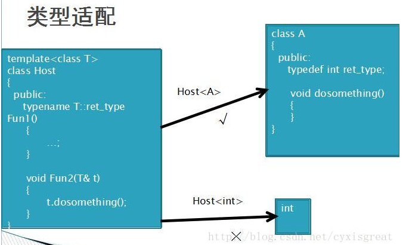
    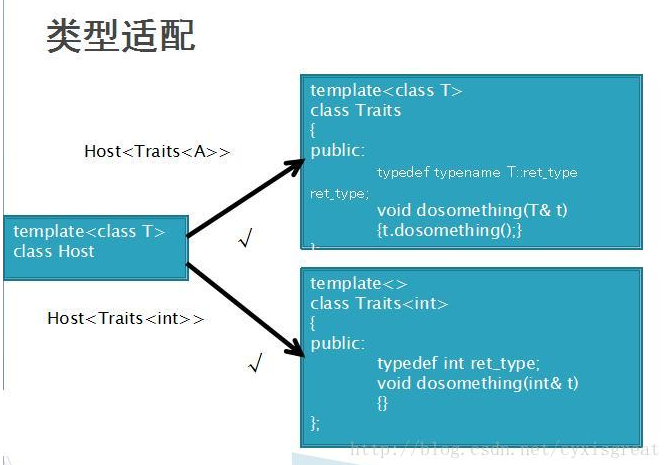
    - **函数转发**：函数转发指的是通过模板类将函数指针以及它的参数类型记录下来，在需要的时候再对函数进行调用。函数转发的意义是啥。
    ```C++
    #include <iostream>
    using namespace std;

    template<typename T>  class function; // 为什么这里声明用的是 typename T，下面的定义则是 typename R 和 typename A0。
    template<typename R, typename A0>
    class function <R (A0)> // 为什么可以这么写。
    {
    public:
        typedef R(*fun)(A0 );
        function(fun ptr):m_ptr(ptr){}
        R operator()(A0 a)
        {(*m_ptr)(a);}
        fun m_ptr;
    };

    int testFun(int a) {
        printf("%d", a);
        return 2;
    }

    int main() {
        function<int (int)> f1(&testFun); // 该例中，把函数 testFun 的函数指针，以及它的函数签名 int (int) 作为模板参数保存在了 f1 这个对象中。在需要的时候，就可以用 f1 对这个函数进行调用。
        f1(4);
        return 0;
    }
    ```
    - **元编程**：元编程的主要思想为，在编译器实现对类型或数值的计算；利用模板特化机制实现编译期循环结构，模板元程序则由编译器在编译期解释执行。
  > 参考：[interview.md 模板]()，[C++ 模板总结](https://blog.csdn.net/tonglin12138/article/details/88595747)，[C++模板全特化、偏特化](https://blog.csdn.net/m_buddy/article/details/72973207)，[C++ 模板应用浅析](https://blog.csdn.net/cyxisgreat/article/details/37957687)
</details>
<details>
  <summary>成员初始化列表</summary>

  - **为什么用成员初始化列表会快一些**：因为对象的初始化动作发生在进入构造函数本体之前，在构造函数内部进行的都是赋值操作，而不是初始化。假定再构造函数内对成员变量进行赋值，如果是内置类型的话，没有多少影响，但是如果是类对象，那么就会先调用一次构造函数，然后再调用赋值操作符进行赋值操作。如果使用成员初始化列表就可以免去一次赋值操作。
  - 可以使用派生类的成员初始化列表调用基类的带参构造函数，派生类构造函数一般隐式调用基类的默认构造函数，想要调用基类的带参构造函数就在派生类的构造函数的初始化列表中调用基类的带参构造函数。
  - 初始化 `const` 成员变量的唯一方法就是使用初始化列表。
  - 成员变量的初始化顺序和初始化列表中列出的变量的顺序无关，只和成员变量再类中声明的顺序有关。
  > [Effective C++ 条款04-确定对象被使用前已被初始化]()，[MainWindow::MainWindow(QWidget *parent) : QMainWindow(parent)解析](https://blog.csdn.net/weixin_41157654/article/details/80820520)，[interview.md 初始化列表]()

</details>
<details>
  <summary>C++ 智能指针</summary>

  - 用户开辟一块内存，使用以后容易忘记释放，会造成内存泄漏，如果释放了内存，但是没有将指针置空，那么指针将变成野指针。为了解决这两个问题，引入智能指针，**以对象管理资源**，获得资源后立刻放入管理对象，管理对象运用析构函数确保资源被释放。
  - **auto_ptr**：`auto_ptr` 在拷贝和赋值过程中，会直接剥夺原对象对内存的控制权，转交给新对象，然后将原对象置为 `nullptr`，如果后面再次访问原对象就会出错。C++11 已移除 `auto_ptr`。
  - **unique_ptr**：`unique_ptr` 直接禁用拷贝和赋值，任何调用他们的行为都将在编译期间报错。
  - **shared_ptr**：`shared_ptr` 既不会直接剥夺原对象对内存的控制权，也允许进行拷贝和赋值，因为它引入了**引用计数**（用指针记录），`shared_ptr` 在内部为资源维护了一个引用计数，用来记录该资源被几个 `shared_ptr` 对象共享。当有一个对象加入管理该资源时，资源的计数加一；在对象销毁时，资源的计数减一，当资源的计数为 0 时，需要释放该资源，当资源的计数不为 0 时，说明还有其他的对象在管理此资源，那么就不能释放该资源。但是 `shared_ptr` 存在由引用计数导致的**循环引用问题**，本来还有线程安全问题，但是 C++ 库针对这一点，将 `shared_ptr` 中的引用计数操作改成原子操作，所以 `shared_ptr` 是线程安全的，而循环引用问题通过引入 `weak_ptr` 解决。
  - **weak_ptr**：`weak_ptr` 为解决 `shared_ptr` 的循环引用问题而设计，它本身不能直接定义为管理原始指针的对象，只能将 `shared_ptr` 对象赋值给 `weak_ptr`，同时也不能将 `weak_ptr` 对象直接赋值给 `shared_ptr` 类型的对象，最重要的一点是赋值给它不会增加引用计数。举个例子，如下代码中，`ptr_a` 和 `m_ptr_b` 指向同一个资源，`ptr_b` 和 `m_ptr_a` 指向同一个资源，当离开局部作用域后，`ptr_a` 和 `ptr_b` 被析构，两个资源各自的引用计数减一，但要注意的是析构的是 `ptr_a` 和 `ptr_b` ，是智能指针，而不是他们管理的资源，所以`m_ptr_a` 和 `m_ptr_b` 不会被析构，由于此时 `m_ptr_a` 和 `m_ptr_b` 还管理着这两个资源，所以直到离开作用域都不会释放该资源。看图理解。当引入 `weak_ptr` 后，由于 `weak_ptr` 不会增加引用计数，在进行完 `ptr_a->set_ptr(ptr_b);ptr_b->set_ptr(ptr_a);` 操作后，两个资源的引用计数还是一，所以当 `ptr_a` 和 `ptr_b` 析构后，资源的引用计数变为 0，他们管理的资源也就可以被析构了。
  ```C++
  // 循环引用问题
  #include <iostream>
  #include <memory>
  using namespace std;

  class CB;
  class CA
  {
  public:
      void set_ptr(shared_ptr<CB>& ptr) { m_ptr_b = ptr; }
  private:
      shared_ptr<CB> m_ptr_b;
  };

  class CB
  {
  public:
      void set_ptr(shared_ptr<CA>& ptr) { m_ptr_a = ptr; }
  private:
      shared_ptr<CA> m_ptr_a;
  };

  int main() {
      {
          shared_ptr<CA> ptr_a(new CA()); 
          shared_ptr<CB> ptr_b(new CB());

          ptr_a->set_ptr(ptr_b);
          ptr_b->set_ptr(ptr_a);
      }

      return 0;
  }
  ```
  
  ```C++
    // 引入 weak_ptr 解决循环引用问题
  #include <iostream>
  #include <memory>
  using namespace std;

  class CB;
  class CA
  {
  public:
      void set_ptr(shared_ptr<CB>& ptr) { m_ptr_b = ptr; }
  private:
      weak_ptr<CB> m_ptr_b; // 改成 weak_ptr
  };

  class CB
  {
  public:
      void set_ptr(shared_ptr<CA>& ptr) { m_ptr_a = ptr; }
  private:
      weak_ptr<CA> m_ptr_a; // 改成 weak_ptr
  };

  int main() {
      {
          shared_ptr<CA> ptr_a(new CA()); 
          shared_ptr<CB> ptr_b(new CB());

          ptr_a->set_ptr(ptr_b);
          ptr_b->set_ptr(ptr_a);
      }

      return 0;
  }
  ```
  > 参考：[C++智能指针](https://blog.csdn.net/Ferlan/article/details/86513679)，[智能指针（三）：weak_ptr 浅析](https://blog.csdn.net/albertsh/article/details/82286999)

</details>
<details>
  <summary>C++的四种强制转换</summary>

  - **static_cast**：强迫隐式转换，与 C 语言中的强迫转换功能基本相同。可用于类层次结构中父类和子类之间的指针或引用的转换，其中向上转换是安全的，向下转换是不安全的；可用于有基本数据类型之间的转换；可把空指针转换为目标类型的指针；可把任何类型的表达式转换为 void 类型。  
  - **dynamic_cast**：主要用作安全向下转型，向上转型与 static_cast 的效果是一样的，当进行下行转换的时候，要求基类中至少有一个虚函数，才会进行安全检查。
  - **const_cast**：将 const 类型转换为非 const 类型，去除掉表达式的 const 属性。
  - **reinterpret_cast**：用于低级转换，数据的二进制形式重新解释，但是不改变其值。用于进行各种不同类型的指针之间、不同类型的引用之间、指针和能容纳指针的整数类型之间（如 int* 类型转换为 int 类型）的转换。
  - **为什么 static_cast 的向下转型是不安全的，而 dynamic_cast 的向下转型是安全的**：因为运行时 dynamic_static 会做安全检查，而 static_cast 不会。一个指向派生类对象的基类指针转型为其派生类的指针类型，这个动作本身就是安全的，因为基类指针指向的这个派生类对象包含了派生类部分，只是基类指针指向的内存没有包含派生类部分，现在重新让一个派生类指针指向该派生类对象，这个派生类指针指向的内存自然会包含该派生类对象的派生类部分；一个指向基类对象的基类指针转型为其派生类的指针类型，这种情况是不好的，因为一个基类对象没有包含派生类的部分，如果强行转换，那么派生类部分的数据就是未知的，对于这种情况 static_cast 不会做出检查，会直接转换，将所指向的内存大小改成派生类的大小，但是 dynamic_cast 会做出检测，返回空指针，用户就可以知道这里出错了。
  
  > 参考：[C++ 中四种 cast 类型强制转换方式](https://blog.csdn.net/epluguo/article/details/12251759)，[关于 dynamic_cast、static_cast 转换做安全检查的不同](https://blog.csdn.net/znzxc/article/details/81177792)

</details>
<details>
  <summary>左值，右值，左值引用，右值引用</summary>

  - **左值**：左值是指表达式结束后依然存在的持久化对象。如 `int x = 1;`，其中 x 是左值。
  - **右值**：右值是指表达式结束时就不再存在的临时对象。如 `int x = 1;`，其中 1 是右值。
  - **左值引用**：用于对左值的引用，通过 `&` 来声明。在定义左值引用时，`=` 右边的要求是一个可修改的左值。
    ```C++
    #include <stdio.h>

    int main()
    {
        const int x = 5;
        int y = 1;
        int z = 1;
        int & tmp1 = x;  // ERROR: x 不是一个可修改的左值
        int & tmp2 = 5;  // ERROR: 5 是一个右值
        int & tmp3 = y + z;  // ERROR: y + z 是一个右值
        return 0;
    }
    ```
    - **左值引用的作用**：用于 rangeFor 循环；避免复制大的对象；参与函数中参数传递。
  - **右值引用**：用于对右值的引用，通过 `&&` 来声明。在定义右值引用时，`=` 右边要求是一个右值。
    ```C++
    #include <stdio.h>

    int main()
    {
        int && x = 5;
        printf("x = %d\n", x);
        return 0;
    } 
    ```
    - **右值引用的作用**：可以通过右值引用，充分使用临时变量，或者即将不使用的变量即右值的资源，减少不必要的拷贝，提高效率。
    - **移动构造函数**：有些时候我们需要一个对象的副本，使用复制构造；而有些时候我们有可能只是想将这个对象换个地方，这时候便可以使用移动构造函数。在移动构造函数中使用**浅拷贝**，避免深拷贝需要重新开辟新的堆空间带来的开销，同时在移动构造函数中将源对象中的指针置为 `nullptr`，避免源对象析构时释放堆上的内存。C++11 引入移动语义：**源对象资源的控制权全部交给目标对象**。
    ![avatar])(./移动构造函数.png)
    ```C++
    A(A && a): //  移动构造函数，没有 const
    p(a.p) // 浅拷贝
    {
        a.p = nullptr; // 将源对象中的资源设置为 nullptr，这样的话 delete 源对象的时候，源对象释放的 p 是一个 nullptr，不会影响现在的对象
    }

    A & operator=(A && a) // 移动赋值运算符
    {
        if(&a == this) return *this;

        p = a.p;
        a.p = nullptr;
        return *this;
    }
    ```
    - **std::move()**：`std::move()` 的作用是将传入的值转换为右值。一般结合移动构造函数和移动赋值构造函数使用，`std::move()` 将对象转换为右值，并作为移动构造函数或者移动赋值构造函数的参数。
  > 参考：[C++ 右值引用（std::move）](https://zhuanlan.zhihu.com/p/94588204)，[C/C++-左值、右值及引用](https://www.cnblogs.com/Bylight/p/10530274.html)，[移动构造函数](https://blog.csdn.net/sinat_25394043/article/details/78728504)，[C++ 的坑-移动构造函数和移动赋值运算符](https://zhuanlan.zhihu.com/p/44156491)

</details>
<details>
  <summary>C++11 中的线程库</summary>


</details>
<details>
  <summary>volatile</summary>

  - `volatile` 关键字是一种类型修饰符，用它声明的类型变量可以被某些编译器未知的因素改变（操作系统，硬件等）。所以使用该关键字告诉编译器不应对这样的对象进行优化。
  - `volatile` 关键字声明的变量，每次访问都必须从内存中取值（没有被 `volatile` 修饰的变量，可能由于被编译器优化，从CPU寄存器中取值）。
  - `const`（编译期保证代码中没有被修改的地方，运行的时候不受限制）可以是 `volatile`（编译期告诉编译器不优化该变量，在运行期每次都从内存中取值）：表示一个变量在程序编译期不能被修改并且不能被优化，在程序运行期变量值可能会被修改，每次使用到该变量值都需要从内存中读取，防止意外错误。
  - 指针可以是`volatile`的。
  > 参考：[interview.md volatile]()

</details>
<details>
  <summary>assert</summary>

  - `assert` 的作用是计算表达式 expression ，如果其值为假，那么它先向 `stderr` 打印一条出错信息,然后通过调用 `abort` 来终止程序运行。
  - 使用 `assert` 要包含头文件 `assert.h`。
  - `assert` 是宏，不是函数。
  - 可以通过在包含 `#include` 的语句之前插入 `#define NDEBUG` 来禁用 `assert` 调用。
  - `assert` 可以用于在函数开始处检验传入参数的合法性。
  - 每个 `assert` 只检验一个条件比较好，因为同时检验多个条件时，如果断言失败，无法直观的判断是哪个条件失败。
  - 在 `assert` 中不能使用改变环境的语句，因为 `assert` 只在 DEBUG 生效，如果这么做，会使用程序在真正运行时遇到问题。`assert` 只有在 Debug 版本中才有效，如果编译为 Release 版本则被忽略。
  > 参考：[断言（assert）的用法](https://www.runoob.com/w3cnote/c-assert.html)

</details>
<details>
  <summary>union</summary>

  - union（联合体）是一种**节省空间**的特殊的类，一个 union 可以有多个数据成员，但是在**任意时刻只有一个数据成员可以有值**。当某个成员被赋值后其他成员变为未定义状态。
  - union 变量所占用的内存长度等于最长的成员的内存长度。
  - 其成员的默认访问权限为 public。
  - 可以含有构造函数、析构函数。
  - 可以包含没有任何构造函数和析构函数的类对象。
  - 不能含有引用类型的成员。
  - 不能继承自其他类，不能作为基类。
  - 不能含有虚函数。
  - 不能包含 static 成员。
  - 匿名 union 指的是一个没有赋予他名称的 union。
  - 匿名 union 在其定义所在作用域可直接访问 union 成员。
  - 匿名 union 不能包含 protected 成员或 private 成员。
  - 全局匿名 union 必须是 static 的。
  - union 的一个作用是可以用来**测试 CPU 是大端模式还是小端模式**。对于一个由 2 个字节组成的 16 位整数，在内存中存储这两个字节有两种方法：一种是将低序字节存储在起始地址，这称为小端（little-endian）字节序；另一种方法是将高序字节存储在起始地址，这称为大端（big-endian）字节序。
  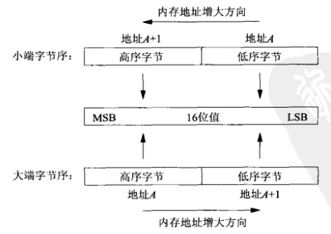
  ```C++
  #include <iostream>
  using namespace std;

  void checkCPU ()
  {
      union MyUnion {
          int a;
          char c;
      } test;
      test.a = 1;
      if (test.c == 1)  // union 中的成员变量的起始地址是相同的
          cout << "little endian" <<endl;
      else cout << "big endian" <<endl;
  }

  int main()
  {
      checkCPU();
      return 0;
  }
  ```
  整型 1 在小端字序中的存储：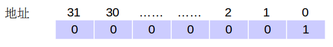
  整型 1 在大端字序中的存储：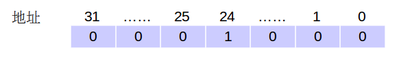
  > 参考：[interview.md union]()，[union介绍](https://www.cnblogs.com/jeakeven/p/5113508.html)，[union变量存储](https://www.cnblogs.com/zhangchaoyang/articles/2713658.html)

</details>
<details>
  <summary>友元类和友元函数</summary>

  - 友元函数是可以直接访问类的私有成员（包括 private 和 protected）的非成员函数。它是定义在类外的普通函数，它不属于任何类，但需要在类的定义中加以声明，声明时只需在友元的名称前加上关键字 `friend`。友元函数的声明可以放在类的私有部分，也可以放在公有部分，它们是没有区别的，都说明是该类的一个友元函数。
  - 友元类的所有成员函数都是另一个类的友元函数，都可以访问另一个类中的隐藏信息。
    - 以下语句说明 `class B` 是 `class A` 的友元类。
    ```C++
    class A {
        ......
    public:
        friend class B;
        ......
    }
    ```
    - 友元关系不能被继承。
    - 友元关系是单向的，不具有交换性。若 `clsss B` 是 `class A` 的友元，`class A`不一定是 `class B` 的友元，要看在类中是否有相应的声明。
    - 友元关系不具有传递性。若 `class B`是 `class A` 的友元，`class C` 是 `class B` 的友元，`class C` 不一定是 `class A` 的友元，同样要看类中是否有相应的申明。
  - 友元能够使得普通函数直接访问类的保护数据，避免了类成员函数的频繁调用，可以节约处理器开销，提高程序的效率，但这样会破坏类的封装性，这是友元的缺点。在现在cpu速度越来越快的今天我们并不推荐使用它。
  > 参考：[C++ 友元函数和友元类用法详解](https://blog.csdn.net/fanyun_01/article/details/79122916)

</details>
<details>
  <summary>decltype</summary>

  - `decltype` 用于求表达式的类型。`decltype(expression)`。
  ```C++
  int i;
  double t;
  struct A { double x; };
  const A* a = new A();
  decltype(a) x1;  // x1 是 A*
  decltype(i) x2;  // x2 是 int
  decltype(a->x) x3;  //  x3 是 double
  ```
  - C++11 中， 当函数返回类型为 `auto` 时，`auto` 和 `decltype` 配合一起使用，使用 `decltype` 告知返回类型。
  ```C++
  #include <iostream>
  using namespace std;
  
  struct A {
      int i;
      A(int ii) : i(ii) {}
  };
  
  A operator + (int n, const A & a) {
      return A(a.i + n);
  }
  
  template <class T1, class T2>
  // 这里告诉编译器，add 的返回值为 decltype(x + y) 类型的 ，编译器将 add 实例化时，会自动推断出 x + y 的类型，C++11 中 函数返回值若为 auto，需要和 decltype 配合使用
  auto add(T1 x, T2 y) -> decltype(x + y) { 
      return x + y;
  }

  int main() {
      auto d = add(100, 1.5);  // d 是 double 类型，d = 101.5
      auto k = add(100, A(1));  // k 是 A 类型，因为表达式“100+A(1)”是A类型的
      cout << d << endl;
      cout << k.i << endl;
      return 0;
  }
  ```
  - C++14 中，当函数返回类型为 `auto` 时，则可以不用 `decltype`。
  ```C++
  auto add (int a, int b) {
      int i = a + b;
      return i;
  }
  ```
  > 参考：[C++11 auto 和 decltype 关键字](http://c.biancheng.net/view/438.html)

</details>

## 网络
<details>
  <summary>TCP 粘包拆包</summary>

  - 拆包原因1：要发送的数据大于 TCP 发送缓冲区剩余空间大小。
  - 拆包原因2：待发送数据大于 MSS（最大报文段长度），TCP 在传输前将进行拆包。
  - 粘包原因1：要发送的数据小于 TCP 发送缓冲区的大小，TCP 将多次写入缓冲区的数据一次发送出去。
  - 粘包原因2：接收数据端的应用层没有及时读取接收缓冲区中的数据。
  - 解决方案1：给每个数据包添加包首部，首部中应该至少包含数据包的长度，这样接收端在接收到数据后，通过读取包首部的长度字段，便知道每一个数据包的实际长度
  - 解决方案2：发送端将每个数据包封装为固定长度，接收端每次从接收缓冲区中读取固定长度的数据就自然而然的把每个数据包拆分开来。
  - 解决方案3：可以在数据包之间设置边界，服务端从网络流中按边界分离出各个数据包。
  - TCP 是基于字节流的，虽然应用层和 TCP 传输层之间的数据交互是大小不等的数据块，但是 TCP 把这些数据块仅仅看成一连串无结构的字节流，没有边界；另外从 TCP 的帧结构也可以看出，在 TCP 的首部没有表示数据长度的字段，基于上面两点，在使用 TCP 传输数据时，才有粘包或者拆包现象发生的可能；UDP 是基于报文发送的，从 UDP 的帧结构可以看出，在 UDP 首部采用了 16bit 来指示 UDP 数据报文的长度，因此在应用层能很好的将不同的数据报文区分开，从而避免粘包和拆包的问题。
  - 还有 TCP 拆包粘包表现形式的图没有画。
  > 参考：[TCP粘包，拆包及解决方法](https://blog.csdn.net/wxy941011/article/details/80428470)，[计算机网络-自顶向下方法 3.5.1-TCP 连接]()
  
</details>
<details>
  <summary>HTTP 与 HTTPS 的区别及 HTTPS 流程</summary>
  
  - HTTP：HTTP 也称超文本传输协议，是 Web 的应用层协议，由一个客户程序和一个服务器程序组成，客户程序和服务器程序运行在不同的端系统中，通过交换 HTTP 报文进行会话。
  - HTTPS：HTTPS 也称安全超文本传输协议，在数据进行传输前，对数据进行加密，使用 HTTP + SSL 实现。
  - HTTP 明文传输，数据都是未加密的，安全性较差，HTTPS数据在传输过程是加密的，安全性较好。
  - 使用 HTTPS 协议需要到 CA（Certificate Authority，数字证书认证机构） 申请证书，一般免费证书较少，因而需要一定费用。
  - HTTP 页面响应速度比 HTTPS 快，主要是因为 HTTP 使用 TCP 三次握手建立连接，客户端和服务器需要交换3个包，而 HTTPS 除了 TCP 的三个包，还要加上 ssl 握手需要的9个包，所以一共是12个包。
  - HTTP 的标准端口80，HTTPS 标准端口是443。
  - **HTTPS 流程**：(1) 客户使用 https 的 url 访问 Web 服务器的443端口，向服务器发起 HTTPS 请求 $\Longrightarrow$ (2) 服务器收到请求后，将网站的证书信息（包含 CA 证书的公钥）传送一份给客户端 $\Longrightarrow$ (3) 客户收到服务器的证书后，验证其合法性，如果合法，客户生成一个随机值，作为客户的密钥，使用服务器公钥对随机值进行非对称加密 $\Longrightarrow$ (4) 将加密后的客户密钥发送给服务器 $\Longrightarrow$ (5) 服务器接收到客户发来的密文后，用服务器私钥进行非对称解密，解密之后的明文就是客户密钥，然后用客户密钥对数据进行对称加密，这样数据就成了密文 $\Longrightarrow$ (6) 服务器将密文发送给客户 $\Longrightarrow$ (7) 客户收到服务器发来的密文，用客户密钥对其进行对称解密，得到服务器发送的数据。
  - 一个 HTTPS 请求包含了两次 HTTP 传输，HTTPS 传输过程中使用了3个密钥，服务器公钥，用于非对称加密,服务器私钥，用于非对称解密，客户密钥，用于对称加密和解密。
  > 参考：[HTTP 和 HTTPS](https://www.cnblogs.com/zhenguoli/p/8622933.html)，[HTTPS 原理及流程](https://www.jianshu.com/p/14cd2c9d2cd2)，[HTTPS过程以及详细案例](https://www.cnblogs.com/helloworldcode/p/10104935.html)，[计算机网络-自顶向下方法]()

</details>
<details>
  <summary>HTTP 状态码</summary>

  - 200：请求成功。
  - 301：资源被永久转移到其他 URL。
  - 400：指示该请求不能被服务器理解。
  - 404：请求的资源不在服务器上。
  - 500：内部服务器错误。
  - 505：服务器不支持请求报文使用的 HTTP 协议版本。
  - 1**：信息，服务器收到请求，需要请求者继续执行操作。
  - 2**：成功，操作被成功接收并处理。
  - 3**：重定向，需要进一步的操作以完成请求。
  - 4**：客户端错误，请求包含语法错误或无法完成请求。
  - 5**：服务器错误，服务器在处理请求的过����中发生了错误。
  > 参考：[HTTP 状态码](https://www.runoob.com/http/http-status-codes.html)

</details>
<details>
  <summary>socket 网络编程</summary>
  
  - `socket`：`socket` 函数用于创建套接字。
    - 函数原型：`SOCKET PASCAL FAR socket(int af, int type, int protocol)`。
    - `af`：指定通信发生的区域，`AF_UNIX`，`AX_INET`，`AF_INET6`，`AF_UNIX` 为 UNIX 本地通信，`AX_INET` 是使用 IPV4 通信，`AF_INET6` 是使用 IPV6 通信。
    - `type`：  描述要建立的套接字类型：`SOCK_STREAM`，`SOCK_DGRAM`，`SOCK_RAW`，`SOCK_STREAM` 是 流式套接字，`SOCK_DGRAM` 是 数据报式套接字，`SOCK_RAW` 是���������始式套接字。
    - `protocol`：说明该套接字使用的特定协议，选择 TCP 或是 UDP。
  - `bind`：将套接字地址（包括本地主机地址和本地端口地址）与所创建的套接字绑定起来。 
    - 函数原型：`int PASCAL FAR bind(SOCKET s, const struct sockaddr FAR * name, int namelen)`。
  - `connect`：用于建立连接。
    - 函数原型：`int PASCAL FAR connect(SOCKET s, const struct sockaddr FAR * name, int namelen)`。
  - `accept`： 用于使服务器等待来自某客户进程的实际连接。
    - 函数原型：`SOCKET PASCAL FAR accept(SOCKET s, struct sockaddr FAR* addr, int FAR* addrlen)`。
  - `listen`：用于监听客户发来的连接请求。
    - 函数原型：`int PASCAL FAR listen(SOCKET s, int backlog)`。
  - `send` 函数用于发送数据。
    - 函数原型：`int PASCAL FAR send(SOCKET s, const char FAR *buf, int len, int flags)`。
  - `recv`：用于接收数据。
    - 函数原型：`int PASCAL FAR recv(SOCKET s, char FAR *buf, int len, int flags)`。
  - `select` 函数用于检测一个或多个套接字的状态，对每一个套接字来说，这个调用可以请求读、写或错误状态方面的信息。请求给定状态的套接字集合由一个 `fd_set` 结构指示，在返回时，此结构被更新，以反映那些满足特定条件的套接字的子集，同时， `select` 函数调用返回满足条件的套接字的数目。
    - 函数原型：`int PASCAL FAR select(int nfds, fd_set FAR * readfds, fd_set FAR * writefds, fd_set FAR * exceptfds, const struct timeval FAR * timeout)`。
    - 使用 `select` 函数可以进行 **I/O 多路复用**。当程序中使用 `connect`，`accept`，`recv`这几个函数时，程序就是阻塞程序，执行到这些函数的时候必须等待某个事件发生，如果没有发生，进程或者线程就被阻塞，而且如果有多个套接字都要传输的时候，一个套接字在发送和接收过程中一直占用着设定的端口，此时其他套接字无法在该端口传输数据，其阻塞时间又会浪费实际可用的时间，使得效率很低。所以可以使用 `select` 函数，`select` 函数可以检测套接字的状态，只要轮询 `select` 函数，查看当前是否有可以处理的套接字即可。
  - 还差两张 socket 通信原理的图没画，一个 TCP 的，一个 UDP 的。
  > 参考：[socket 技术详解](https://www.cnblogs.com/fengff/p/10984251.html)，[socket 通信中 select 函数的使用和解释](https://www.cnblogs.com/gangzilife/p/9766292.html)，[IO 多路复用](https://www.jianshu.com/p/dd5b6893bef7)
  
</details>
<details>
  <summary>通信光缆被挖掘机挖断了，现在建立好的TCP的连接变成啥样，有进行四次挥手嘛 ：逐渐超时被动关闭</summary>

</details>
<details>
  <summary>TCP 三次握手</summary>

  - **三次握手过程**
    - 假定 A 为客户端，B为服务端。
    - 首先 B 处于监听状态，等待客户的连接请求。
    - A 向 B 发送连接请求报文，称为 **SYN 报文段**，报文段中设置 SYN = 1，序号字段 Seq Number 设置为 x。
    - B 收到 SYN 报文段后，如果同意建立连接，则向 A 发送连接确认报文，称为 **SYNACK 报文段**，报文段中设置 SYN = 1，确认字段 Ack Number 设置为 x + 1，序号字段设置为 y。
    - A 收到 B 的 SYNACK 报文段后，A 向 B 发送确认报文段，设置 SYN = 0，确认字段 Ack Numbwe 设置为 y + 1，序号字段设置为 x + 1。 
  - **为什么是三次握手，不是二次握手**
    - **为了防止历史失效连接请求报文段引发混乱**，假定客户端发送的第一个连接请求报文段没有丢失，而是在某个网络节点长时间滞留，但是此时客户端已经重新发送了新的连接请求并建立了连接，假定此时此次连接结束并释放，而在网络滞留的那个请求报文段到达服务端，那么服务端此时会认为是客户端新发送的连接请求。现在假定使用两次握手，那么当服务端接收到 SYN 报文段，向客户端发送一个确认报文段，服务端此时认为已经进入连接，但是第一个连接请求实际上已经废弃了，所以客户端不会和服务端建立连接，只是服务端单方面认为建立了连接，并一直等待客户端发送数据过来，导致资源浪费；假定使用三次握手，当服务端接收到 SYN报文段，向客户端发送一个 SYNACK 报文段，并等待客户端发送确认报文段以建立连接，客户端检查接收到的 SYNACK 报文段，由于这是历史失效连接，客户端并不会返回确认报文段，而是发送 RST 报文段给服务端，表示中止这一次连接。
  - **为什么是三次握手，不是四次握手**
    - 这里的四次握手其实是客户端到服务端的SYN $\Rightarrow$ 服务端到客户端的 ACK $\Rightarrow$ 服务端到客户端的 SYN $\Rightarrow$ 客户端到服务端的 ACK；三次握手则是客户端到服务端的SYN $\Rightarrow$ 服务端到客户端的 SYN + ACK $\Rightarrow$ 客户端到服务端的 ACK。所以三次握手相当于把四次握手的第2个步骤和第3个步骤合为一个步骤。
  > 参考：[计算机网络-自顶向下方法 3.5-面向连接的运输：TCP]()，[TCP 为什么是三次握手，而不是两次或四次](https://www.zhihu.com/question/24853633)，[计算机网络-传输层](https://github.com/CyC2018/CS-Notes/blob/master/notes/%E8%AE%A1%E7%AE%97%E6%9C%BA%E7%BD%91%E7%BB%9C%20-%20%E4%BC%A0%E8%BE%93%E5%B1%82.md#tcp-%E7%9A%84%E4%B8%89%E6%AC%A1%E6%8F%A1%E6%89%8B)

</details>
<details>
  <summary>TCP 四次挥手</summary>

  - **四次挥手过程**
    - 假定 A 为客户端，B 为服务端
    - 以下描述不讨论序号和确认号，根据序号和确认号的规则可确定其值。
    - A 发送连接释放报文，报文段中 FIN = 1，A进入 FIN-WAIT-1 状态。
    - B 收到之后发出确认，此时 TCP 处于半关闭状态，B 能向 A 发送数据但是 A 不能向 B 发送数据，A进入 FIN-WAIT-2 状态。
    - 当 Ｂ不再需要连接时，发送连接释放报文，报文段中 FIN = 1。
    - 当 A 收到后发出确认，进入 TIME-WAIT 状态，等待 2 * MSL（最大报文存活时间）后释放连接。
    - B 收到 A 的确认后释放连接。
  - **为什么是四次挥手**
    - 由于TCP连接是全双工的，因此每个方向都必须单独进行关闭。这原则是当一方完成它的数据发送任务后就能发送一个 FIN 来终止这个方向的连接。
  - **什么要有 TIME-WAIT 阶段**
    - 客户端发送出最后的 ACK 报文，但该 ACK 报文可能丢失。服务端如果没有收到 ACK 报文，将不断重复发送 FIN 报文。所以客户端不能立即关闭，它必须确认服务端接收到了该 ACK 报文。客户端会在发送出 ACK 报文之后进入到 TIME_WAIT 状态。客户端会设置一个计时器，等待 2 * MSL 的时间。如果在该时间内再次收到 FIN，那么客户端会重发 ACK报文 并再次等待 2 * MSL。
  - **为什么四次挥手不把 ACK 报文段和 FIN 报文段合为一个报文段发送给客户端，像三次握手把服务端的 ACK 报文段和 SYN 报文段合为一个报文段发送给客户端一样**
    - 当收到对方的 FIN 报文时，仅仅表示对方不再发送数据了但是还能接收数据，己方是否现在关闭发送数据通道，需要上层应用来决定，因此，己方 ACK 和 FIN 一般都会分开发送。
  > 参考：[计算机网络-传输层](https://github.com/CyC2018/CS-Notes/blob/master/notes/%E8%AE%A1%E7%AE%97%E6%9C%BA%E7%BD%91%E7%BB%9C%20-%20%E4%BC%A0%E8%BE%93%E5%B1%82.md#tcp-%E7%9A%84%E4%B8%89%E6%AC%A1%E6%8F%A1%E6%89%8B)，[TCP的三次握手与四次挥手理解及面试题](https://blog.csdn.net/qq_38950316/article/details/81087809)

</details>
<details>
  <summary>socket 中的 accept() 发生在 TCP 三次握手的哪个阶段</summary>

  - `accept()` 发生在三次握手之后。
  > 参考：[TCP 服务端 accept 发生在三次握手的哪一个阶段](https://www.cnblogs.com/taoshihan/p/11217150.html)

</details>
<details>
  <summary>HTTP 请求方法有几种</summary>

  - **GET**：获取资源，GET 方法用来请求访问已被 URI 识别的资源。指定的资源经服务器端解析后返回响应内容。
  - **HEAD**：获取报文首部，和 GET 方法类似，但是不返回报文实体主体部分，主要用于确认 URL 的有效性以及资源更新的日期等。
  - **POST**：传输实体的主体，POST 主要用来传输数据，而 GET 主要用来获取资源。
  - **PUT**：上传文件，由于自身不带验证机制，任何人都可以上传文件，因此存在安全性问题，一般不使用该方法。
  - **PATCH**“：对资源进行部分修改，PUT 也可以用于修改资源，但是只能完全替代原始资源，PATCH 允许部分修改。
  - **DELETE**：删除文件，按请求 URI 删除指定的资源，与 PUT 功能相反，并且同样不带验证机制。
  - **OPTIONS**：查询支持的方法和检查服务器性能。
  - **CONNECT**：要求在与代理服务器通信时建立隧道，实现用隧道协议进行 TCP 通信，使用 SSL 和 TLS 协议把通信内容加密后经网络隧道传输。
  - **TRACE**：追踪路径，服务器会将通信路径返回给客户端。
  > [图解 HTTP 2.5-告知服务器意图的 HTTP 方法]()
  
</details>
<details>
  <summary>URL，URN，UNI</summary>

  - **URL**：统一资源定位符，URL 表示某一互联网资源的地点，互联网资源和 URL 唯一对应，URL 是 URI 的子集。
  - **URN**：统一资源名称，URN 表示一个实体的标识符，实体和 URN 唯一对应，URN 是 URI 的子集。
  - **URI**：统一资源标识符，URI 用字符串标识某一互联网资源，互联网资源和 URI 唯一对应。
  > 参考：[HTTP 协议中 URI 和 URL 有什么区别](https://www.zhihu.com/question/21950864)

</details>
<details>
  <summary>TCP 拥塞控制</summary>

  - 如果网络出现拥塞，分组将会丢失，此时发送方会继续重传，从而导致网络拥塞程度更高。因此在出现拥塞的时候，应该控制发送方发送的速率。TCP 主要通过四个算法进行拥塞控制：慢开始、拥塞避免、快速恢复。
  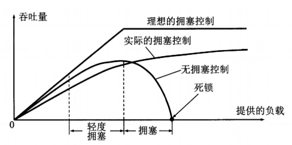
  - TCP 发送方需要维护一个叫做**拥塞窗口**（cwnd）的状态变量，他对一个 TCP 发送方的发送速率做出了限制；还有一个叫做**慢启动阈值**的状态变量，用于限制慢启动阶段的最大速率。
  - TCP 的**丢包事件**定义为：出现超时，或是收到接收方的 3 个冗余 ACK。
  - **慢开始**
    - **慢开始阶段开始**：当一条 TCP 连接开始时，令 cwnd = 1，即发送方只能发送一个报文段，当发送方收到确认后 cwnd += 1，并且之后发送方每次接收到一个确认报文段，都将 cwnd += 1，这个看起来是线性增长，其实是**指数增长**，因为一轮收到的每个确认都将 cwnd += 1，相当于这一轮将 cwnd 的值翻了一倍。
    - **慢开始阶段结束**：如果存在一个有超时指示的丢包事件（即检测到拥塞），TCP 发送方将设置 ssthresh = cwnd / 2、cwnd = 1，并重新开始慢启动过程。当 cwnd 的值到达或超过 ssthresh 的值的时候，TCP 由慢开始模式转向拥塞避免模式。
  - **拥塞避免**：
    - **拥塞避免阶段开始**：一旦从慢开始转换为拥塞避免模式，cwnd ≈ ssthresh，此时每过一个 RTT（往返延时），cwnd += 1，由于这里是每隔一段时间进行加一操作，所以是**线性增长**。
    - **拥塞避免阶段结束**：如果存在一个有超时指示的丢包事件（即检测到拥塞），TCP 发送方将设置 ssthresh = cwnd / 2、cwnd = 1，并由拥塞避免转向慢启动过程。当收到 3 个冗余 ACK 指示的丢包事件，将设置ssthresh = cwnd / 2，cwd = ssthresh，并由拥塞避免模式转向快速恢复模式。
  - **快速恢复**：
    - **快速恢复阶段开始**：快速恢复中，将 cwnd += 3，这里的 3 是指 3个 冗余 ACK。*（那快速恢复阶段 cwnd 是怎么增长的）*
    - **快速恢复阶段结束**：当丢失报文段的一个 ACK 到达时，转换为拥塞避免模式。当出现丢包事件（不管是超时引起的，还是 3 个冗余 ACK 引起的）时，将设置 ssthresh  = cwnd / 2、cwnd = 1，并转换为慢启动模式。
  
  > 参考：[计算机网络自顶向下方法 3.7-TCP 拥塞控制]()，[计算机网络-传输层](https://github.com/CyC2018/CS-Notes/blob/master/notes/%E8%AE%A1%E7%AE%97%E6%9C%BA%E7%BD%91%E7%BB%9C%20-%20%E4%BC%A0%E8%BE%93%E5%B1%82.md#tcp-%E6%8B%A5%E5%A1%9E%E6%8E%A7%E5%88%B6)

</details>
<details>
  <summary>TCP 流量控制的介绍</summary>

  - TCP 为他的应用程序提供流量控制服务以消除发送方使接收方缓存溢出的可能性。
  - TCP 通过让发送方维护一个称为接收窗口（rwnd）的变量来控制流量控制，接收窗口给告诉发送方，接收方还有多少缓存。主机 B 通过把当前的 rwnd 值放入他发给主机 A 的报文段接收窗口字段中，主机 A 就可以知道主机 B 的可用缓存空间还有多少。
  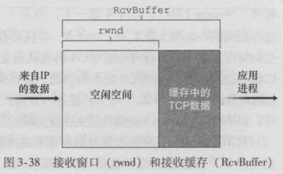
  - 使用接收窗口可能会有一定问题，假设主机 B 的接收缓存已经存满，使得 rwnd = 0，将 rwnd  = 0 的消息告诉主机 A后，主机 A 就不向主机 B 发送数据了，假设主机 B 缓存中的数据都已经被读出，且主机 B 没有数据想要发送给主机 A，那么主机 A 将一直不知道主机 B 的缓存已经有空间了，即主机 A 被阻塞不再发送数据。解决方法是当主机 B 的接收窗口为 0 时，主机 A 继续发送只有一个字节数据的报文段。
  > 参考：[计算机网络自顶向下 3.5.5-流量控制]()

</details>
<details>
  <summary>从浏览器中输入一个 url 到回显的全过程</summary>

  - **准备：DHCP、UDP、IP和以太网**
    - 用户设备上的操作系统生成一个 DHCP 请求报文，将报文放入具有目的端口 67（DHCP 服务器）和源端口 68（DHCP客户）的 UDP 报文段，报文段放置在一个具有广播 IP 目的地地址（255: 255: 255: 255）和源 IP地址 0.0.0.0 的 IP 数据报中。
    - 包含 DHCP 请求报文的 IP 数据报则北放置在以太网帧中，该以太网帧具有目的 MAC 地址 FF: FF: FF: FF，使该帧广播到与交换机连接的所有设备。
    - 路由器接收到广播以太网帧，该帧包含 DHCP 请求，一层层分解，抽取出 DHCP 报文。
    - 运行在路由器的 DHCP 服务器接收到 DHCP 报文后，DHCP 生成一个 DHCP ACK 报文，其中包含分配给用户设备的 IP 地址、默认网关路由器的 IP 地址、DNS 服务器的 IP 地址、子网块。该报文放入到一个 UDP 报文段中，UDP 报文段放入到一个 IP 数据报中，IP' 数据报再放入到一个以太网帧中，目的 MAC 地址为用户设备的 MAC 地址。
    - 包含 DHCP ACK 的以太网帧由路由器发送给交换机，因为交换机是自学习的，之前收到过用户设备发送来的以太网帧，所以交换机知道如何将该以太网帧发送给用户设备。
    - 用户收到 DHCP ACK 的以太网帧，从中抽取出 DHCP ACK 报文，获得分配给它的 IP 地址、 DNS 服务器的 IP 地址、默认网关路由器的 IP 地址、子网块。
  - **准备：DNS 和 ARP**
    - 用户设备的操作系统生成一个 DNS 查询报文，将 url 放入到 DNS 报文的问题段中，DNS 报文放置在一个目的端口为 53 的 UDP 报文段中，该 UDP 报文段放入到 IP 目的地址为 DNS 服务器地址的 IP 数据报中。
    - 用户设备将包含 DNS 请求报文的数据报放入到一个以太网帧中，该帧将发送到默认网关路由器，虽然用户设备已经知道了网关路由器的 IP 地址，但是不知道网关路由器的 MAC 地址，为了获得网关路由器的 MAC 地址，需要使用 ARP 协议。
    - 用户设备生成一个目的地址为默认网关 IP 地址的 ARP 查询报文，该报文放入到一个具有广播吗目的地址（FF: FF: FF: FF）的以太网帧中，并向交换价发送该以太网帧，交换机将该帧交付给所有连接的设备，包括网关路由器。
    - 网关路由器接收到包含该 ARP 报文的以太网帧，发现 ARP 报文中的目标 IP 地址与其接收到该帧的接口的 IP 地址一致，他将 ARP 回答报文放在一个以太网帧中，其目的 MAC 地址为用户设备的 MAC 地址，并向交换机发送给帧，再由交换机交付给用户设备。
    - 用户设备接收到包含 ARP 报文的帧，并从 ARP 报文中抽取网关路由器的 MAC 地址。
    - 用户设备现在将具有 IP 目的地址为 DNS 服务器的 IP 数据报放入到目的 MAC 地址为网关路由器的以太网帧中。用户向交换机发送该帧，交换机将该帧交付给网关路由器。
  - **准备：域内路由选择到 DNS 服务器**
    - 网关路由器接收到该帧后抽取 IP 数据报，路由器查找该数据报目的地址，并根据其转发表决定该数据报应发送到哪个路由器，下一个路由器又根据它的转发表决定应该转发到哪个路由器，如此进行下去，最终到达 DNS 服务器。
    - 包含 DNS 查询报文的 IP 数据报到达了 DNS 服务器，DNS 服务器抽取出 DNS 报文，在它的 DNS 数据库中查找 url，找到对应的 IP 地址的 DNS 源记录（假设它当前缓存在该 DNS 服务器中）。然后 DNS 服务器返回一个包含 url 对应的主机的 IP 地址的 DNS 回答报文，将该报文放入 UDP 报文段中，该报文段放入目标 IP 地址为用户设备的 IP 数据报，将该数据包发送给用户设备。
    - 用户设备从 DNS 回答报文中抽取到 url 对应的 IP 地址。
  - **Web 客户-服务器交互：TCP 和 HTTP**
    - 用户设备生成一个套接字用于发送 HTTP GET 报文，首先，用户设备的 TCP 需要与目标主机中的 TCP 执行三次握手以建立 TCP 连接，因此用户设备首先生成一个目的端口为 80 的 TCP SYN 报文段，将该 TCP 报文段放置在目的 IP 地址为目的主机的 IP 数据报中，将该数据报放置在目的 MAC 地址为网关路由器的帧中，并向交换机发送该帧。
    - 在路由器之家转发着该以太网帧，直到到达目的主机。
    - 以太网帧到达目的主机后，从帧中抽取出 TCP SYN 报文并分解到与端口 80 相联系的欢迎套接字，对于用户设备和目的主机之间的 TCP 连接生成一个连接套接字。产生一个 TCP SYNACK 报文段，将其放目的 IP 地址为用户设备的 IP 数据报中，最后放入链路层帧中并发送。
    - 包含 TCP SYNACK 报文段的数据报最终到达用户设备，收取出 TCP SYNACK 报文段并分解到之前用户设备生成的 TCP 套接字，从而进入连接状态。
    - 用户设备的浏览器生成包含要获取的 url 的 HTTP GET 报文，HTTP GET 报文则写入套接字，其中 GET 报文成为一个 TCP 报文段的载荷，该 TCP 报文段放入一个数据报中，并交付到目的主机。
    - 在目的主机的 HTTP 服务器从 TCP 套接字读取 HTTP GET 报文，生成一个 HTTP 响应报文，将请求的 Web 页内容放入到 HTTP 响应体中，并将该报文发送进 TCP 套接字中。
    - 包含 HTTP 回答报文的数据报通过转发最终到达用户设备，用户设备的 Web 浏览器程序从套接字读取 HTTP 相应，从 HTTP 响应中抽取 Web 网页的 html，最终显示出网页。
  > 参考：[计算机网络 5.7-回顾：Web 页面请求的历程]()
</details>
<details>
  <summary>对路由协议的了解与介绍。内部网关协议 RIP、OSPF，和外部网关协议 BGP、EGP</summary>
 
  - 路由选择协议的任务是确定数据报在源于目的地之间采用的数据。
  - **RIP（路由选择信息协议）**：RIP 协议是一种距离向量协议，以路由跳数作为计数单位，每条链路的费用是一跳。
  - **OSPF（开放最短路径优先协议）**：OSPF 的核心是一个使用洪泛链路状态信息的链路状态协议和一个 Dijkstra 算法，每条链路的费用为一。
  - **BGP（边界网关协议）**：在 BGP 中，每个 AS（自治系统）从相邻 AS 处获得子网可达性信息；AS 将 向本 AS 内部的所有路由器传播可达性信息；基于可达性信息和 AS 策略，可决定路径。
  > 参考：[计算机网络自顶向下方法 4.6-因特网中的路由选择]()

</details>
<details>
  <summary>路由协议所使用的算法</summary>

  - **LS 算法（链路状态路由选择算法）**：LS 算法是一种全局路由选择算法，在该算法中假设所有网络拓扑和链路费用是已知的，通过 LS 算法可以球的从源节点到任意节点的最低费用路径。可以使用 **Dijkstra 算法**作为 LS 算法。Dijkstra 算法从起始点开始，采用贪心算法的策略，每次遍历到始点距离最近且未访问过的顶点的邻接节点，直到扩展到终点为止。
  
  - **DV 算法（距离向量路由选择算法）**：DV 算法是一种迭代的、异步的和分布式的算法，该算法要求每个路由器发送其路由表全部或部分信息，但仅发送到邻近节点上，通过 DV 算法可以球的从源节点到任意节点的最低费用路径。DV 算法基于 **Bellman-Ford 算法**，该算法基于这样一个事实，如果结点 i 的所有邻点都知道到结点 j 的最短距离，那么求结点 i 和结点 j 之间的最短距离就可以用结点 i 到每个邻站之间的距离分别加上该邻点到结点 j 的最短距离，然后再从得数中选择最小的一个。
  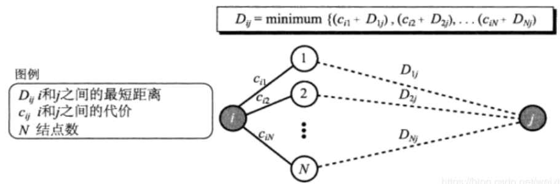
  - **两种算法的对比**
    - **报文复杂性**：LS 算法要求每个节点知道网络中的每条链路的费用，要求发送 O(N * E) 报文（其中，N为节点数量，E为边的数量）；DV 算法要求每次迭代时，两个邻点直接交换报文。
    - **收敛速度**：LS 收敛较快；DV 收敛较慢。
    - **健壮性**：LS 仅计算自己的转发表，路由计算在某种程度上是分离的，一定程度上提供了健壮性；DV 算法中，一个节点可向任意目的节点通告其不正确的最低费用路径，在每次迭代中一个节点的计算会传递给他的邻居，然后下次迭代时再传递给它邻居的邻居，最终导致一个不正确的节点计算值扩散到整个互联网。
  > 参考：[现代操作系统 4.5-路由选择算法]()，[路由选择、路由协议与路由算法](https://blog.csdn.net/a1414345/article/details/72579410)

</details>
<details>
  <summary>TCP 和 UDP 的区别</summary>

  - **面向连接**：TCP 是面向连接的传输协议，即传输数据之前需要先建立好连接；UDP 不是面向连接的，传输数据之前不需要建立连接。
  - **可靠性**：TCP 是可靠数据传输协议；UDP不是可靠数据传输协议。
  - **拥塞控制**：TCP 有拥塞控制；UDP 没有拥塞控制。
  - **流量控制**：TCP 有流量控制；UDP 没有流量控制。
  - **服务对象**：TCP 只能点对点的两点间通信；UDP 可以一对一，一对多，多对一的通信。
  - **报文形式**：TCP是面向字节流的，他的报文可能会进行合并或者拆分；UDP 是面向报文的，其报文不合并不拆分。
  - **适用场景**：TCP适用于要求可靠传输的应用，如文件传输等；UDP 适合实时应用，如直播等。
  > 参考：[TCP 和 UDP 的区别和各自适用的场景](https://www.nowcoder.com/tutorial/93/0cf933dc97be4913b3f5d012eba1e875)
  
</details>
<details>
  <summary>TCP 和 UDP 相关的协议与端口号</summary>

  - TCP 常用相关协议
    - TELNET：远程终端协议，端口号 23。
    - SMTP：简单邮件传输协议，端口号 25。
    - FTP：文本传输协议，端口号 20（DATA）、21（CONTROL）。
    - HTTP：超文本传输协议，端口号 80。
    - HTTPS：超文本传输安全协议，端口号 443。
    - DNS：域名系统，端口号 53。
    - SSH，安全壳协议，端口号 22。
    - POP3，邮局协议版本3，端口号 110。
  - UDP 常用相关协议
    - SMTP：简单邮件传输协议，端口号 25。
    - DNS：域名系统，端口号 53。
    - DHCP，动态主机配置协议，端口号 67。
  > 参考：[TCP 和 UDP 协议常用端口汇总](https://blog.csdn.net/feizaoSYUACM/article/details/80866605?utm_medium=distribute.pc_relevant.none-task-blog-BlogCommendFromMachineLearnPai2-2.channel_param&depth_1-utm_source=distribute.pc_relevant.none-task-blog-BlogCommendFromMachineLearnPai2-2.channel_param)，[TCP 和 UDP 各自的协议和端口号](https://blog.csdn.net/qq_35023382/article/details/85320349)

</details>
<details>
  <summary>网络层分片的原因与具体实现</summary>

  - **分片原因**：一个 IP 数据报的大小超过 MTU（链路层最大传输单元）。
  - **分片实现**：IP 数据报首部中**标识、片偏移、标志**这几个字段包含了分片和用于重组的信息。标识是生成 IP 数据报生成的唯一号，IP 分片后，所有的片的标识保持原来数据报的标识；片偏移用于确定片在原始数据报中的位置；最后一个片的标志设为 0，其他所有片的标志设为 1。
  > 参考：[计算机网络自顶向下方法 4.4-网际协议：因特网中的转发与编址]()

</details>
<details>
  <summary>TCP 的 11 种状态</summary>

  - **CLOSED**：初始状态，表示TCP连接是“关闭着的“。
  - **LISTEN**：表示服务器端的某个 SOCKET 处于监听状态，可以接受客户端的连接。
  - **SYN_RCVD**：表示服务器接收到了来自客户端请求连接的 SYN 报文。
  - **SYN_SENT**：表示客户端已发送SYN报文。
  - **ESTABLISHED**：表示TCP连接已经成功建立。
  - **FIN_WAIT_1**：当客户端想关闭连接，向服务端发送一个 FIN 报文，随后进入 FIN_WAIT_1 状态。
  - **FIN_WAIT_2**：服务端在接收到对方的对 FIN 报文的应答报文后，进入 FIN_WAIT_2 状态，此时 SOCKET 进入半连接状态。
  - **CLOSE_WAIT**：表示正在等待关闭，当服务端发送完对 FIN 报文的应答后，进入 CLOSE_WAIT 状态，接着向客户端发送一个 FIN 报文。
  - **TIME_WAIT**：当客户端接收到服务端发送来的 FIN 报文后，发出一个 ACK 信号，随后进入 TIME_WAIT 状态，等待 2 * MSL 的时间后关闭连接返回 CLOSED 状态。
  - **CLOSING**：罕见，当一方发送完 FIN 报文后，先接收到对方的 FIN 报文后，在接收到对方的 ACK 报文时，进入 CLOSING 状态，这种情况只发生在双方几乎同时发送关闭连接请求的时候。
  - 关闭阶段的状态中客户端和服务端可以互换，这里为了表述的更加清楚，使用了客户端代表想要关闭连接的一方，用服务端代表被请求关闭的一方。
  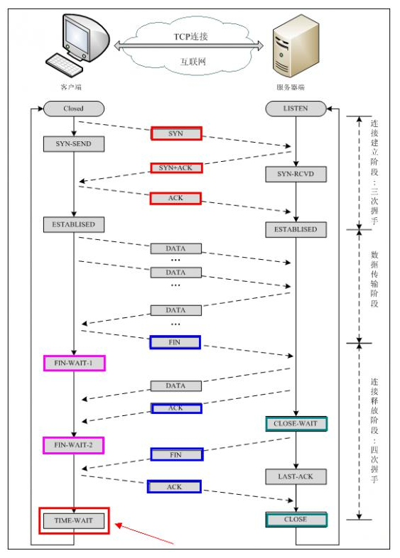
  > 参考：[TCP 的 11 种状态](https://www.cnblogs.com/qingergege/p/6603488.html)

</details>
<details>
  <summary>TCP 怎么保证可靠性</summary>

  - **序列号，确认号**：发送方和接收方都会有一个序列号和一个确认号，序列号是该报文段首字节的字节流编号，确认号是一方期望下一次从对方那里收到的报文的的序号。
  - **超时重传**：当接收方接收到发送过来的报文 x 后，应当返回一个确认报文，如果超过一定时间，确认报文还没有到达发送方，就发生超时事件，发送方认为**报文丢失**（事实上不一定丢失，可能在某个网络节点滞留得比较久），发送方重传报文 x。
  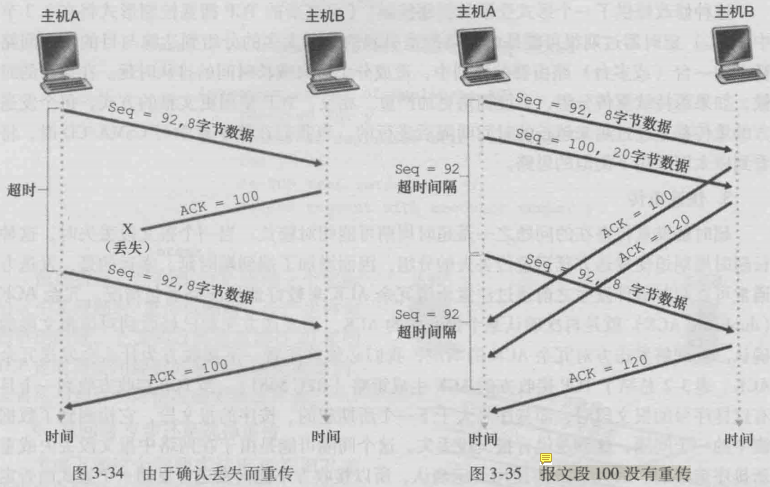
  - **超时间间隔加倍**：每当超时事件发生时，超时间隔变为先前值的两倍。
  - **快速重传**：超时重传存在的问题之一是超时周期可能相对较长，可以通过检测冗余 ACK 在超时事件发生之前检测到丢包情况。当接收方收到一个序号（A）大于其期望序号（B）的报文时（失序），说明发送方序号为 B 的报文丢失，接收方后面接收到数据后返回的确认报文的确认号都为 B，之前发送方已经收到过确认号为 B 的确认报文，后面如果又接收到三个确认号为 B 的确认报文，发送方就知道序号为 B 的报文丢失了（*由于 TCP中没有否认确认报文，所以需要用这种方式告诉发送方报文丢失了*），需要重传序号为 B 的报文。
  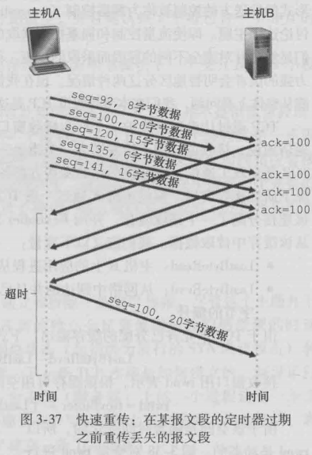
  - **差错恢复**：GBN 协议和 SR 协议的混合体。
  > 参考：[计算机网络自顶向下方法 3.5.4-可靠数据传输]()

</details>
<details>
  <summary>GBN 协议和 SR 协议</summary>

  - 解决**流水线**（允许发送方发送多个分组而无需等待确认报文）的**差错恢复**的两种基本方法为回退 N 步（GBN）和选择重传（SR）。
  - **GBN（回退 N 步）协议**：在 GBN 协议中，定义一个基序号（base），为最早的未确认分组序号；一个下一个序号（nextseqnum），最小的未使用序号；一个窗口（窗口长度为 N），base 和 nextseqnum 需要在窗口范围内。
  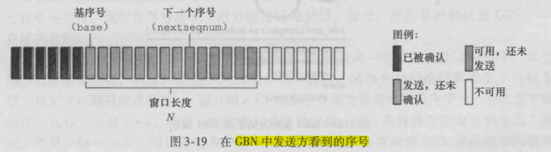
  GBN 协议中，对序号为 n 的分组采取累计确认的方式，表明接收方以正确接收到序号为 n 的以前的且包括 n 在内的所有分组；接收方丢弃所有的失序分组，所以 base 后面的分组中没有已被确认的分组；如果出现超时，发送方重传所有已发送但还未被确认过的分组。
  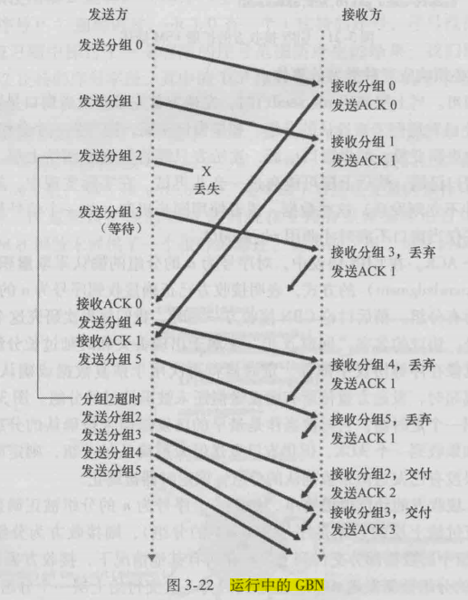
  - **SR（选择重传）协议**：在 SR 协议中，与 GB 一样，定义了一个基序号，一个下一个序号，一个窗口。
  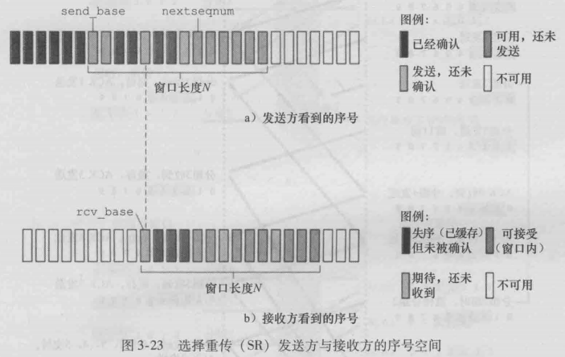
  SR 协议中，接收方将确认一个正确接收的分组而不管其是否按序 。 失序的分组将被缓存直到所有丢失分组（即序号更小的分组）皆被收到为止，这时才可以将一批分组按序交付给上层。
  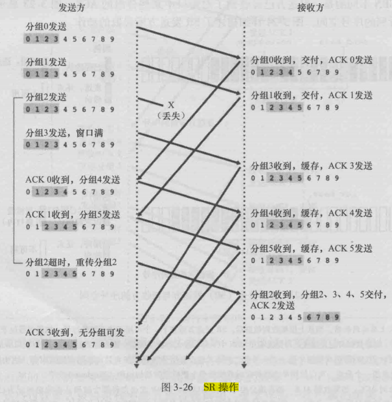
  > 参考：[计算机网络自顶向下方法 3.4-可靠数据传输原理]()

</details>
<details>
  <summary>http/1.0 和 http/1.1 的区别</summary>

  - **长连接**：HTTP1.0 默认不开启长连接；HTTP1.0 默认开启长连接。
  - **缓存处理**：HTTP1.0 中主要使用首部（header）里的 If-Modified-Since，Expires 来做为缓存判断的标准；HTTP1.1 则引入了更多的缓存控制策略，例如 Entity tag，If-Unmodified-Since，If-Match，If-None-Match 等更多可供选择的字段来控制缓存策略。
  - **带宽优化**：在 HTTP1.0 中，客户端只需要某个对象的一部分，而服务器却将整个对象送过来了；HTTP1.1则在请求头引入了 range 字段，它允许只请求资源的某个部分，可以有效降低带宽压力。
  - **HOST 字段**：HTTP1.0 中没有 HOST 字段，因为 HTTP 1.0 认为每台服务器绑定唯一的 IP 地址；HTTP1.0 中有 HOST 字段，因为它考虑到了一台物理服务器上可以存在多个虚拟主机，他们共享一个 IP 地址。考虑一个物理主机上没有虚拟主机，那么一个物理主机对应一个 IP 地址，那么当 HTTP 报文段到达该传输到该主机时，可以直接获取想要的资源；但如果物理主机上有多个虚拟主机，那么当 HTTP 报文到达该物理主机时，他不知道应该选择哪个虚拟主机上的资源，所以需要加入 HOST 字段，让其有能力判断目标主机的位置。
  - **错误通知的管理**：在 HTTP1.1 中新增了24个错误状态响应码。
  > 参考：[http1.0，http1.1，http2.0区别](https://www.jianshu.com/p/2c25b7d54aa2)，[HTTP协议：HTTP1.0、HTTP1.1、HTTP2.0对比](https://segmentfault.com/a/1190000020042105)

</details>
<details>
  <summary>由 http 升级为 https 需要做哪些操作</summary>

  - 购买申请 SSL 证书。
  - 对网站内容进行备份。
  - 安装证书。
  - 修改相关配置，将网页重定向。
  > 参考：[如何将网站升级为HTTPS协议](https://blog.csdn.net/chanzhi2016/article/details/71706197)

</details>
<details>
  <summary>URL 包括哪三个部分</summary>

  - URL 可被认为是三部分组成：资源类型 + 存放资源的主机域名 + 资源文件吗。(存疑)
  - URL 也可以被认为是四部分组成：协议 + 主机 + 端口 + 路径。
  > 参考：[URL格式](https://baike.baidu.com/item/URL%E6%A0%BC%E5%BC%8F/10056474?fr=aladdin)

</details>
<details>
  <summary>一个机器能够使用的端口号上限是多少，为什么</summary>

  - 端口号上限为 65535，下限为 0，因为端口号是一个 16 比特的数，16比特能表示的范围就是 0~65535。
  > 参考：[计算机网络自顶向下的方法 3.2-多路复用与多路分解]()

</details>
<details>
  <summary>对称加密和非对称加密体系</summary>

  - **加密与解密**：通过加密算法将一段明文转为密文，解密算法算法间一段密文转为明文。加密：$C = E(P, K_E)$， $P$ 代表明文，$K_E$ 代表加密密钥，$C$ 代表密文，$E$ 代表加密算法。解密：$P = D(C, K_D)$，$D$ 代表解密算法，$K_D$ 代表解密密钥。
  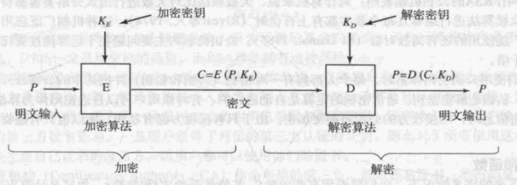
  - **对称加密**：当给定加密密钥后可以很容易的找到解密密钥的就是对称加密。这种加密体系下的传输数据的双方只需保存同一个密钥，可使用该密钥进行加密和解密（由于解密密钥可以由加密密钥推出）。
  - **非对称加密**：当给定一个加密密钥不能够推出解密密钥的就是非对称加密。这种加密体系下传输数据的双方需要都有一个公钥和一个私钥，一个用于解锁，一个用于加锁。
  - **应用**：在 HTTPS 上同时使用了对称加密和不对称加密两种加密手段，客户端存有一个密钥用于对称加密和解密。服务器存有一个公钥和一个私钥，分别用来加密和解密，HTTPS 要保证中间传输的是密文且双方能够够解密密文，就需要双方能加密和解密对方发过来的报文段。首先服务器将自己的公钥传输给客户端，让客户端用公钥加密客户端的密钥，然后发给服务器（由于该密钥由非对称加密手段加密，只有服务器里的私钥才能解密，中途传输是安全的），到达服务器后用私钥解密客户端密钥，然后之后的传输的所有数据双方都使用客户端的密钥进行机密和解密。
  > 参考：[现代操作系统 9.5-密码学原理]()

</details>
<details>
  <summary>数字签名的了解（高频）</summary>

  - 数字前面是一种密码技术，数字签名可以验证某个人在一个文档上的前面确实是该人签的。
  - **数字签名原理**：首先，文件所有者利用散列算法（MD5 或 SHA-1） 将其原始文档转换为一个 16 字节长度的散列值，然后文件所有者利用他的**私钥**对该散列值进行运算得到数字签名。文件接收者接收到该文件、该文件的数字签名、文件所有者的公钥，文件所有者利用**公钥**对数字签名进行运算，可以得到该文件的散列值，文件接收者接着利用散列算法（与所有者用的一致）求出文档的散列值，判断两个散列值是否相同，若不相同说明文档修改过，若相同则说明文档没修改过。
  
  - **为什么要将文件进行散列操作**：其实可以跳过散列操作直接对文件进行解密操作，生成数字签名，但是文件大小可能非常大，生成的数字签名可能非常大，而且加密解密的时间将会很长，所以要对其进行散列操作，转换为一个 16 字节的散列值。
  - **为什么使用私钥计算数字签名**：因为私钥是文件所有者一个人私有的，其他人不能拥有，可以证明这个文件是他签署的，所以需要用私钥对文件进行运算生成数字签名。（*这里使用私钥将明文（文件散列值）转换为密文（数字签名），HTTPS 使用私钥将密文（加密的客户端密钥）转换为明文（客户端密钥），因为两者的目的不一样，这里是为了证明这个文件是文件所有者所签署（写）的，HTTPS 是为了只有服务器能获取（读）到这个文件*）。
  - **数字证书**：前面描述数字签名的原理时，文件所有者需要向文件接收者发送公钥，如何证明该公钥对应着该文件所有者，如何证明该公钥中途没有被修改过，答案是引入数字证书。文件所有者一般通过数字证书的方式发布公钥，数字证书一般包含用户姓名，公钥和可信任的第三方数字签名，引入第三方数字签名是**为了保证公钥不会被篡改**，**证明这个公钥确实是该文件所有者的**。此时的公钥就如普通文件一样，利用数字签名的原理可保证公钥没被修改过，这里的第三方签名由认证机构（CA）提供，第三方数字签名的私钥由 CA 保管，公钥则向大众提供，用户即可利用其判断文件所有者提供的公钥是否正确。
  > 参考：[计算机网络自顶向下方法 8.3.3-数字签名]()，[现代操作系统 9.5-密码学原理]()

</details>
<details>
  <summary>客户端为什么信任第三方证书</summary>

  - 描述数字签名原理和数字证书吗。
  > 参考：[数字签名的了解]()

</details>
<details>
  <summary>RSA 加密算法</summary>

  - 选择两个大素数 $p$ 和 $q$。
  - 计算 $n = pq$ 和 $z = (p - 1)(q - 1)$。
  - 选择一个小于 $n$ 的一个数 $e$，且使 $e$ 和 $z$ 没有公因数。
  - 求一个数 $d$，使得 $ed - 1$ 可以被 $z$ 整除。
  - 公钥为一对数 $(n, e)$，私钥是一对数 $(n, d)$。
  - 加密算法为 $c = (m^e) mod (n)$，其中 $m$ 是明文，$c$ 是密文。
  - 解密算法为 $m = (c^d) mod (n)$，其中 $m$ 是明文，$c$ 是密文。
  > 参考：[计算机网络自顶向下方法 8.2.2-公开密钥加密]()

</details>
<details>
  <summary>介绍一下 ping 的过程，分别用到了哪些协议</summary>

  - 
</details>
<details>
  <summary>一个 ip 配置多个域名，靠什么识别</summary>

  - 根据 HTTP 报文段中的 HOST 字段识别。
  > 参考：[http/1.0 和 http/1.1 的区别]()

</details>
<details>
  <summary>服务器攻击（DDoS 攻击）</summary>

  - DDOS ，即分布式拒绝服务，利用大量主机（肉鸡）向目标发送请求，消耗其网络带宽和系统资源，导致网络或系统不胜负荷以至于瘫痪而无法提供正常的服务。
  - **如何应对 DDoS 攻击**：购买高防服务器；把参加 DDoS 攻击的主机加入黑名单；DDoS 清洗，把异常流量清洗掉；CDN 加速，把网站流量分配到各个节点中。
  > 参考：[什么是 DDoS 攻击](https://www.zhihu.com/question/22259175)
  
</details>

## 操作系统
<details>
  <summary>为什么需要操作系统</summary>
  
  - **提供抽象**：操作系统可以隐藏硬件，呈现给程序良好、清晰、优雅、一致的抽象，将丑陋的硬件转变为美丽的抽象。
  - **资源管理**：操作系统可以记录哪个程序在使用什么资源，对资源请求进行分配，评估使用代价，并且未不同的程序和用户调节互相冲突的资源请求。
  > 参考：[现代操作系统 1.1-什么是操作系统]()

</details>
<details>
  <summary>进程间通信</summary>
  
  - **消息传递**：提供 `send` 和 `recieve` 两个原语操作（原语一般是指由若干条指令组成的程序段，用来实现某个特定功能，在执行过程中不可被中断）。操作系统内核存有一组消息缓冲区，当发送进程想要发送消息给接收进程时，发送进程调用 `send`，`send` 陷入内核，将要发送的消息复制到内核中的消息缓冲区（队列形式）中，而接收进程 PCB（进程管理快）中有一个消息队列指针，指向内核中属于它的消息缓冲区，当接收进程想要接受数据的时候就调用 `recieve`，陷入内核，将消息缓冲区头部的数据取出，这样就完成了一个消息传递的过程。`send` 和 `recieve` 使用信号量实现。
  - **共享内存**：两个或多个进程可将自身的一块地址空间映射到同一块物理内存，当一个进程在此共享内存进行修改的时候，其他拥有此块共享内存的进程可以读取到修改的内容，进而实现了进程通信的功能，这里关键要解决互斥问题，可用解决读者-写者问题的思路解决。
  - **管道**：分为无名管道（PIPE）和命名管道（FIFO）。管道特性：半双工，具有固定读写端，其中 PIPE 只能用于具有亲缘关系的进程之间通信，而 FIFO 可用于无亲缘关系的进程之间通信。管道的实质是一个内核缓冲区，管道一端的进程顺序地将进程数据写入缓冲区，另一端的进程则顺序地读取数。看上去和消息传递的过程很相似，但是消息传递可以不按照队列次序进行接收，可以根据自定义条件接收消息。
  > [操作系统原理（北京大学） P38-进程间通信](https://www.bilibili.com/video/BV1Gx411Q7ro?p=38)，[进程间通讯的7种方式](https://blog.csdn.net/zhaohong_bo/article/details/89552188)

</details>
<details>
  <summary>同步-互斥问题</summary>
  
  - 进程同步指的是系统中多个进程中发生的事情存在某种**时序关系**，需要相互合作，共同完成一项任务。具体的说，一个进程运行到某一点时，要求另一伙伴进程为他提供消息，在未获得消息之前，该进程进入阻塞态，获得消息之后被唤醒进入就绪态。
  - 进程之间的互斥是由于各个进程要求使用共享资源，而这些资源需要排他性使用，各进程之间**竞争**使用这些资源。
  - 一般情况下提问同步机制其实问的是同步 + 互斥。
  - 经典案例：生产者-消费者问题，一个或多个生产者生产数据放入缓冲区，消费者从缓冲区去数据，每次取一项。存在问题：只能有一个生产者或消费者对缓冲区进行操作（互斥）；缓冲区已满时，生产者不会继续往缓冲区添加数据，当缓冲区已空时，消费者不会继续取出数据（同步）。读者-写者问题，可以同时读，不可以同时读写和两个以上的写（互斥）。
  - 同步方式：**临界区**（访问公共资源时，一个进程访问时，其他进程不能访问），**信号量**（PV操作，关键在于其将判断和加减操作合为一个原语，中间不会被中断，可以保证临界区的同步与互斥），**互斥锁**（二元信号量，其控制的量只有1和0这两个量，就是简化版的信号量，有互斥功能，无同步功能），**条件变量**（线程因为某种原因休眠后，又因为某个条件被唤醒，可解决一个线程等待另一个线程完成某些动作时的轮询判断，可保证同步）。
  > [操作系统原理（北京大学） P29-进程同步](https://www.bilibili.com/video/BV1Gx411Q7ro?p=38)，[怎样理解C++11中的条件变量](https://www.zhihu.com/question/68017337/answer/796332672)

</details>
<details>
  <summary>进程调度方法</summary>

  - **先来先服务**：非抢占式算法，使用该算法，进程按照它们请求 CPU 的顺序使用 CPU，适用于批处理系统。
  - **最短作业优先**：非抢占式算法，使用该算法，需要与之进程的运行时间，选择运行时间最短的那个进程运行，适用于批处理系统。
  - **最短剩余时间优先**：抢占式算法，使用该算法，调度程序总是选择剩余运行时间最短的那个进程运行，适用于批处理系统。
  - **轮转调度**：每个进程被分配一个时间段，称为时间片，即允许该进程在该时间段中运行。如果在时间片结束时该进程还在运行，则将剥夺CPU井分配给另一个进程。如果该进程在时间片结束前阻塞或结束，则CPU立即进行切换，适用于交互式系统。
  - **优先级调度**：每个进程被赋予一个优先级，允许优先级最高的可运行进程先运行，适用于交互式系统。
  - 还有其他调度机制，不一一列举。
  > 参考：[现代操作系统 2.4-调度]()

</details>
<details>
  <summary>线程调度方法</summary>
  
  - **用户级线程调度**：内核不知道线程的存在，内核使用进程调度算法调度进程，然后可以在进程内定制线程的调度方法。
  - **内核级线程调度**：内核可以把线程当作进程，使用进程调度方法。
  - 用户级线程和内核级线程之间的差别在于性能，用户级线程的线程切换需要少量的机器指令，而内核级线程需要完整的上下文切换；另一方面，在使用内核级线程时， 一且线程阻塞在 I/O 上就不需要像在用户级线程中那样将整个进程挂起 。
  > 参考：[现代操作系统 2.4-调度]()

</details>
<details>
  <summary>线程调用机制</summary>

</details>
<details>
  <summary>常见锁有哪些，区别，如何选择</summary>
  
  - **互斥锁**：在访问共享资源后临界区域前，对互斥锁进行加锁；在访问完成后释放互斥锁导上的锁。在访问完成后释放互斥锁导上的锁；对互斥锁进行加锁后，任何其他试图再次对互斥锁加锁的线程将会被阻塞睡眠，直到锁被释放后会被唤醒。一般适用于排他性的场景，如往共享内存中写数据。
  - **读写锁**：如果有其他线程读数据，则允许其他线程进行读操作，但不允许写操作；如果有其它线程写数据，则其它线程都不允许读、写操作。读写锁适用于读比写多的场景。
  - **自旋锁**：自旋锁与互斥锁功能一样，保证临界区只有一个线程或进程，唯一一点不同的就是互斥量阻塞后睡眠让出 CPU，而自旋锁阻塞后不会让出 CPU，会一直忙等待，直到得到锁。自旋锁适用于锁的持有时间较短的场景。
  - **乐观锁**：每次使用数据的时候都不会加锁，只有在提交的时候会检查是否违反数据完整性。适用于并发竞争不激烈的场景。
  - **悲观锁**：每次使用数据的时候都会加锁。适用于并发竞争激烈的场景。
  - 不确定乐观锁和悲观锁是否可以与其他三种锁并列。
  > 参考：[多线程的同步与互斥](https://blog.csdn.net/daaikuaichuan/article/details/82950711)，[各种锁以及使用场景](https://blog.csdn.net/lyl194458/article/details/90641870)

</details>
<details>
  <summary>死锁发生的必要条件</summary>
  
  - **互斥条件**：资源不能被共享，只能被一个进程独占。
  - **占有和等待条件**：当进程因请求资源而阻塞时，对已获得的资源保持不放，并等待所需资源的到来。
  - **不可抢占条件**：已经分配给一个进程的资源不能强制性地被抢占，它只能披占有它的进程显式地释放。
  - **环路等待条件**：在发生死锁时，必然存在一个进程-资源的环形链，该环路中的每个进程都在等待若下一个进程所占有的资源。
  > [死锁面试题](https://blog.csdn.net/hd12370/article/details/82814348)

</details>
<details>
  <summary>解决死锁问题的思路和方法</summary>
  
  - **死锁检测和死锁恢复**：使用此技术，系统不阻止死锁的产生，而是运行死锁的发生，当检测到死锁发生后，采取措施进行恢复。
    - **每种类型一个资源的死锁检测**：创建一个资源分配图，其中若进程持有资源则资源指向进程，若资源需要进程则进程指向资源，构建出一个有向图，如果该图中存在**有向环路**，那么就存在死锁，可采用检测有向图环路的算法进行检测死锁。如进程 A 拥有 c 资源，还需要 d 资源，进程 B 拥有 d 资源，还需要 c 资源，这就发生死锁，这里 c 资源和 d 资源都只有一个。*此算法是一种类型对应一个资源，有多个不同类型的资源，单个资源的银行家算法是一种类型有多个资源！*
    - **每种类型多个资源的死锁检测**：假定当前系统中还未分配的资源可以满足当前一个进程的所有资源需求，那么这个进程可以顺利执行，执行完毕后可以释放掉其所拥有的所有资源，如果当前还未分配资源不能满足任何一个进程所需资源，那么就陷入死锁，只要将资源满足需求的进程先释放掉，看是否还有剩余进程就能判定有无死锁。如进程 A 总共需要 2 个 c 和 3 个 d 才能继续执行，进程 B 总共需要 3 个 c 和 2 个 d 才能执行，当前 A 有1个 c 和1个 d， B 有1个 c 和 2个 d，未分配的 c 还有1个，未分配的 d 还有 1 个，此时假定这些进程不放弃已经拥有的资源，那么 A 和 B 的资源需求哦都得不到慢则，则陷入死锁。*感觉这个算法和多个资源的银行家算法很相似啊！*
    - **死锁恢复**：**利用抢占恢复**，临时把某个资源从它的当前所有者那转移到另一个进程中，一般需要人工干预，且比较困难；**利用回滚恢复**，如果系统设计人员以及主机操作员了解到死锁有可能发生，他们就可以周期性地对进程进行检查点检查，进程检查点检查就是将进程的状态写入一个文件以备以后重启，一旦检测到死锁，就可以将死锁的进程进行回滚，将需要的资源分配给一个死锁的进程；**通过杀死进程恢复**：直接杀死一个或多个进程用以回收资源，最好杀死可以从头开始不会带有副作用的资源。
  - **死锁避免**：首先引入两个概念：安全状态和不安全状态。如果没有死锁发生，并且即使所有进程突然请求对资源的最大需求，也仍然存在某种调度次序能够使得每一个进程运行完毕，则称该状态是安全的。而不安全状态则不存在一种次序能够使得所有进程运行完毕。注意：不安全状态不等于死锁。安全状态也有可能会走向死锁，需要按照给定的次序走才不会导致死锁；而不安全状态除非中间发生特殊情况，否则必然造成死锁。
  
    - **单个资源的银行家算法**：银行家算法就是对每一个资源请求进行检查，检查如果满足这一请求是否会达到安全状态。若是，那么就满足该请求，否则，就推迟对这一请求的满足。为了检查状态是否安全，银行家需要考虑他是否有足够的资源满足某一个客户。如果可以，那么这笔贷款就是能够收回的，井且接看检查最接近最大限额的一个客户，以此类推。如果所有投资最终都能被收回，那么该状态是安全的，最初的请求可以批准。
    - **多个资源的银行家算法**：检测当前未分配资源是否可以满足当前一个进程的所有资源需求，如果不存在这样一个进程，那么系统将死锁，如果存在一个这样的进程，假定将所需资源分配给它后结束该进程，将其所占有的所有资源回收，然后继续寻找一个满足要求的进程，直到算法结束。
    - 银行家算法虽然很有意义但缺乏实用价值，因为很少有进程能够在运行前就知道其所需资源的最大值。而且进程数也不是固定的，往往在不断地变化，况且原本可用的资源也可能突然间变成不可用。也就是说死锁避免的策略并不可行。
  - **死锁预防**：通过破坏死锁的四个必要条件达到死锁预防的效果。
    - **破坏互斥条件**：但是有些资源本就是不可同时操作的，比如同时写一个文件，破坏互斥条件虽然避免死锁但是会导致数据同步问题。
    - **破坏占有并等待条件**：规定所有的进程在开始执行前请求所需的全部资源，如果系统可分配的资源可以满足需求，那么将他们分配给这个进程，如果不满足，就不进行分配，进程等待。
    - **破坏不可抢占条件**：有些资源规定不可被抢占，如果强行抢占的话，可能会导致严重错误，如一个进程已经开始刻盘，突然将刻盘机分配个另一个进程，可能会划伤光盘。
    - **破坏环路链路等待条件**：将资源统一编号，进程可以在任何时刻提出资源请求，但是所有请求必须按照资源编号的顺序提出。
  
  > [现代操作系统 6.4-死锁检测与死锁恢复]()，[现代操作系统 6.5-死锁避免]()，[现代操作系统 6.6-死锁预防]()
  
</details>
<details>
  <summary>共享内存在进程外如何访问，如何保证安全</summary>

  - 读者-写者问题，用读写锁。
  > 参考 [同步-互斥问题]()

</details>
<details>
  <summary>虚拟内存</summary>

  - 虚拟内存的基本思想是：每个程序拥有自己的地址空间，这个空间被分割成多个块，每一块称作一页或页面（page）。每一页有连续的地址范围。这些页被映射到物理内存，但井不是所有的页都必须在内存中才能运行程序。
  - 虚拟地址空间按照固定大小划分成被称为**页面**（page）的若干个单元，在物理内存中对应的单元称为**页框**（page frame）。内存和磁盘之间的交换总是以整个页面为单元进行的。
  - 在没有虚拟内存的计算机上，系统直接将虚拟地址送到内存总线上，读写操作使用具有同样地址的物理内存字，而在使用虚拟内存的情况下，虚拟地址不是被直接送到内存总线上，而是被送到**内存管理单元**（Memory Management Unit, MMU），MMU把虚拟地址映射为物理内存地址。
  - 当程序访问了一个尚未映射到物理内存的页面，此时 MMU 使 CPU 陷入到操作系统，这个陷阱叫做**缺页中断**。操作系统找到一个页框（页面置换算法找到合适的页框）且把它的内容写入磁盘（假定磁盘上没有相同的备份），随后把需要访问的页面读到刚才回收的页框中，修改映射关系，然后重新访问该页面。
  - 虚拟地址到物理地址的映射可以概括如下：**虚拟地址被分为虚拟页号（高位部分）和偏移量（低位部分）两部分**。虚拟页号可用作页表的索引，以找到该虚拟页面对应的页表项，由页表项可以找到页框号，然后把页框号拼接到偏移量的高位端，以替换掉虚拟页号，形成送往内存的物理地址。
  - **页表的目的是把虚拟页面映射为页框**，从数学角度来说，页表是一个函数，他的参数是虚拟页号，结果是物理页框号。
  - 正常情况下，虚拟地址转换为物理地址需要先读取页表找到页面对应的页框，再加上偏移量，但是我们可以引入一个称为**转换检测缓冲区**（TLB）的硬件，它可以将虚拟地址映射到物理地址而无需经过页表（虽然不经过页表，但是经过 TLB ，也许是因为 TLB 更快），进而**加速分页过程**。**TLB 工作流程**：将一个虚拟地址放入 MMU 中进行转换时，硬件首先通过将该虚拟页号与 TLB 中所有表项同时进行匹配，判断虚拟页面是否在其中。如果发现一个有效的匹配并且要进行的方位操作并不违反保护位，则将页框号直接从 TLB 中取出而不必在访问页表；如果 MMU 检测到没有有效的匹配项，就会进行正常的页表查询。接着从 TLB 中淘汰一个表项，然后用新找到的页表项代替他。
  - 针对虚拟地址空间很大的情况，为了避免把所有的页表都放在内存中，提出**多级页表**的解决方案，可把32位的虚拟地址划分为10位的 PT1 域、10位的 PT2 域和12位的 Offfset（偏移量）域。多级页表工作流程：当一个虚拟地址送到 MMU 时，MMU 首先提取 PT1 域并把该值作为访问顶级页表的索引，由索引顶级页表得到的表项中含有二级页表的地址或页框号，现在把 PT2 域做为访问二级页表的所有，以便找到虚拟页面对应的页框号，最后加上偏移量就可得到物理地址。
  - 还有一种用于解决虚拟地址空间很大的方法：**倒排页法**，该方法使用实际内存中的每个页框对应一个表项，而不是每个页面对应一个表项，即使用页框作为索引。由于页框的数量是固定的，所以倒排页法的页表也是固定大小的，所以可以避免由巨大虚拟地址空间导致的巨大页表的问题，但是这样从虚拟地址转换为物理地址的耗时会很长，因为不能用虚拟地址的页号作为索引搜索页表了，所以需要搜索整个页表找到对应的表项，这一波是用空间换时间。
  > 参考：[现代操作系统 3.3-虚拟内存]()

</details>
<details>
  <summary>页面置换算法</summary>

  - 当发生缺页中断时，操作系统必须在内存中选择一个页面将其换出内存，以便为即将调人的页面腾出空间。如果要换出的页面在内存驻留期间已经被修改过，就必须把它写回磁盘以更新该页面在磁盘上的副本； 如果该页面没有被修改过（如一个包含程序正文的页面），那么它在磁盘上的副本已经是最新的，不需要回写。直接用调入的页面覆盖被淘汰的页面就可以了。
  - **最优页面置换算法**：每个页面都可以用在该页面首次被访问前所要执行的指令数作为标记，最优页面置换算法规定应该置换标记最大的页面。问题是无法实现，操作系统无法知道各个页面下一次什么时候被访问。
  - **最近未使用页面置换算法**：根据读写位设置4个类别的页面，第0类：读=0，写=0；第1类：读=0，写=1，第2类：读=1，写=0，第3类：读=1，写=1。从编号最小的类别中选一个页面淘汰。
  - **先进先出页面置换算法**：由操作系统维护一个所有当前在内存中的页面的链表 ，最新进人的页面放在表尾，最早进入的页面放在表头。当发生缺页中断时，淘汰表头的页面井把新调人的页面加到表尾。
  - **第二次机会页面置换算法**：检查最老页面的 R（读） 位，如果 R 位是0，这个页面既老又没用，可以立刻置换掉；如果是1，就将 R 位清零，并把这个页面放到链表尾端，然后继续搜索，加入 R 位判断是为了避免将经常使用的页面替换掉。
  - **时钟页面置换算法**：把所有的页面保存在一个类似钟面的环形链表中，当发生缺页中断时 ，算法首先检查表针指向的页面，如果它的 R 位是0，就淘汰该页面 ， 井把新的页面插入这个位置，然后把表针前移一个位置；如果 R 位是1，就将 R 位清零并把表针前移一个位置。重复这个过程直到找到了 一个 R 位为0的页面为止。
  - **最近最少使用页面置换算法**：这个策略也称为 **LRU**，其思路是在缺页中断发生时，**置换未使用时间最长的页面**。该算法成本较高，可使用硬件实现，也可使用软件进行模拟，一种方案是 **NFU 算法**，该算法将每个页面与一个软件计数器相关联，计数器的初值为0。每次时钟中断时，由操作系统扫描内存中所有的页面，将每个页面的 R 位（它的值是0或1）加到它的计数器上 。 这个计数器大体上跟踪了各个页面被访问的频繁程度 。 发生缺页中断时，则置换计数器值最小的页面。该算法的缺点是从不忘记任何事情，比如，在一个多次（扫描 ） 编译器中，在第一次扫描中被频繁使用的页面在程序进入第二次扫描时，其计数器的值可能仍然很高。为了改进这个缺点，提出**老化算法**，在 NFU 算法的基础上进行修改，首先，在 R 位被加进之前先将计数器右移一位，其次，将 R 位加到计数器最左端的位而不是最右端的位。（*为什么现代操作系统里面没有提到使用「双向链表+哈希表」的构建 LRU 缓存的方法*）。
  - **工作集页面置换算法**：进程的工作集可以被称为过去 t 秒实际运行时间中它所访问过的页面的集合，基于工作集的页面置换算法的基本思路就是找出一个不在工作集的页面并淘汰它。每个时钟滴答中，有一个定期的时钟中断会用软件方法来清除 R 位。在处理每个表项时，检查 R 位，如果 **R = 1**，把当前实际时间写进页表项的“上次使用时间”域，以表示缺页中断发生时该页面正在被使用，即它在工作集中，不应该被删除；如果 **R = 0且生存时间大于 t**，那么这个页面就不再在工作集中，用新的页面替换它；如果 **R = 0且生存时间小于等于 t**，则该页面仍然在工作集中，但将其作为候选者，当扫描完整个页表后，还是没有发现 R = 0 且生存时间大于t 的表项时，就从候选者中挑出生存时间最长的进行替换。
  - **工作集始终页面置换算法！**：该算法基于时钟算法，并使用了工作集信息。每次缺页中断，首先检查指针指向的页面，如果**R = 1**，该页面在当前时钟滴答中就被使用过，那么该页面就不适合被淘汰，然后把该页面的的 R 位置0，指针指向下一个页面；如果**R = 0且生存时间大于 t 且该页面是干净的**，他就不在工作集中，用一个新页面替换它；如果**R = 0且生存时间大于 t 且该页面被修改过**，就不能立即申请页框，因为这个页面在磁盘上没有有效副本，**为了避免由于调度写磁盘操作引起进程切换**，指针继续向前走。
  > 参考：[现代操作系统 3.4-页面置换算法]()

</details>
<details>
  <summary>fork 功能</summary>
  
  - 在 UNIX系统中，只有一个系统调用可以用来创建进程：`fork`，这个系统调用会创建一个与调用进程相同的副本。在调用了 `fork` 以后，这两个进程（父进程与子进程）拥有相同的内存映像、同样的环境和同样的打开文件。
  - 通常，在 `fork` 创建子进程后，子进程接着执行 `execve` 系统调用，以修改其内存映像并运行一个新的程序。例如，当用户在 shell 中键入命令 `sort` 后，shell 就创建一个子进程，这个子进程就执行 `sort`。
  - 之所以要安排两步建立进程，是为了在 `fork` 之后但在 `execve` 之前允许该子进程处理其文件描述符，这样就可以完成对标准输入文件、标准输出文件和标准错误文件的重定向。
  - 而在 Windows 中，使用 `CreateProcess` 代替 `fork` + `execve`，既处理进程的创建，也负责把正确的程序装入新的进程。
  > 参考：[现代操作系统 2.1-进程]()

</details>
<details>
  <summary>中断过程，如何保存现场</summary>

  - **中断过程**：识别中断源 $\Rightarrow$ 保护现场 $\Rightarrow$ 进入中断服务程序 $\Rightarrow$ 恢复现场 $\Rightarrow$ 中断返回
  - **保护现场**：将一些寄存器压入栈。
  > 参考：[操作系统-中断机制](https://blog.csdn.net/qq_41001071/article/details/90142906)

</details>
<details>
  <summary>用户态与内核态的区别</summary>

  - 内核态运行操作系统；用户态运行用户程序。
  - 内核态的程序可以执行特权指令；用户态的程序不可以执行特权指令，但是可以执行非特权指令。
  - 当程序运行在第 0 级特权级上时，那么就称其为运行在内核态；当程序运行在第 3 级特权级上时，那么就称其为运行在用户态。中间还有两个特权级可供虚拟机使用。
  - 当处于用户态执行的时候，进程所能访问的内存空间和对象收到限制，其所占有的处理器时可以被抢占的；当处于内核态执行时，则能访问所有的内存空间和对象，且所占有的处理器是不允许被抢占的。
  > 参考：[用户态和内核态的区别](https://www.cnblogs.com/gizing/p/10925286.html)

</details>
<details>
  <summary>用户态与内核态的切换</summary>
  
  - **系统调用**：用户态进程通过系统调用申请使用操作系统提供的服务程序完成工作。
  - **异常**：���CPU在执行运行在用户态下的程序时，发生了某些事先不可知的异常，这时会触发由当前运行进程切换到处理此异常的内核相关程序中，也就转到了内核态，比如缺页异常。
  - **外部中断**：当外围设备完成用户请求的操作后，会向CPU发出相应的中断信号，这时CPU会暂停执行下一条即将要执行的指令转而去执行与中断信号对应的处理程序，如果先前执行的指令是用户态下的程序，那么这个转换的过程自然也就发生了由用户态到内核态的切换。
  > 参考：[用户态和内核态的区别](https://www.cnblogs.com/gizing/p/10925286.html)

</details>
<details>
  <summary>线程与进程的区别</summary>

  - 进程是资源分配最小单位，线程是程序执行的最小单位。
  - 进程有自己独立的地址空间，同一进程的线程共享本进程的地址空间。
  - 一个进程崩溃后，不会对其他进程产生影响，但是一个线程崩溃整个进程都死掉。
  - CPU切换一个线程比切换进程开销小。
  - 创建一个线程比进程开销小。
  - 线程之间通信更方便，同一个进程下，线程共享全局变量，静态变量等数据，进程之间的通信需要以通信的方式（IPC）进行。 
  > 参考：[进程与线程的区别](https://blog.csdn.net/wsq119/article/details/82154305)

</details>
<details>
  <summary>何时用多线程，何时用多进程</summary>
  
  - 对资源的管理和保护要求高，不限制开销和效率时，使用多进程。
  - 要求效率高，频繁切换时，资源的保护管理要求不是很高时，使用多线程。
  > 参考：[进程与线程的区别](https://blog.csdn.net/wsq119/article/details/82154305)

</details>
<details>
  <summary>调用函数压栈</summary>
  
  - 几个概念：每个栈帧对应着一个未运行完的函数，栈帧中保存了该函数的返回地址和局部变量，ebp指向函数栈帧的底部，esp指向函数栈帧的顶部。
  - 以 `main()` 函数调用一个函数 `void func(int var1, int var2);`为例，当 `main()` 函数执行到 `func()` 函数时，先将 `main()` 函数的**返回地址**压入栈中，然后将 **ebp** 的值压入栈中，将 esp 的值赋予 ebp，新 esp 的值则等于新的 ebp 的值减去需要的空间（*使用 push 和 pop 等操作才会自动改变 ebp 的值，而使用 move 改变栈空间并不会改变 esp 的值*），接着将 `func()` 函数的**参数从右向左**依次压入栈中。
  > 参考：[函数调用过程中栈到底是怎么压入和弹出的](https://www.zhihu.com/question/22444939/answer/22200552)

</details>
<details>
  <summary>生产者消费者，读者写者，哲学家就餐</summary>
  
  
</details>
<details>
  <summary>海量数据的 bitmap 使用原理</summary>
  
  - bitmap 使用一个 bit 位来标记某个元素对应的 value，而该元素作为 key。key 和 value 应该是一一对应的。
  - bitmap 用于海量数据的**排序**，**查询**，**去重**。如 20 亿个整数中找不不重复的整数个数，内存中无法存放 20 亿个整数，但是可以存放 20 亿个位，让位与整数一一对应，判重时只要看对应的位是否为 1 即可。
  - 如果元素是字符串类型的，怎么将字符串类型映射到位图中去呢，这里不用 hash 函数，因为 hash 可能会将不同元素重复映射到一个位置上，可以反过来思考，将位图上的位映射到字符串元素，但仍然是使用元素作为 key，位作为 value。
  - 如果数据量大到一定程度，由于元素和位是一一对应的，bitmap 的大小也可能也会超出内存范围，这时使用 bitmap 是不行的，可以引入布隆过滤器，布隆过滤器可以将数据元素映射到一个固定大小（好像不是）的位数组上，避免了 bitmap 带来的缺点。
  > 参考：[bitmap 简介](https://www.cnblogs.com/cjsblog/p/11613708.html)，[漫画：什么是Bitmap算法](https://www.sohu.com/a/300039010_114877)

</details>
<details>
  <summary>布隆过滤器原理与优点</summary>
  
  - **布隆过滤器原理**：当一个元素被加入集合时，**通过 K 个 Hash 函数将这个元素映射成一个位数组中的 K 个点，把它们置为 1**（使用多个 hash 是为了减少 hash 碰撞）。检索时，我们只要看看这些点是不是都是 1 就（大约）知道集合中有没有它了，如果这些点中有任何一个为 0，则被检元素一定不在，如果都是1，则被检元素很可能在。
  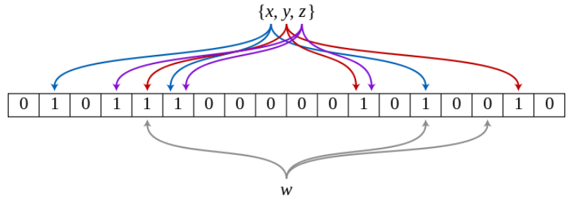
  - **布隆过滤器的优点**
    - 增加和查询元素的**时间复杂度**都为 O(K)。
    - Hash 函数相互之间没有关系，方便**硬件并行运算**。
    - 布隆过滤器不需要存储元素本身，在某些对**保密要求**比较严格的场合有很大优势。
    - 在能够承受一定的误判时，布隆过滤器比其他数据结构有着很大的**空间优势**。
    - 数据量很大时，布隆过滤器可以表示全集，其他数据结构不能。
  **布隆过滤器的缺点**
    - 有误判率（存在哈希冲突），即不能准确判断元素是否在集合中（补救方法：再建立一个白名单，存储可能会误判的数据），
    - 一般情况下不能从布隆过滤器中删除元素，因为如果删除一个元素在位数组中的映射，可能会删除掉其他元素在位数组中的部分映射。如将 `tencent` 的映射存入位数组，1、4、6上的位都被置 1，将 `baidu` 的映射存入位数组，2、4、7的位都被置为 1，如果要删除 `baidu`，那么 2，4，7上的位都置为 0，而 `tencent` 的有一个映射位于位置 4 上，所以如果将位置 4 的位置为 0，检索 `tencent` 的时候就检索不到了。
    - 不能获取元素本身，因为无法从位图中逆推出元素。只能查找与插入。
  - **布隆过滤器的应用场景**：**去重**和针对海量数据的**查询**。具体：网页黑名单，垃圾邮件过滤，url 去重，内容推荐。
  > 参考：[分布式缓存击穿（布隆过滤器 Bloom Filter）](https://blog.csdn.net/fouy_yun/article/details/81075432)，[布隆过滤器-实现以及性能分析](https://blog.csdn.net/lovehang99/article/details/102157077)，[大量数据去重：Bitmap和布隆过滤器(Bloom Filter)](https://blog.csdn.net/zdxiq000/article/details/57626464)

</details>
<details>
  <summary>同步 I/O 和异步 I/O</summary>
  
  - 同步 I/O 就是进程阻塞直到 I/O 完成，同步 I/O包括阻塞 I/O，非阻塞 I/O，I/O 复用，信号驱动 I/O。
    - 阻塞 I/O：使用 `recv` 的进程一直等数据直到拷贝到用户空间，这段时间内进程始终阻塞。举个例子，A 同学用杯子装水，打开水龙头装满水然后离开，这一过程就可以看成是使用了阻塞 IO 模型，因为如果水龙头没有水，他也要等到有水并装满杯子才能离开去做别的事情。这种 IO 模型是同步的。
    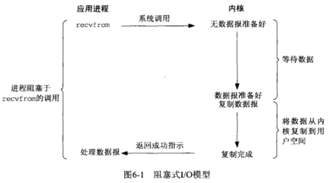
    - 非阻塞 I/O：让 `recv` 不管有没有获取到数据都返回，如果没有数据那么一段时间后再调用 `recv` 看看，如此循环。举个例子，B 同学也用杯子装水，打开水龙头后发现没有水，它离开了，过一会他又拿着杯子来看看，在中间离开的这些时间里，B 同学离开了装水现场（回到用户进程空间），可以做他自己的事情，这就是非阻塞 IO 模型。但是它只有是检查无数据的时候是非阻塞的，在数据到达的时候依然要等待复制数据到用户空间（等着水将水杯装满），因此它还是同步 IO。
    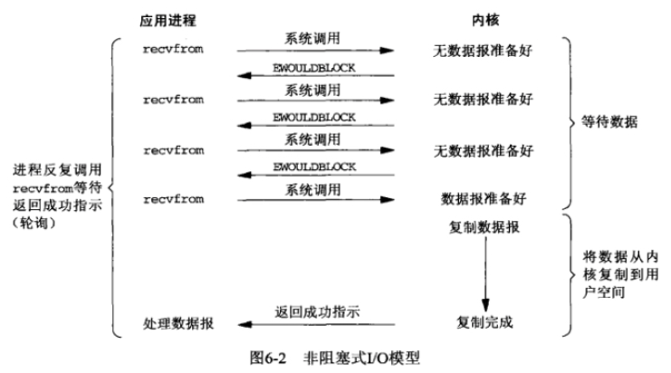
    - I/O 复用：这里在调用 `recv` 前先调用 `select` 或者 `poll`，这2个系统调用都可以在内核准备好数据（网络数据到达内核）时告知用户进程，这个时候再调用 `recv` 一定是有数据的。因此这一过程中它是阻塞于 `select` 或 `poll`，而没有阻塞于 `recv`，它也是同步 IO。这种 IO 模型比较特别，分个段,因为它能同时监听多个文件描述符（fd）。这个时候 C 同学来装水，发现有一排水龙头，舍管阿姨告诉他这些水龙头都还没有水，等有水了告诉他，于是等啊等（`select` 调用中），过了一会阿姨告诉他有水了，但不知道是哪个水龙头有水，自己看吧，于是C同学一个个打开，往杯子里装水（`recv`）。这里再顺便说说鼎鼎大名的 `epoll`（高性能的代名词啊），`epoll` 也属于 IO 复用模型，主要区别在于舍管阿姨会告诉 C 同学哪几个水龙头有水了，不需要一个个打开看（当然还有其它区别）。
    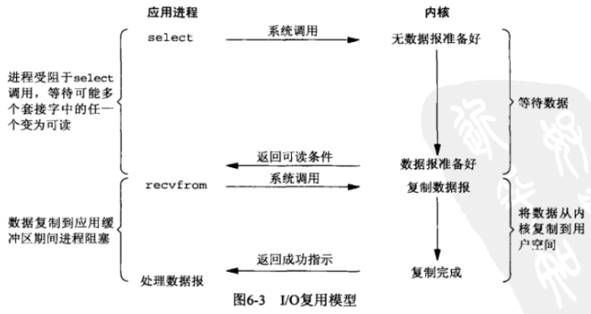
    - 信号驱动 I/O：通过调用 `sigaction` 注册信号函数，等内核数据准备好的时候系统中断当前程序，执行信号函数（在这里面调用 `recv`）。D 同学让舍管阿姨等有水的时候通知他(（注册信号函数），没多久 D 同学得知有水了，跑去装水。是不是很像异步 IO，很遗憾，它还是同步IO（省不了装水的时间啊）。
    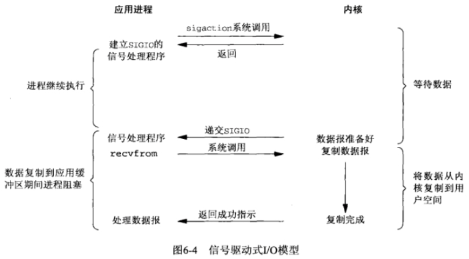
  - 异步 I/O 与同步 I/O 相反，当 I/O 完成后通知进程，中间没有任何阻塞。调用 `aio_read`，让内核等数据准备好，并且复制到用户进程空间后执行事先指定好的函数。E 同学让舍管阿姨将杯子装满水后通知他,整个过程 E 同学都可以做别的事情（没有 `recv`），这才是真正的异步IO。
  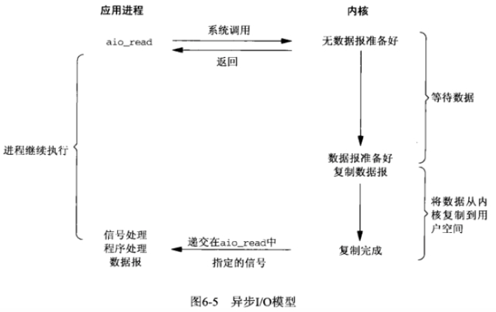
  - 阻塞 I/O，非阻塞 I/O，I/O 复用，信号驱动 I/O 这些在 I/O 完成之前都有阻塞过程，所以都是同步 I/O，只有中间过程完全没有阻塞的才是异步 I/O。
  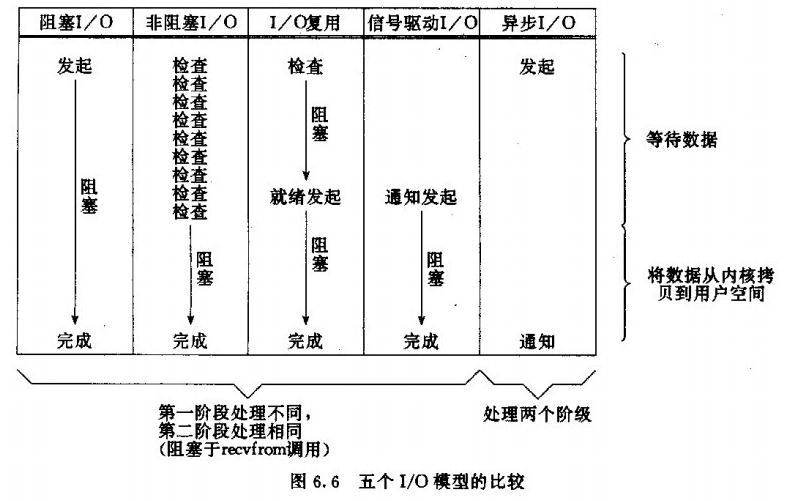
  > 参考：[简述同步IO、异步IO、阻塞IO、非阻塞IO之间的联系与区别](https://www.cnblogs.com/felixzh/p/10345929.html)

</details>
<details>
  <summary>文件读写使用的系统调用</summary>
  
  - **open**：`open` 函数根据用户设置的标志 `flags`和模式 `mode` 在路径 `pathname` 下建立或者打开一个文件。当函数成功时，**返回一个整型的文件描述符**，出错时返回-1。
    - 函数原型：`int open(const char *pathname, int flags);` 或 `int open(const char *pathname, int flags, mode_t mode); `。
    - `pathname`：文件路径。
    - `flags`：用于设置文件打开后允许的**操作方式**，只读、只写、读写等。
    - `mode`：用于表示打开文件的**权限**，如用户有读写执行的权限，必须是此时通过 `open` 新创建的文件，当 `flags = O_CREAT`（O_CREAT：文件不存在则创建它，同时第三个参数mode需要设定新文件的权限） 时才有效。
  - **read**：`read` 函数从文件描述符 `fd` 对应的文件中读取 `count` 字节，放到 `buf` 开始的缓冲区。如果 `count` 的值为 0，`read` 函数返回 0，不进行其他操作；读取成功时，文件对应的读取位置指针向后移动，移动的大小为读取的字节数。如果 `read` 函数读取成功，返回读取的字节数；当返回值为 -1 的时候，读取函数有错误发生；如果已经达到文件的末尾，返回 0。
    - 函数原型：`ssize_t read(int fd, void *buf, size_t count);`。
    - `fd`：文件描述符。
    - `buf`：缓冲区。
    - `count`：读取的字节数。
    - 数据走向：目标文件 $\Rightarrow$ 缓冲区
  - **write**：`write` 函数向文件描述符 `fd` 写入数据，数据的大小由 `count` 指定，`buf` 为要写入数据的指针。写入成功返回写入数据的字节数，写入出错则返回 -1。当操作的对象是普通文件时，写文件的位置从文件的当前开始，如果在打开文件时指定了 `flag = O_APPEND`（对文件的读写追加到文件的尾端），每次写操作时，会将写操作的位置移到文件的结尾处。
    - 函数原型：`ssize_t write(int fd, const void *buf, size_t count);`。
    - `fd`：文件描述符。
    - `buf`：缓冲区。
    - `count`：写入的字节数。
    - 数据走向：缓冲区 $\Rightarrow$ 目标文件。
  - **mmap**：`mmap` 函数将普通文件映射到内存中，普通文件被映射到进程地址空间后，进程可以像访问普通内存一样对文件进行访问，不必再调用 `read`，`write`等操作。`mmap` 系统调用使得进程之间可以通过映射同一个普通文件实现共享内存。`mmap` 函数执行成功后返回映射区的起始地址，执行失败返回 -1。
    - 函数原型：`void *mmap(void *start, size_t length, int prot, int flags, int fd, off_t offset);`。
    - `start`：映射区的起始地址，通常为 `NULL`，表示由系统自己决定映射到什么位置。
    - `length`：映射的数据长度，即文件需要映射到内存中的数据大小。
    - `prot`：映射区的保护方式。
    - `flags`：指定映射对象的类型，映射选项和映射页是否可以共享。
    - `fd`：文件描述符。
    - `offse`：被映射数据在文件中的起点。
  - **close**：`close` 函数关闭一个文件描述符，关闭以后此文件描述符不再指向任何文件，从而描述符可以再次使用。当函数成功时，返回 0，如果由错误发生，返回 -1。
    - 函数原型：`int close(int fd);`
    - `fd`：文件描述符。
  > 参考：[Linux 文件操作系统调用](https://www.cnblogs.com/kooyun/p/5465686.html)

</details>
<details>
  <summary>线程池的了解、优点、调度处理方式和保护任务队列的方式</summary>
  

</details>
<details>
  <summary>怎么回收线程</summary>
  
  - 使用 Posix 线程 。需要 `#include <pthread.h>`
    - **创建线程**：`int pthread_create(pthread_t *tid, pthread_attr_t *attr, func *f, void *arg);`
    - **终止线程**：`void  pthread_exit(void *thread_return);`
    - **回收线程**：`int pthread_join(pthread_t tid, void **thread_return);`
  - 使用 C++11 线程库。需要 `#include <thread>`
  > 参考：[深入理解计算机系统 12.3-基于线程的并发编程]()

</details>
<details>
  <summary>僵尸进程问题</summary>
  
  - 当一个进程终止时，内核并不是立即把他从系统中清除，相反，进程被保持在一种已终止的状态中，直到被他的父进程回收。当父进程回收已终止的子进程时，内核将子进程的退出状态传递给父进程，然后抛弃已终止的进程，从此时开始，该进程就不存在了。**一个终止了但是还未被回收的进程称为僵尸进程**。
  - 在每个进程退出的时候,内核释放该进程所有的资源,包括打开的文件,占用的内存等。 但是仍然为其保留一定的信息，包括进程号，退出状态，运行时间等。直到父进程通过 `wait` 或者 `waitpid` 来取时才释放。
  - **僵尸进程的危害**：如果父进程一直不调用 `wait` 或 `waitpid` 来回收已终止的子进程的话，那么他的进程号就一直被该僵尸进程占用，而系统的进程号是有限的，如果系统中有大量的僵尸进程，那么有可能会因为没有可用的进程号导致无法创建新的进程。
  - **解决僵尸进程问题**
    - **子进程退出时向父进程发送 SIGCHILD 信号**，父进程处理 SIGCHILD 信号，在信号处理函数中调用 `wait` 或者 `waitpid` 回收已终止进程。
    - **将僵尸进程变为孤儿进程**，将产生大量僵尸进程的父进程杀死，这样该父进程产生的僵尸进程就变成了孤儿进程，孤儿进程将由 `init` 进程接管，`init` 进程将回收这些孤儿进程。
  > [深入理解计算机系统 8.4.3-回收子进程]()，[孤儿进程与僵尸进程[总结]](https://www.cnblogs.com/Anker/p/3271773.html)

</details>
<details>
  <summary>孤儿进程</summary>
  
  - 一个父进程退出，而他的一个或多个子进程还在运行，那么这些子进程将成为孤儿进程。孤儿进程将由 `init` 进程所收养（`init` 进程的 PID 为 1，是在系统启动时由内核创建的，他不会终止，是所有进程的祖先），`init` 进程会对孤儿进程进行回收。
  > [深入理解计算机系统 8.4.3-回收子进程]()，[孤儿进程与僵尸进程[总结]](https://www.cnblogs.com/Anker/p/3271773.html)
  
</details>
<details>
  <summary>异常和中断的区别</summary>
  

</details>
<details>
  <summary>一般情况下在 Linux/windows 平台下栈空间的大小</summary>
  
  - 32位 Windows 下，进程栈的默认大小为 1M，线程栈的默认大小为 1M。
  - 32为 Linux 下，进程栈的默认带下大小为 10M，线程栈的默认大小为 8M。
  - 可以自行设置栈的大小。
  > 参考：[进程空间分配和堆栈大小](https://www.cnblogs.com/ladawn/p/8449399.html)

</details>
<details>
  <summary>分页与分段的区别</summary>
  
  - **目的不同**：分页是为了得到更大的线性地址，而不用增加物理内存；分段是为了程序和数据可以划分为逻辑上独立的地址空间。
  - **大小是否可以改变**：页面是定长的，段不是定长的。
  - **地址空间的维度**：分页是一维地址空间的，分段是二维地址空间的。由于程序的各页是根据程序地址空间连续编址的，只需给出一个虚拟地址就可以定位到物理地址，所以是一维地址空间；而对于分段来说，一个程序被拆分成各段，各段独立编址，各段从零开始编址，整个程序的地址不连续，需要给出段的起始地址和段内地址才能进行定位。
  > 参考：[现代操作系统 3.7-分段]()，[为什么说分页管理的地址空间是一维的，而分段管理的地址空间是二维的](https://www.zhihu.com/question/21736290?sort=created)，[为什么分页机制中逻辑地址空间是一维的，而分段机制中逻辑地址空间是二维的](https://blog.csdn.net/yangkuiwu/article/details/53493458?utm_source=itdadao&utm_medium=referral)

</details>
<details>
  <summary>文件系统的理解</summary>

  - **文件**：文件是一种抽象机制，它**提供了一种在磁盘上保存信息而且方便以后读取的方法**。这种方法可以使用户不必了解存储信息的方法 、 位置和实际磁盘工作方式等有关细节。
  - **文件访问**
    - 顺序访问：进程在这些系统中可从头按顺序读取文件的全部字节或记录，但不能跳过某一些内容，也不能不按顺序读取。
    - 随机访问：当用磁盘来存储文件时，可以不按顺序地读取文件中的字节或记录，可以按照关键字而不是位置来访问记录。 
  - **文件存储实现**：每个文件被赋予一个 **i 节点**的数据结构，其中列出了**文件属性和文件块的磁盘地址**。每个 i 节点都有一个号码，可以使用 i 节点号标识文件。
  - **目录的实现**：目录由一系列的目录项组成，而一个目录项由文件的文件名和文件对应的 i 节点号组成。文件中不包含文件名，文件名只存在于目录项中。
  - **共享文件**
    - 硬链接：硬链接创建一个目录项，目录项中包含文件名和一个 i 节点号，该 i 节点号代表被共享的那个文件。
    - 软链接：软链接创建一个文件，文件中保持着被共享的文件的地址。（*相当于 Windows 中的快捷方式*）。
    - 硬链接与软连接的区别：软链接可以跨文件系统；硬链接不可以跨操作系统，因为不同操作系统的 i 节点定义可能不同，软链接可以对目录进行链接；硬链接不可以对目录进行链接。删除软链接的源文件，链接文件将无效；删除硬链接的源文件，链接文件仍有效。
  - **虚拟文件系统**（VFS）：由于一个操作系统中可以有多个文件系统，为了统一接口，引入虚拟文件系统，对不同文件系统的所有细节进行抽象，使得不同文件系统在操作系统看来都是相同的。
  - **日志文件系统**：保存一个用干记录系统下一步将要做什么的日志，这样当系统在完成它们即将完成的任务前崩溃时，重新启动后，可以通过查看日志，获取崩溃前计划完成的任务，并完成它们。
  > 参考：[现代操作系统 4-文件系统]()，[硬盘基本知识](https://www.cnblogs.com/jswang/p/9071847.html)，[Linux系统硬链接和软链接](https://www.cnblogs.com/songgj/p/9115954.html)，[Linux 的 inode 的理解](https://blog.csdn.net/xuz0917/article/details/79473562?utm_medium=distribute.pc_relevant.none-task-blog-BlogCommendFromMachineLearnPai2-2.channel_param&depth_1-utm_source=distribute.pc_relevant.none-task-blog-BlogCommendFromMachineLearnPai2-2.channel_param)

</details>
<details>
  <summary>I/O 复用的三种方法（select，poll，epoll）深入理解</summary>

  - 假设有多路网络连接，如果所有连接共用一个线程，那么一个连接在等待数据的时候，其他连接同时也在等待这个连接结束，这个连接将阻塞后面所有的连接；如果为每一个连接都创建一个独立的线程，线程之间的切换将比较耗时，而且创建多个线程也比较占空间；如果所有连接共用一个线程，不主动等待数据，而是查询数据，查询是否有数据发送过来给连接，如果有数据就读取，这就是 I/O 复用。
  - **I/O 复用的适用场景**
    - 客户端处理多个 socket。
    - 客户端同时处理连接和用户输入。
    - 服务器同时处理 TCP 和 UDP。
    - 服务器要监听多个端口。
    - 服务器要同时处理监听 socket 和 连接 socket。
  - **select** 允许应用程序监视一组文件描述符，等待一个或者多个描述符成为就绪状态，然后遍历所有的描述符，找到就绪的描述符，从而完成 I/O 操作。
    - 函数原型：`int select(int n, fd_set *readfds, fd_set *writefds, fd_set *exceptfds, struct timeval *timeout);`。
    - `fd_set` 使用数组实现，数组大小使用 `FD_SETSIZE` 定义，所以只能监听少于 `FD_SETSIZE` 数量的描述符。
    - 有三种类型的描述符类型：`readset`、`writeset`、`exceptset`，分别对应读、写、异常条件的描述符集合。
    - `timeout` 为超时参数，**调用 `select` 会一直阻塞直到有描述符的事件到达或者等待的时间超过 `timeout`**。
    - 成功调用返回结果大于 0，出错返回结果为 -1，超时返回结果为 0。
    - 每次调用 `select`，都需要把 fd 集合从用户态拷贝到内核态，这个开销在 fd 很多时会很大。
    - 同时每次调用 `select` 都需要在内核遍历传递进来的所有 fd 集合，这个开销在 fd 很多时也很大。
    - select支持的文件描述符数量很少，默认是1024。
  - **poll** 的功能与 select 类似，也是等待一组描述符中的一个成为就绪状态。
    - 函数原型：`int poll(struct pollfd *fds, unsigned int nfds, int timeout);`。
    - `poll` 没有描述符数量的限制。
    - `poll` 中使用 pollfd 传输描述符数组，而不是 fd_set。
  - **epoll** 允许应用程序监视一组文件描述符，等待一个或者多个描述符成为就绪状态，无需遍历描述符，因为会返回就绪的描述符。
    - `int epoll_create(int size);`：内核中间加一个 ep 对象，把所有需要监听的 socket 都放到 ep 对象中。
    - `int epoll_ctl(int epfd, int op, int fd, struct epoll_event *event);`：epoll_ctl 负责把 socket 增加、删除到内核的 ep 对象中。
    - `int epoll_wait(int epfd, struct epoll_event * events, int maxevents, int timeout);`：epoll_wait 负责检测可读队列，一直阻塞直到有 socket 可读或者超时。
    - epoll 有 EPOLLLT 和 EPOLLET 两种触发模式，LT 是默认模式，ET 是高速模式。
    - LT 模式是水平触发。LT 模式下，事件就绪时，假设对事件没做处理，内核会反复通知事件就绪。
    - ET 模式是边缘触发。ET 模式下，事件就绪时，内核只会在第一次通知事件就绪，通知之后进程必须立即处理事件，假设对事件没做处理，内核不会反复通知事件就绪。（*为什么 ET 模式要是非阻塞*）
  > 参考：[I/O多路复用-概述与应用场景](https://my.oschina.net/u/2247638/blog/891197)，[I/O 多路复用是什么意思](https://www.zhihu.com/question/32163005)，[I/O多路复用技术是什么](https://www.zhihu.com/question/28594409)，[select、poll、epoll之间的区别](https://www.cnblogs.com/aspirant/p/9166944.html)，[彻底理解 I/O 多路复用！](https://mp.weixin.qq.com/s/PzOF9lFYVacPIRx0JakTjA)，[EPOLLLT和EPOLLET的区别](https://blog.csdn.net/u010325193/article/details/86413438?utm_medium=distribute.pc_relevant.none-task-blog-BlogCommendFromMachineLearnPai2-3.channel_param&depth_1-utm_source=distribute.pc_relevant.none-task-blog-BlogCommendFromMachineLearnPai2-3.channel_param)
  
</details>

## Linux
<details>
  <summary>文件处理命令 grep，awk，sed</summary>
  
</details>

## 数据结构
<details>
  <summary>C++ 的 STL 介绍</summary>

  - STL 是C++标准库的重要组成部分，不仅是一个可复用的组件库，而且是一个包罗数据结构和算法的软件框架。
  - **STL 六大组件**
    -  **容器**（Containers）：各种数据结构，如：`vector`、`list`、`deque`、`set`、`map`。用来存放数据。从实现的角度来看，STL容器是一种 class template。
    - **算法**（algorithms）：各种常用算法，如：`sort`、`search`、`copy`、`erase`。从实现的角度来看，STL 算法是一种 function template。
    - **迭代器**（iterators）：容器与算法之间的胶合剂，是所谓的“泛型指针”。共有五种类型，以及其他衍生变化。从实现的角度来看，迭代器是一种将 operator*、operator->、operator++、operator- - 等指针相关操作进行重载的 class template。所有 STL 容器都有自己专属的迭代器，只有容器本身才知道如何遍历自己的元素。原生指针也是一种迭代器。
    - **仿函数**（functors）：行为类似函数，可作为算法的某种策略。从实现的角度来看，仿函数是一种重载了operator() 的 class 或 class template。一般的函数指针也可视为狭义的仿函数。
    - **适配器**（adapters）：一种用来修饰容器、仿函数、迭代器接口的东西。例如：STL 提供的 queue 和 stack，虽然看似容器，但其实只能算是一种容器配接器，因为它们的底部完全借助 deque，所有操作都由底层的 deque 供应。改变 functors 接口者，称为 function adapter；改变 container 接口者，称为 container adapter；改变 iterator 接口者，称为 iterator adapter。
    - **配置器**（allocators）：负责空间配置与管理。从实现的角度来看，配置器是一个实现了动态空间配置、空间管理、空间释放的 class template。
    > 参考：[STL 简介和常见的面试题](https://blog.csdn.net/dreamispossible/article/details/89442263?utm_medium=distribute.pc_relevant.none-task-blog-BlogCommendFromMachineLearnPai2-6.nonecase&depth_1-utm_source=distribute.pc_relevant.none-task-blog-BlogCommendFromMachineLearnPai2-6.nonecase)
    
</details>
<details>
  <summary>B- 树和 B+ 树的区别，分别是怎么实现的</summary>
  
  - 相对于在外存中操作，在内存中操作要快许多，所以我们尽量发数据放在内存中进行查找操作，但如果一个数据集十分庞大，无法放入内存，还是需要在外存中查询。查询过程中，如果每次从外存中只读取一个数据，I/O 操作过于频繁，效率是极低的；为了提高效率，可以**每次从外存中读取一批数据到内存**，再在这一批数据中查找目标值。为此引入多路搜索树，即 B- 树和 B+ 树。
  - **m 阶 B- 树**
    - 根节点至少有两个子女。
    - 每个中间节点都包含 k - 1 个元素 和 k 个孩子，其中 $m/2 \leq k \leq m$。
    - 每一个叶子节点都包含 k - 1 个元素，其中 $m/2 \leq k \leq m$。
    - 所有的叶子节点都位于同一层。
    - 每个节点中的元素从小到大排列，节点当中 k - 1 个元素正好是 k 个孩子包含的元素的值域划分。
  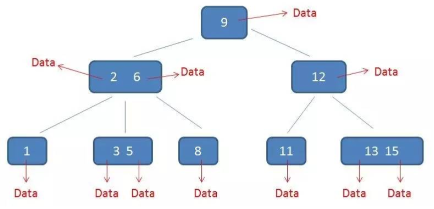
  - **m 阶 B+ 树**
    - 有 k 个子树的中间节点包含有 k 个元素。
    - 每个元素步保存数据，只用来索引。
    - 所有数据保存在叶子节点。
    - 所有的叶子节点中包含了全部元素的信息，及指向这些元素记录的指针。
    - 叶子节点本身按照关键字的大小从小到大顺序来连接。
    - 所有的中间节点元素都同时存在于子节点，在子节点元素中是最大（或最小）元素。
  
  - **B- 树与 B+ 树对比**：
    - B+ 树种没有卫星数据，同样大小的磁盘页可以容纳更多的节点元素，所以 B+ 树比 B- 树更加矮胖，**B+ 树查询时 I/O 次数更少**。
    - B+ 树查询必须最终查找到叶子节点，而 B- 树只要找到匹配元素即可，所以 B- 树的查询是不稳定的，而 **B+ 树查询是稳定的**。
    - 在范围查找中，B- 树需要先自上而下找到范围的下限，然后再进行中序遍历，一直到范围的上限；B+ 树需要先自上而下找到范围的下限，然后对叶子节点组成的链表进行遍历，一直到范围的上限。所以 **B+ 树范围查找更方便**。
    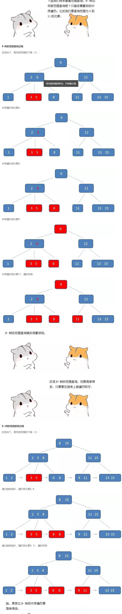
  > 参考：[数据结构 8.2-B-树]()，[b+树图文详解](https://blog.csdn.net/qq_26222859/article/details/80631121)

</details>
<details>
  <summary>STL 里 map 的底层实现</summary>

  - map 使用**红黑树**作为底层实现。红黑树是一种二叉搜索树，红黑树的查找、插入、删除的时间复杂度都是 **O(logn)**，且性能稳定。（*相比于平衡二叉搜索树（AVL树），红黑树是一种弱平衡二叉搜索树，红黑树不需要要个保持高度平衡，其插入和删除时进行的旋转操作要比平衡二叉搜索树更少*）。
  - map 中所有元素会根据元素的键值进行**自动排序**。
  - map 所有元素都是 pair，pair 的第一元素视为 key，pair 的第二 元素视为 value。
  - map 不允许两个元素拥有相同的 key。
  - 不能修改元素的 key，因为 map 元素的 key 关系到 map 元素的排列规则；但是可以修改元素的 value，因为元素的 value 不会影响 map 的排列。
  > 参考：[STL 源码剖析 5.4-map]()

</details>
<details>
  <summary>STL 中 unordered_map 和 map 的区别</summary>

  - map 的底层实现是红黑树；unordered_map 的底层实现是哈希表。
  - map 内部元素是有序的；unordered_map 内部元素是无序的。
  - map 查找的时间复杂度是 O(logn)；unordered_map 查找的时间复杂度是 O(1)，最坏是 O(n)。
  - map 插入的时间复杂度是 O(logn)；unordered_map 插入的时间复杂度是 O(1)，最坏是 O(n)。
  - map 删除的时间复杂度是 O(logn)；unordered_map 删除的时间复杂度是 O(1)，最坏是 O(n)。
  - map 适用于有顺序要求的问题；unordered_map 适用于查找问题。  
  > 参考：[c++ map与unordered_map区别及使用](https://blog.csdn.net/qq_21997625/article/details/84672775)

</details>
<details>
  <summary>STL 中的 hash 表的实现</summary>

  - **基本构思**：开辟物理地址连续的桶数组 ht[]，借助散列函数 hash()，将词条关键码 key 映射为桶地址 hash(key)，从而快速地确定待操作词条的物理位置。但是不同关键码可能映射到同一个桶，即发生哈希冲突。
  - **封闭定址策略**：若新词条与旧词条发生冲突，允许建立新的数据结构，把这个桶内的数据转移到新的数据结构内。
    - 多槽位法：将彼此冲突的每一组词条组织为一个小规模的子词典，分别存放于它们共同对应的桶单元中。
    - 独立链法：令相互冲突的每组词条构成小规模的子词典， 采用列表来实现各子词典。
    - 公共溢出法：在原散列表之外另设一个词典结构，一旦在插入词条时发生冲突就将该词条转存至这个新创建的词典结构中。
  - **开放定址策略**：若新词条与已有词条冲突， 则只允许在散列表内部为其寻找另一空桶。
    - 线性试探法：在插入关键码 key 时，若发现对应的桶单元被占用，那么就试探该桶单元后面的一个桶单元是否被占用，如果这个桶也被占用，那么继续往后找，直到发现一个可用空桶。
    - 查找链：假定使用线性试探法，那么查找词条时从桶单元 ht[hash(key)] 开始查找，若没有找到，就试探后面的一个桶，如果还没有，就继续往后找，直到桶中为 key，或桶为空（最后一个桶的后面也看作空桶）。
    - 懒惰删除：查找链中如果有任何一环缺失，都会导致无法抵达后续词条，为了解决这个问题，引入懒惰删除，再已经删除的同上设置一个标识，指示该桶虽然为空，但是此前存放过词条。  
  > 参考：[数据结构 9.3-散列表]()

</details>
<details>
  <summary>STL 中 vector 的实现</summary>

  - vector 内部维护一个数组，当数组空间不足时，进行**扩容**，创建一个大小为原数组大小两倍的数组，复制原数组的内容到新数组中，然后释放原数组。
  - 当装填因子（指向量规模与其内部数组的容量之比）小于某一阈值的时候，数组发生**下溢**。当装填因子小于 25% 的时候，创建一个大小为原数组大小一半的数组，复制原数组的内容到新数组，然后释放原数组。
  > 参考：[数据结构 2-向量]()

</details>

## 算法
<details>
  <summary>注意事项</summary>
  
  - 当有多层嵌套循环的时候记得检查循环变量有无用错的地方。
  - 

</details>

## 数据库
<details>
  <summary>MySQL 索引为何失效</summary>
  
  - `LIKE` 以 `%` 开头，索引无效。
  - `or` 语句前后没有同时使用索引，索引失效。
  - 当全表扫描速度比索引速度快时，MySQL 会使用全表扫描，索引失效。
  - 如果存在 NULL 值条件，索引失效。
  - 查询条件上如果对索引列使用函数，索引无效。
  - 当查询条件存在隐式转换时，索引会失效。
  - 还有许多，未一一列举。
  > 参考：[索引失效的情况有哪些，索引何时会失效（全面总结）](https://blog.csdn.net/bless2015/article/details/84134361?utm_medium=distribute.pc_relevant.none-task-blog-BlogCommendFromMachineLearnPai2-7.channel_param&depth_1-utm_source=distribute.pc_relevant.none-task-blog-BlogCommendFromMachineLearnPai2-7.channel_param)

</details>
<details>
  <summary>事务是什么，事务的几个特性</summary>
  
  - MySQL 事务主要用于处理操作量大，复杂度高的数据。比如说，在人员管理系统中，你删除一个人员，你既需要删除人员的基本资料，也要删除和该人员相关的信息，如信箱，文章等等，这样，这些数据库操作语句就构成一个事务。
  - **原子性**：一个事务（transaction）中的所有操作，要么全部完成，要么全部不完成，不会结束在中间某个环节。事务在执行过程中发生错误，会被回滚（Rollback）到事务开始前的状态，就像这个事务从来没有执行过一样。
  - **一致性**：在事务开始之前和事务结束以后，数据库的完整性没有被破坏。这表示写入的资料必须完全符合所有的预设规则，这包含资料的精确度、串联性以及后续数据库可以自发性地完成预定的工作。
  - **隔离性**：数据库允许多个并发事务同时对其数据进行读写和修改的能力，隔离性可以防止多个事务并发执行时由于交叉执行而导致数据的不一致。事务隔离分为不同级别，包括读未提交（Read uncommitted）、读提交（read committed）、可重复读（repeatable read）和串行化（Serializable）。
  - **持久性**：事务处理结束后，对数据的修改就是永久的，即便系统故障也不会丢失。
  > 参考：[MySQL 事务](https://www.runoob.com/mysql/mysql-transaction.html)

</details>
<details>
  <summary>常用 SQL 语句（DDL，DM，DCL，TCL）</summary>

</details>
<details>
  <summary>数据库中 join 的类型与区别（inner join, outer join, cross join, natural join, self join），注意适用场景和 sql 语句的编写</summary>

</details>
<details>
  <summary>数据库的索引类型</summary>

</details>
<details>
  <summary>聚集索引和非聚集索引的区别（叶节点存储内容）</summary>

</details>
<details>
  <summary>唯一性索引和主码索引的区别</summary>

</details>
<details>
  <summary>索引的优缺点，什么时候使用索引，什么时候不能使用索引（重点）</summary>

</details>
<details>
  <summary>索引的底层实现（B+树，为何不采用红黑树，B树）</summary>

</details>
<details>
  <summary>索引最左前缀问题</summary>

</details>
<details>
  <summary>Mysql 的优化（高频，索引优化，性能优化）</summary>

</details>
<details>
  <summary>数据库引擎介绍，innodb和myisam的特点与区别</summary>

</details>
<details>
  <summary>数据库隔离性设置不同会出现的问题（脏读、不可重复读、丢失修改、幻读）</summary>

</details>
<details>
  <summary>数据库的隔离级别，mysql 和 Oracle 的隔离级别分别是什么</summary>

</details>
<details>
  <summary>数据库连接池的作用</summary>

</details>
<details>
  <summary>Mysql 的表空间方式，各自特点</summary>

</details>
<details>
  <summary>分布式事务</summary>

</details>
<details>
  <summary>数据库的范式</summary>

</details>
<details>
  <summary>数据的锁的种类，加锁的方式</summary>

</details>
<details>
  <summary>视图的作用与使用方法（如何删除等）</summary>

</details>
<details>
  <summary>分库分表，主从复制，读写分离</summary>

</details>

## 设计模式
<details>
  <summary>为什么会有设计模式，有什么优点</summary>
  
  - 加快开发速度，设计模式是过去的程序员积累的经验，对某些场景下的代码设计有一定的总结，可以直接套用。
  - 提高**可维护性、可扩展性、可复用性**，初学者写的代码可能只考虑了功能实现，而没有考虑到后期维护问题，后期如果增加新功能代码应该如何修改，类之间的关系可能错综复杂，不熟悉该项目代码的人难以阅读及理解。
  > 参考：[设计模式简介](https://www.runoob.com/design-pattern/design-pattern-intro.html)，[设计模式总结篇](https://blog.csdn.net/niunai112/article/details/80034203)
  
</details>
<details>
  <summary>设计模式的几项原则</summary>

  - **开放封闭原则**：对扩展开放，对修改关闭。在程序需要进行拓展的时候，不能去修改原有的代码。
  - **里氏代换原则**：任何基类可以出现的地方，子类一定可以出现。LS 里氏代换原则是对开闭原则的补充。实现开闭原则的关键步骤就是抽象化，而基类与子类的继承关系就是抽象化的具体实现，所以里氏代换原则是对实现抽象化的具体步骤的规范。
  - **依赖倒转原则**：针对接口编程，依赖于抽象而不依赖于具体。
  - **接口隔离原则**：使用多个隔离的接口，比使用单个接口要好。它还有另外一个意思是：降低类之间的耦合度。由此可见，其实设计模式就是从大型软件架构出发、便于升级和维护的软件设计思想，它强调降低依赖，降低耦合。
  - **最少知道原则**：一个实体应当尽量少地与其他实体之间发生相互作用，使得系统功能模块相对独立。
  - **合成复用原则**：尽量使用合成/聚合的方式，而不是使用继承。
  > 参考：[C++------简单工厂模式，工厂方法模式和抽象工厂模式](https://www.cnblogs.com/zhangzeze/p/9392598.html)

</details>
<details>
  <summary>简单工厂模式</summary>

  - 简单工厂模式是由一个工厂对象决定创建出哪一种产品类的实例。
  - 例子：创建一个操作符工厂，该工厂可以生产各种操作符实例，客户在生产前需要告知该工厂类需要生产的操作符实例类型。
  ```C++
  #include <iostream>
  #include <string>
  using namespace std;
  #define ADD 1
  #define SUB 2
  #define MUL 3
  #define DIV 4

  class Operation {
  public:
      double getNumberA() { return _numberA; }
      double getNumberB() { return _numberB; }
      void setNumberA(int a) { _numberA = a; }
      void setNumberB(int b) { _numberB = b; }
      virtual double GetResult() { double result = 0; return result; }
  private:
      double _numberA = 0;
      double _numberB = 0;
  };

  class OperationAdd : public Operation {
  public:
      virtual double GetResult() { double result = 0; result = getNumberA() + getNumberB(); return result; }
  };

  class OperationSub : public Operation {
  public:
      virtual double GetResult() { double result = 0; result = getNumberA() - getNumberB(); return result; }
  };

  class OperationMul : public Operation {
  public:
      virtual double GetResult() { double result = 0; result = getNumberA() * getNumberB(); return result; }
  };

  class OperationDiv : public Operation {
  public:
      virtual double GetResult() {
          double result = 0;
          if (!getNumberB()) throw "Division by zero condition!";
          result = getNumberA() / getNumberB();
          return result;
      }
  };

  class OperationFactory {
  public:
      static Operation* createOperate(int operate) {
          Operation *op = nullptr;
          switch(operate) {
              case ADD: op = new OperationAdd(); break;
              case SUB: op = new OperationSub(); break;
              case MUL: op = new OperationMul(); break;
              case DIV: op = new OperationDiv(); break;
          }
          return op;
      }

  private:
      static Operation* op;
  };
  Operation* OperationFactory::op = nullptr;

  int main() {
      Operation* _operator_ = OperationFactory::createOperate(SUB);
      _operator_->setNumberA(5);
      _operator_->setNumberB(2);
      double res = _operator_->GetResult();
      cout << "result: " << res << endl;
      return 0;
  }
  ```
  - 优点：工厂类包含了必要的逻辑判断，根据客户端的选择条件动态实例化相关的类，对于客户端来说，去除了与具体产品的依赖。
  - 缺点：违反了开放封闭原则：对扩展开放，对修改关闭。如上面的例子，如果要增加一个求 `NumberA` 的 `NumberB` 次方的功能，除了要添加一个 `Operation` 的派生类`OperationPow`，还要对 `OperationFactory` 进行修改，在 `createOperate` 函数的 `switch` 内添加一个属于 `OperationPow` 的分支条件。
  > 参考：[C++------简单工厂模式，工厂方法模式和抽象工厂模式](https://www.cnblogs.com/zhangzeze/p/9392598.html)，[大话设计模式-简单设计模式]()

</details>
<details>
  <summary>工厂方法模式</summary>
  
  - 工厂方法模式是指定义一个用于创建对象的接口，让子类决定实例化哪个类，将创建过程延迟到子类中进行。
  - 例子：创建两个工厂，一个用于生产学雷锋的大学生，一个用于生产社区志愿者，当有老人需要帮助的时候，客户如果想要大学生可以找生产大学生的工厂，如果想要志愿者可以找生产志愿者的工厂。
  ```C++
  #include <iostream>
  #include <string>
  using namespace std;

  class LeiFeng {
  public:
      virtual void swap() { cout << "swap" << endl; }
      virtual void wash() { cout << "wash" << endl; }
      virtual void buyRice() { cout << "buyRice" << endl; }
  };

  class Upgrade: public LeiFeng {
  public:
      virtual void swap() { cout << "upgrade swap" << endl; }
      virtual void wash() { cout << "upgrade wash" << endl; }
      virtual void buyRice() { cout << "upgrade buyRice" << endl; }
  };

  class Volunteer: public LeiFeng {
      virtual void swap() { cout << "volunteer swap" << endl; }
      virtual void wash() { cout << "volunteer wash" << endl; }
      virtual void buyRice() { cout << "volunteer buyRice" << endl; }
  };

  class IFactory {
  public:
      virtual LeiFeng* createLeiFeng() = 0;
  };

  class UndergraduateFactory: public IFactory {
  public:
      virtual LeiFeng* createLeiFeng() { return new Upgrade(); }
  };

  class VolunteerFactory: public IFactory {
  public:
      virtual LeiFeng* createLeiFeng() { return new Volunteer(); }
  };

  int main() {
      IFactory* factory = new VolunteerFactory();
      LeiFeng* student = factory->createLeiFeng();
      student->swap();
      student->wash();
      student->buyRice();
      return 0;
  }
  ```
  - 优点：保留了简单工厂模式的优点，即据客户端的选择条件动态实例化相关的类，对于客户端来说，去除了与具体产品的依赖；同时也克服了简单工厂违背开放封闭原则的缺点。
  - 缺点：每次增加一个新产品，除了需要增加一个该产品的类（简单工厂模式也需要），还要再增加一个该产品的工厂类。
  > 参考：[C++------简单工厂模式，工厂方法模式和抽象工厂模式](https://www.cnblogs.com/zhangzeze/p/9392598.html)，[大话设计模式-简单设计模式]()

</details>
<details>
  <summary>抽象工厂模式</summary>

  - 抽象工厂模式是指提供一个创建一系列相关或相互依赖对象的接口，而无需指定它们具体的类。
  - 例子：创建两个工厂，一个使用 SqlServer 语句作为材料，一个使用 Access 语句作为材料，两个工厂都会生产一系列不同的产品，但是两个工厂的生产的产品系列都是一样的，一个工厂有的产品另一个工厂也会生产同系列的产品，只是两个工厂使用的原材料不同，客户可以选择其中一个工厂为其生产所有不同系列的产品。
  ```C++
  #include <iostream>
  #include <string>
  using namespace std;

  class User {
  public:
      int getId() { return id; }
      string getName() { return name; }
      void setId(int i) { id = i; }
      void setName(string n) { name = n; }

  private:
      int id;
      string name;
  };

  class Department {
  public:
      int getId() { return id; }
      string getDepartName() { return depart_name; }
      void setId(int i) { id = i; }
      void setDepartName(string n) { depart_name = n; }

  private:
      int id;
      string depart_name;
  };

  class IUser {
  public:
      virtual void insert(User user) = 0;
      virtual User getUser(int id) = 0;
  };

  class SqlServerUser: public IUser {
  public:
      virtual void insert(User user) { cout << "sqlServer insert" << endl; }
      virtual User getUser(int id) { cout << "sqlServer getUser" << endl; return User(); }
  };

  class AccessUser: public IUser {
  public:
      virtual void insert(User user) { cout << "access insert" << endl; }
      virtual User getUser(int id) { cout << "access getUser" << endl; return User(); }
  };

  class IDepartment {
  public:
      virtual void insert(Department department) = 0;
      virtual Department getDepartment(int id) = 0;
  };

  class SqlServerDepartment: public IDepartment {
  public:
      virtual void insert(Department department) { cout << "sqlServer insert" << endl; }
      virtual Department getDepartment(int id) { cout << "sqlServer getDepartmentUser" << endl; return Department(); }
  };

  class AccessDepartment: public IDepartment {
  public:
      virtual void insert(Department department) { cout << "access insert" << endl; }
      virtual Department getDepartment(int id) { cout << "access getDepartmentUser" << endl; return Department(); }
  };

  class IFactory {
  public:
      virtual IUser* createUser() = 0;
      virtual IDepartment* createDepartment() = 0;
  };


  class SqlServerFactory: public IFactory {
  public:
      virtual IUser* createUser() { return new SqlServerUser(); }
      virtual IDepartment* createDepartment() { return new SqlServerDepartment(); }
  };

  class AccessFactory: public IFactory {
  public:
      virtual IUser* createUser() { return new AccessUser(); }
      virtual IDepartment* createDepartment() { return new AccessDepartment(); }
  };

  int main() {
      User* user = new User();
      Department* department =  new Department();
      IFactory* factory = new SqlServerFactory();
      IUser* iu = factory->createUser();
      iu->getUser(1);
      iu->insert(*user);
      IDepartment* ide = factory->createDepartment();
      ide->getDepartment(1);
      ide->insert(*department);
      return 0;
  }
  ```
  - 优点：用户可以更为便利的交换一系列产品，如上面的例子，此时使用的是 SqlServer 作为数据库，使用的插入、查找都是 SqlServer 语句，如果要切换成 Access 作为数据库，只需要将 `IFactory* factory = new SqlServerFactory();` 改为 `IFactory* factory = new AccessFactory();`，这里的插入、查找就是产品，`SqlServerFactory` 和 `AccessFactory` 生产出来的插入和查找都是不一样的。
  - 缺点：扩展十分麻烦，如果需要在增加一个项目表 IProject，则需要增加 `IProject`，`SqlserverProject`，`AccessProject` 共三个类，还需要修改`IFactory`，`SqlserverFactory`，`AccessFactory`共三个类。《大话设计模式》一书中介绍了使用**反射 + 抽象工厂**进行设计的抽象工厂模式，更占优势，但是 C++ 中并没有反射功能，实现起来可能比较麻烦，这个的实现先暂时搁置。
  > 参考：[C++------简单工厂模式，工厂方法模式和抽象工厂模式](https://www.cnblogs.com/zhangzeze/p/9392598.html)，[大话设计模式-简单设计模式]()

</details>
<details>
  <summary>单例模式</summary>
  
  - 单例模式保证一个类只有一个实例，并提供一个访问它的全局访问点。
  - 有缺陷的懒汉式单例模式，此方法有两个缺陷，一个是**线程安全问题**，当多线程获取单例时有可能引发竞态条件：如果一个线程在 `if` 语句中判断 `m_instance` 为空，假定此时只是刚刚判断完条件，刚进入内部，要执行但是还没有执行 `m_instance = new Singleton();` 语句，恰好第二个线程也尝试获取单例，这个时候判断 `m_instance` 还是空的，因为此时第一个线程还没有成功创建单例，于是线程一与线程二都会进行实例化，这样就有两个实例了，不符合单例的定义，使用加锁可解决此问题；二是**内存泄漏问题**，可能会忘记对单例对象进行 `delete`操作，这可能会造成内存泄漏，使用智能指针可解决此问题。
  ```C++
  #include <iostream>
  using namespace std;

  class Singleton {
  public:
      static Singleton* getInstance() { if (m_instance == nullptr) m_instance = new Singleton(); return m_instance; }
      ~Singleton() { cout << "singleton deconstruct!" << endl; }
  private:
      static Singleton* m_instance;
      Singleton () { cout << "singleton construct!" << endl; };
      Singleton(const Singleton& singleton) = delete;
      Singleton& operator=(const Singleton& singleton) = delete;
  };
  Singleton* Singleton::m_instance = nullptr;

  int main() {
      Singleton* instance1 = Singleton::getInstance();
      Singleton* instance2 = Singleton::getInstance();
      delete instance1;
      return 0;
  }
  ```
  - 线程安全、内存安全的单例模式，使用 `shared_ptr`，使用对象管理资源的思想，保证内存安全，加入双检锁，提供线程安全，为什么要有两重判断呢，这是因为创建锁的开销比较大，如果只是在 `if` 判断前加一个锁，那么不管之前是否创建过单例，每次使用这个函数的时候都进行加锁操作，成本较高，如果在加锁操作外面加一个 `if` 判断语句的话，如果之前创建过单例，就不会进行加锁操作了，但是加锁操作后面的那个 `if` 判断还是要保留的，因为两个或多个线程也许都可以通过第一个 `if` 判断，在一个线程执行完创建实例的工作后，由于没有另外的判断，已经通过第一个 `if` 判断的其他线程则会继续创建实例，所以需要加上两个判断语句。但实际上双检索有严重 bug，由于内存读写的乱序执行。
  ```C++
  #include <iostream>
  #include <memory>
  #include <mutex>
  using namespace std;

  class Singleton {
  public:
      static shared_ptr<Singleton> getInstance() {
          if (m_instance == nullptr) {
              lock_guard<mutex> lock(m_mutex);
              if (m_instance == nullptr)
                  m_instance = shared_ptr<Singleton>(new Singleton());
          }
          return m_instance;
      }
      ~Singleton() { cout << "singleton deconstruct!" << endl; }

  private:
      static shared_ptr<Singleton> m_instance;
      static mutex m_mutex;
      Singleton () { cout << "singleton construct!" << endl; };
      Singleton(const Singleton& singleton) = delete;
      Singleton& operator=(const Singleton& singleton) = delete;
  };
  shared_ptr<Singleton> Singleton::m_instance = nullptr;
  mutex Singleton::m_mutex; 

  int main() {
      shared_ptr<Singleton> instance1 = Singleton::getInstance();
      shared_ptr<Singleton> instance2 = Singleton::getInstance();
      return 0;
  }
  ```
  - Magic Static 版懒汉模式（推荐），这里所用到的特性是 C++11 标准中的 **Magic Static** 特性：如果当变量在初始化的时候，并发同时进入声明语句，并发线程将会阻塞等待初始化结束。这样保证了并发线程在获取静态局部变量（C++ 静态变量的生存期是从声明到程序结束）的时候一定是初始化过的，所以具有线程安全性。注意这里 `getInstance` 函数返回的是引用而不是指针，理由主要是无法避免用户使用 `delete m_instance;` 导致对象被提前销毁。
  ```C++
  #include <iostream>
  #include <memory>
  #include <mutex>
  using namespace std;

  class Singleton {
  public:
      static Singleton& getInstance() {
          static Singleton m_instance;
          return m_instance;
      }
      ~Singleton() { cout << "singleton deconstruct!" << endl; }

  private:
      Singleton () { cout << "singleton construct!" << endl; };
      Singleton(const Singleton& singleton) = delete;
      Singleton& operator=(const Singleton& singleton) = delete;
  };

  int main() {
      Singleton& instance1 = Singleton::getInstance();
      Singleton& instance2 = Singleton::getInstance();
      return 0;
  }
  ```
  - 饿汉式单例模式，饿汉式单例模式在单例定义的时候就会进行实例化，而懒汉式单例模式在需要使用的时候进行实例化。饿汉模式是线程安全的。
  ```C++
  #include <iostream>
  #include <memory>
  #include <mutex>
  using namespace std;

  class Singleton {
  public:
      static Singleton* getInstance() { return m_instance; }
      ~Singleton() { cout << "singleton deconstruct!" << endl; }

  private:
      static Singleton* m_instance;
      Singleton () { cout << "singleton construct!" << endl; };
      Singleton(const Singleton& singleton) = delete;
      Singleton& operator=(const Singleton& singleton) = delete;
  };
  Singleton* Singleton::m_instance = new Singleton();

  int main() {
      Singleton* instance1  = Singleton::getInstance();
      Singleton* instance2 = Singleton::getInstance();
      return 0;
  }
  ``` 
  - 懒汉式和饿汉式的选择：在访问量较小时，采用懒汉实现，这是以时间换空间；在访问量比较大，采用饿汉实现，这是以空间换时间。
  > 参考：[C++ 单例模式总结与剖析](https://www.cnblogs.com/sunchaothu/p/10389842.html)，[设计模式之单例模式（C++ 版）](https://segmentfault.com/a/1190000015950693)
</details>

## 项目

<details>
  <summary>航路规划模块介绍</summary>
  
  - 航路规划模块需要做的事情就是给定起点，终点和海上岛屿信息，规划出一条从起点到终点且与岛屿无碰撞的的路径；同时，需要一个测试软件，用于展示算法的可行性。

</details>
<details>
  <summary>航路规划算法</summary>
  
  - **基本思路**：海图中岛屿通过有序的离散数据点构成的多边形来描述，描述一个岛屿的数据量十分大，所以使用基于面积的凸壳算法岛屿进行简化处理，降低描述岛屿的数据量；简化后的岛屿为凹多边形或者凸多边形，将其中的凹多边形分解为凸多边形；接着使用自由空间法把可行区域划分为多个多边形，多边形之间的连通关系使用图表示，图中的一个节点代表一个多边形，求起点到终点所经过的多边形，就是求有向图中两节点之间的可行路径；求得起点到终点所经过的多边形后，把多个多边形合并为一个多边形，现在的任务转化为求多边形内两点的最短路径；可以使用 Dijkstra 算法计算两点的最短路径，但是使用 Dijkstra 计算出的路径，可能不符合实际的物理约束（最小航迹段长度、最大转弯角），可以引入稀疏 A* 算法解决此问题；稀疏 A* 算法使用 Dijsktra 算法计算出的路径作为其引导方向和启发信息，得到满足实际约束的路径。
  - **基于面积的凸壳算法**：
  - **自由空间法**：
  - **Dijkstra 算法**：
  - **稀疏 A 星算法**：
  -  **算法程序中类之间的关系**：
  - **算法模块是怎么提供给别人的**：应当提供一个 `namespace::function(argv, argv,...)` 形式的函数；还有三个类：点类 `namespace::Point`，多边形类 `namespace::Polygon`，矩形类 `namespace::Rectangle`。
  
</details>
<details>
  <summary>Qt 问题</summary>
  
  - `Qt Designer` + `css` 实现 ui 部分，`C++`  实现逻辑部分。
  - **信号和槽原理**：信号和槽其实就是**对象之间的一种通信机制**。要求两个对象（一个对象之间也可以，但没必要，信号和槽主要用来对象之间的通信）中的函数建立映射关系，**前者被调用时后者也要被调用**（前者是信号，后者为信号对应的槽函数）。
    - **直接调用**：可以直接在前者的函数中调用后者的函数，但是当前者对象不能获取后者对象的时候，那这种方法就实现不了了。
    - **回调函数 + 映射表**：可以建立两个函数之间的映射关系，让前者被调用的时候，自动调用后者。创建一个**映射关系类**，包含一个 `map` 对象，他的 `key` 为字符串，可用来表示信号，他的 `value` 为函数指针，可用来表示槽函数，类中包含两个函数，一个 `connect` 函数，将一个字符串作为 `key`，一个函数指针作为 `value`，把这一对 `key-value` 添加到类中的 `map` 对象，用于将字符串和函数指针绑定，功能类似信号和槽机制中的 `connect`；还有一个 `invoke` 函数，用于调用字符串对应的函数，功能类似与信号和槽机制中的信号。这种方法感觉有**缺点**，，例子：可以在 `class B` 中使用全局对象 `Connections connection` 的 `connection.connect("hello", this->test());` 建立字符串 ”hello“ 与 `B::test();` 的绑定，然后在 `class A` 中的 `A::hi();` 中使用 `connection.invoke("hello")`，执行这个函数时，就会运行 `B::test();` 函数。
    ```C++
    class Connections 
    {
    public:
        //按名称“建立映射关系”
        void connect(const std::string &name, const std::function<void()> &callback) 
        {
            m_callbackMap[name] = callback;
        }
        //按名称“调用”
        void invok(const std::string &name)
        {
            auto it = m_callbackMap.find(name);
            //迭代器判断
            if (it != m_callbackMap.end()) {
                //迭代器有效的情况，直接调用
                it->second();
            }
        }
    private:
        std::map<std::string, std::function<void()>> m_callbackMap;
    };
    ```
    - **发布-订阅模式**：有博客说可以用发布-订阅模式来实现信号和槽机制，但是看了下代码，感觉还是不太对，信号和槽是将两个对象的两个函数绑定，而网上使用发布-订阅模式实现的机制其实是先将两个类的两个函数绑定，然后再将两个对象绑定。这样是会带来一些问题的，比如，有两个类 `class Tom` 和 `class Jerry`，`class Tom` 是发布者，`class Jerry` 是订阅者，`class Tom` 中的 `miao();` 和 `lai();` 分别绑定了 `class Jerry` 的 `onMiao();` 和 `onLai();`，创建四个对象 `Tom tom1`，`Tom tom2`，`Jerry jerry1`，`Jerry jerry2`，其中，`tom1` 绑定 `jerry1`，`tom2` 绑定 `jerry2`，发现两组发布者的 `miao()` 和 `lai()` 都会触发订阅者对应的槽函数，如果 `jerry2` 只想要 `tom2` 在 `miao()` 的时候进行 `onMiao()`，而不想在 `lai()` 的时候 `onLai()`，这就没法实现了，因为 `class Tom` 和 `class Jerry` 中这两个函数是绑定的，只要是这两个类的对象且这两个对象绑定，那么这两个对象中的 `lai()` 和 `onLai()` 就一定是绑定的。而信号和槽可以解决这个问题，`connect(&tom1, SIGNAL(miao()), &jerry1, SLOT(onMiao()));`，`connect(&tom1, SIGNAL(lai()), &jerry1, SLOT(onLai()));`，`connect(&tom2, SIGNAL(miao()), &jerry2, SLOT(onMiao()));`。
    ```C++
    #include <vector>
    #include <algorithm>
    #include <functional>
    #include <iostream>

    //Subject 事件或消息的主体。模板参数为观察者类型
    template<typename ObserverType>
    class Subject {
    public:
        //订阅
        void subscibe(ObserverType *obs)
        {
            auto itor = std::find(m_observerList.begin(), m_observerList.end(), obs);
            if (m_observerList.end() == itor) {
                m_observerList.push_back(obs);
            }
        }
        //取消订阅
        void unSubscibe(ObserverType *obs)
        {
            m_observerList.erase(std::remove(m_observerList.begin(), m_observerList.end(), obs));
        }
        //发布。这里的模板参数为函数类型。
        template <typename FuncType>
        void publish(FuncType func)
        {
            for (auto obs: m_observerList)
            {
                //调用回调函数，将obs作为第一个参数传递
                func(obs);
            }
        }
    private:
        std::vector<ObserverType *> m_observerList;
    };

    using std::cout;
    using std::endl;

    //CatObserver 接口 猫的观察者
    class CatObserver {
    public:
        //猫叫事件
        virtual void onMiaow() = 0;
    public:
        virtual ~CatObserver() {}
    };

    //Tom 继承于Subject模板类，模板参数为CatObserver。这样Tom就拥有了订阅、发布的功能。
    class Tom : public Subject<CatObserver>
    {
    public:
        void miaoW()
        {
            cout << "miao!" << endl;
            //发布"猫叫"。
            //这里取CatObserver类的成员函数指针onMiaow。而成员函数指针调用时，要传递一个对象的this指针才行的。
            //所以用std::bind 和 std::placeholders::_1将第一个参数 绑定为 函数被调用时的第一个参数，也就是前面Subject::publish中的obs
            publish(std::bind(&CatObserver::onMiaow, std::placeholders::_1));
        }
    };
    //Jerry 继承于 CatObserver
    class Jerry: public CatObserver
    {
    public:
        //重写“猫叫事件”
        void onMiaow() override
        {
            //发生 “猫叫”时 调用 逃跑
            RunAway();
        }
        void RunAway()
        {
            cout << "cat coming, run!" << endl;
        }
    };
    int main(int argc, char *argv[])
    {
        Tom tom;
        Jerry jerry;

        //拿jerry去订阅Tom的 猫叫事件
        tom.subscibe(&jerry);

        tom.miaoW();
        return 0;
    }
    ```
  - **事件系统**：

  > 参考：[Qt实用技能4-认清信号槽的本质](https://zhuanlan.zhihu.com/p/75126932)

</details>
<details>
  <summary>设计模式问题</summary>
  
  - **Qt 程序中类之间的关系**：
</details>
<details>
  <summary>通信问题</summary>
  
  - 项目中使用 udp 进行通信。
  - 由于项目特性，通信中采用停等模式，而非流水线模式。
  - 基于 rdt3.0 机制实现可靠数据传输。
  - 改进 rdt3.0，增加序号，序号不仅有 0 和 1。
  - 刁作为发送方，李作为接收方。
  - 刁发出的第一个报文段为起点和终点。
  - 接收到起点和终点后，李进行规划路径，并返回包含第一个规划路径点的报文段给刁，刁接收到以后，根据该路径点计算出随机点作为实际路径点并发送给李，李得到实际路径点后，动态绘制出实际航路，并计算出以该路径点开始依据给定速度靠近下一个规划路径点的路径点，并返回给刁，刁又根据收到的路径点计算出随机点作为实际路径点并发送给李，李又重复之前的动作，这样反复，直到李收到最后的实际终点。
  - 是否能够端口复用，能否多个 socket 绑定一个端口。
  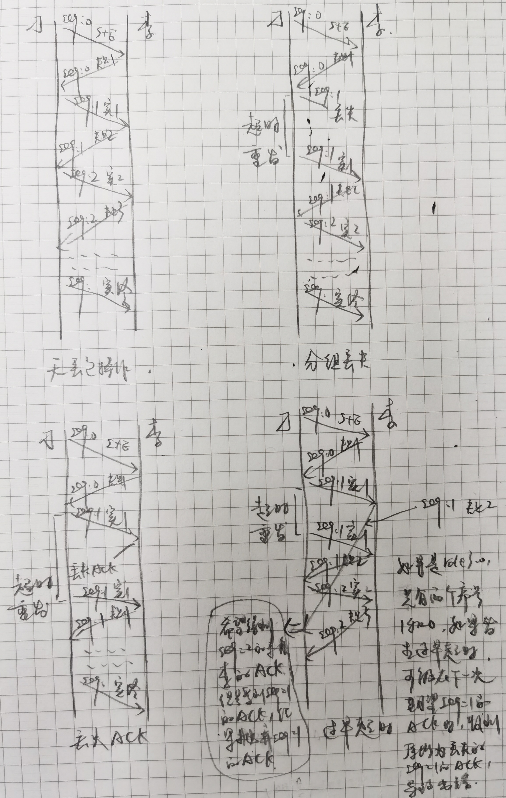
  > 参考：[计算机网络自顶向下方法 3.4-可靠数据传输原理]()

</details>
<details>
  <summary>多线程问题</summary>
  
  - **哪些地方得用多线程**：Qt 种使用多线程，一般就是为了不会有其他过程阻塞 ui 主线程，导致 ui 卡着不动。个人觉得 Qt 中应该不能有太多同时存在的线程，因为这样会分掉 ui 主线程的时间片，导致 ui 界面卡顿。项目中，ui 为一个线程，算法程序为一个线程，还有其他耗时比较长的地方都应该为一个线程。udp 通信不需要为一个线程，udp 发送数据耗时不长，udp 接收数据不是使用轮询而是信号和槽机制，每当有数据报到来时，`QUdpsocket` 都会发射一个 `readyRead()` 信号，所以 udp 通信不需要为一个线程。
  - **线程间通信**：可以使用信号传递小数据，但最好不要用信号传递大数据，所以线程间通信使用全局变量。
  - **Qt 中线程操作**：有两种使用线程的方法，一种是继承 
    
</details> 
<details>
  <summary>异常问题</summary>
  
  - **项目中的异常**
    - 航路规划模块的算法部分会提供一个公开的函数接口给使用者，当函数使用者输入的参数（*起始点，终止点，障碍物，规划区域*）不符合要求（*起止点和终止点不能在障碍物内，起始点和终止点不能在规划区域外，障碍物必须是多边形，规划区域必须是矩形*）时，该函数会抛出异常。
    - 算法程序中只有公开的那个函数会抛出异常，其他函数都不会抛出异常，因为假定输入是正确的，算法内部不应该出现任何异常，如果抛出标准库的异常，只能说明算法程序写的有问题，需要找出 bug 并进行修改。
    - 公开的那个函数应当是强烈（strong）保证的，由于该函数只接受了使用者的四个参数，且都是值传递，不会改变函数使用者的对象的内容，也就没有造成数据败坏的可能性，所以这里不用考虑使用 copy and swap 策略，异常安全除了不会造成数据败坏这个条件，还有一个条件，那就是不泄露任何资源，所以该公开函数内部需要使用 RAII 机制，保证不会泄漏任何资源，那么该函数如果抛出异常，并不会改变程序状态，**“函数成功，就是完全成功，函数失败，程序恢复到调用函数之前的状态”**，所以公开的函数应该是强烈保证的；而算法程序中的其他函数应当都是不抛掷（nothrow）保证，如果公开的函数的输入参数都是符合要求的，且算法程序中没有 bug，那么应该正确输出结果，不抛掷异常，但如果算法程序中存在 bug，可能导致内存溢出，越界等异常，由程序 bug 导致的异常不需要 `catch`，程序将由于异常终止，可以提示程序员程序有问题需要修改。
    - 公开的函数内应该针对不同的错误输入 `throw` 不同的异常，由函数使用者 `catch` 异常。整个“海上作战项目”是交互式的软件，航路规划模块得到的参数是由指挥员在软件上设定的，当指挥员设定的参数不符合要求的时候，异常处理代码可以通知指挥员航路规划的参数错误，给出建议，并让指挥员重新输入。
    - `throw` 后面接的是一个表达式，其值的类型可以是基本类型也可以是类。项目中可以自定义一个异常类，异常类有自己的属性值，以区别是什么异常（起点在障碍物内，终点在障碍物内，障碍物不是多边形...），针对不同的异常，创建不同属性值的异常类对象，并 `throw`，由函数使用者进行 `catch`（其中，`catch(异常类型)` 可以捕获对应类型的异常，`catch(...)`可以捕获任何类型的异常），`catch` 后进入异常处理代码，异常处理代码需要根据捕获到的异常类对象的属性做出不同的处理。
  - **异常安全函数**
    - **异常安全的条件**：**不泄露任何资源**，可以使用 RAII 机制保证；**不允许数据败坏**，可以使用 copy and swap 策略保证。
    - **异常安全函数的三个保证**：基本（basic）承诺：如果异常被抛出，程序内的任何事物仍然保持在有效状态下，没有任何对象或数据结构会因此而败坏，所有对象都处于一种内部前后一致的状态；强烈（strong）保证：如果异常被抛出，程序状态不改变，如果函数成功，就是完全成功，如果函数失败，程序会恢复到调用函数之前的状态；不抛掷（nothrow）保证：承诺绝对不抛出异常，因为它们总是能够完成它们原先承诺的功能。*异常安全函数应当提供以上三种保证的任意一个*。
    - **如何提供强烈保证**：使用 RAII 机制保证不泄资源，使用 copy and swap 策略保证数据不会败坏。使用 copy and swap 策略，即如果打算修改一个对象，先复制这个对象到一个副本，在副本上进行修改，当修改完成后，把副本和原对象在一个 nothrow 的 swap 内进行置换操作。如果不使用这个策略，当只修改了一部分对象内容，仍有一部分需要修改时，如果发生异常，那么后面修改对象的操作将不能继续，这样的对象是数据败坏的；而使用了 copy and swap 策略，修改操作都是在副本上进行的，如果中途抛出异常，改变的只有副本，而原对象还是保持调用函数之前的状态，不会数据败坏。
  - **错误码与异常**：
  - **C++ 标准的异常**
    - **std::exception**：该异常是所有标准 C++ 异常的父类。
    - **std::bad_alloc**：该异常可以通过 `new` 抛出。
    - **std::bad_cast**：该异常可以通过 `dynamic_cast` 抛出。
    - **std::domain_error**：当使用了一个无效的数学域时，会抛出该异常。
    - **std::length_error**：当创建了太长的 `std::string` 时，会抛出该异常。
    - **std::out_of_range**：该异常可以通过方法抛出，例如 `std::vector` 和 `std::bitset<>::operator[]()`。
    - **std::overflow_error**：当发生数学上溢时，会抛出该异常。
    - **std::range_error**：当尝试存储超出范围的值时，会抛出该异常。
    - **std::underflow_error**：当发生数学下溢时，会抛出该异常。
    
  > [Effective C++ 条款29-为“异常安全”而努力是值得的]()，[C++ 异常处理完全攻略](http://c.biancheng.net/view/422.html)，[C++ 异常处理](https://www.runoob.com/cplusplus/cpp-exceptions-handling.html)

</details>
<details>
  <summary>对象管理资源问题</summary>
  
  - 还是让程序员自己管理资源好了。
  - 智能指针用起来感觉有些丑陋，不够好看。
  - 公开的那个函数内部应该要使用 RAII 机制，保证函数异常安全，但是可以不使用智能指针，可以使用自定义的资源管理类。
  - 个人觉得使用 RAII 机制最主要的原因应该不是怕忘了释放资源，因为当你记得要使用智能指针或者其他资源管理类的进行管理资源的时候，说明你知道要释放内存，那么直接在某个位置写上释放内存的代码不就行吗；我认为使用 RAII 机制的一个关键原因应该是为了异常安全，如果程序员记得写上资源释放的代码，但在释放资源的代码之前发生异常，则会造成资源泄漏，而使用 RAII 机制在发生异常的时候不会造成资源泄漏。
  > 参考：[智能指针有什么不足之处](https://www.zhihu.com/question/61008381/answer/183081437)

</details>
<details>
  <summary>测试问题</summary>
  
  - 为保证算法部分的代码 bug-free，需要提供测试。
  - 
  > 参考：[]()

</details>
<details>
  <summary>项目中遇到的困难</summary>
  
  - 项目经常增加需求，由于代码的扩展性不好，经常重写代码。为解决此问题，画出程序的 UML 图，分析类之间，函数之间，类与函数之间的关系，并进行重构。
  - 项目中的边界情况很多，很难考虑全面。为解决此问题，进行单元测试，分析测试结果。
  > 参考：[]()
  
</details>
<details>
  <summary>电机控制</summary>
   
  - **编码器测速**：
  - **PID 调节**：
</details>
<details>
  <summary>舵机控制</summary>
   

</details>
<details>
  <summary>CCD 巡线</summary>
   

</details>
<details>
  <summary>策略</summary>
   

</details>
<details>
  <summary>通信</summary>
   

</details>
<details>
  <summary>姿态获取和调整</summary>
   

</details>
<details>
  <summary>调试中遇到的问题</summary>
   

</details>


## 自我介绍
<details>
  <summary>自我介绍</summary>
  
  - 面试官好，我叫李崇，是南京理工大学控制工程的一名硕士研究生。
  - 本科期间，曾参加中国机器人大赛，负责机器人的程序编写和调试，在比赛的准备过程中，充分锻炼了解决问题和团队合作的能力。
  - 研究生期间，参与了某海上作战项目，负责航路规划模块，实现了一种航路规划算法，还开发了用于验证航路规划算法可行性的桌面软件。
  - 我的自我介绍完毕，谢谢！

</details>

## 其他
<details>
  <summary>Git 与 GtiHub</summary>
  
  
</details>
<details>
  <summary>专业不是计算机相关专业，为什么选择计算机就业方向</summary>
  

</details>
<details>
  <summary>最近在看的书</summary>
  
  
</details>
<details>
  <summary>对你提升最大的一本书</summary>
  
  
</details>
<details>
  <summary>反问</summary>
  
  
</details>


